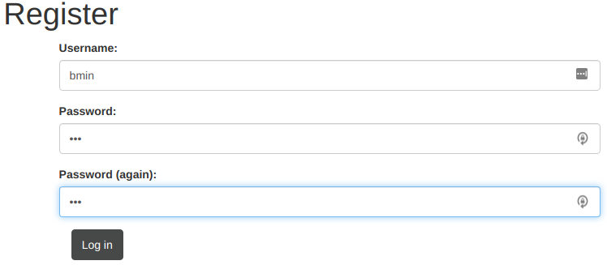
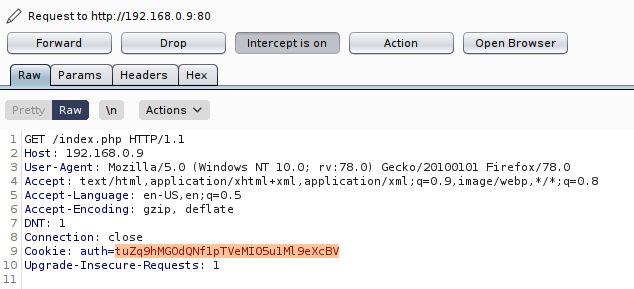
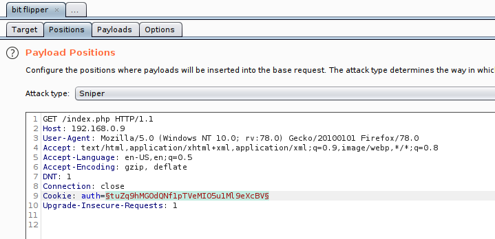
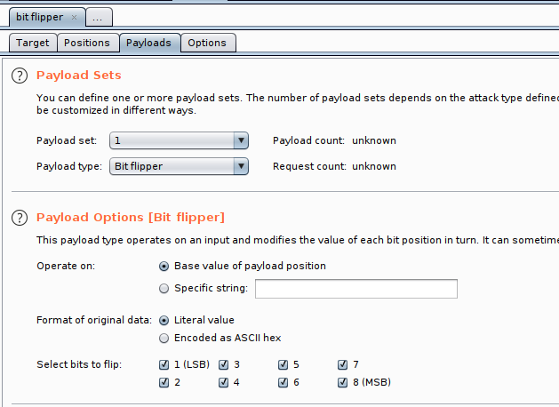
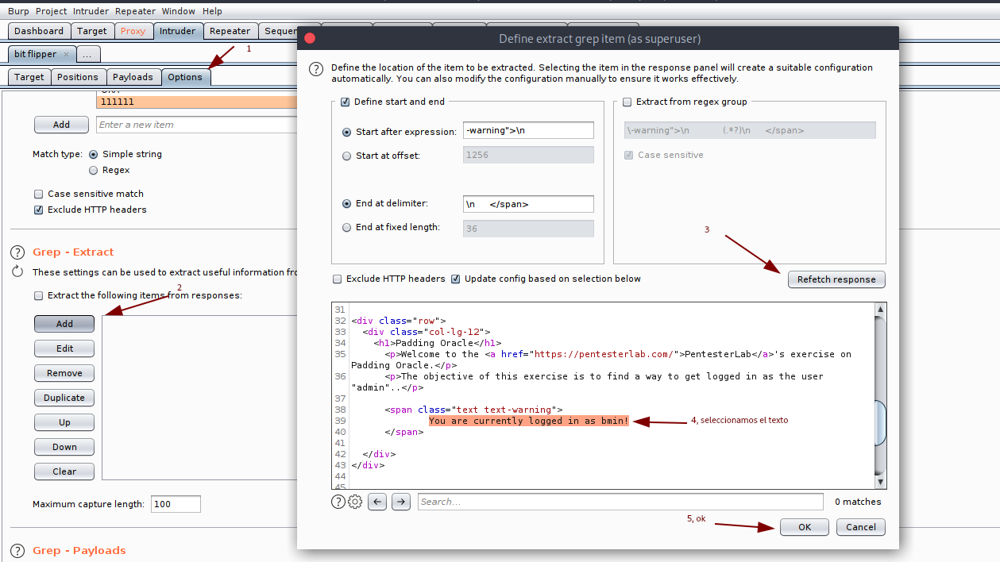
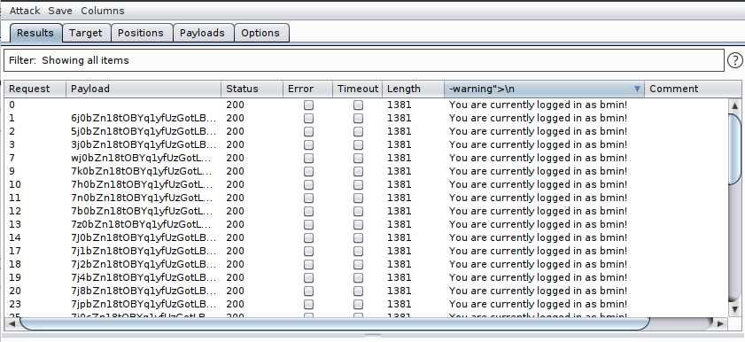

# Bit Flipper Attack

Para esta demostracion usaremos la maquina de padding oracle, de PentesterLab.

https://pentesterlab.com/exercises/padding_oracle/

Empezamos creando un usuario llamado bmin

Y luego nos logeamos para obtener la cookie por burpsuite.

Luego lo que hacemos es enviarlo al intruder y seleccionamos la cookie para realizar el ataque.

Luego, le damos clic en **Start Attack** y esperamos a que salgan los resultados.

Cuando salgan los resultados verificamos cual realiza el output deseado y esa sería la cookie valida.

Eso sería todo :D. 
