# Business logic vulnerabilities - PortSwigger

Todos los laboratorios posteriormente expuestos los puedes encontrar para resolverlos en el siguiente link.

[https://portswigger.net/web-security/logic-flaws](https://portswigger.net/web-security/logic-flaws)

## Índice


## 1. Lab: Excessive trust in client-side controls

```bash
Esta práctica de laboratorio no valida adecuadamente la entrada del usuario. Puede aprovechar una falla lógica en su flujo de trabajo de compras para comprar artículos por un precio no deseado. Para resolver el laboratorio, compre una "Lightweight l33t leather jacket".

Puede acceder a su propia cuenta con las siguientes credenciales: wiener:peter
```

Ahora lo que haremos será hacer clic es el producto que deseamos comprar.

**NOTA: NO SE OLVIDE QUE DEBE INICIAR CON SU CUENTA**

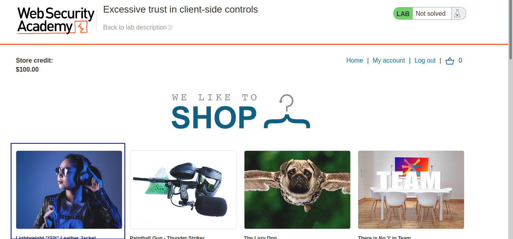

Y ahora intercpetaremos el paquete al hacer clic en **Add to cart**.

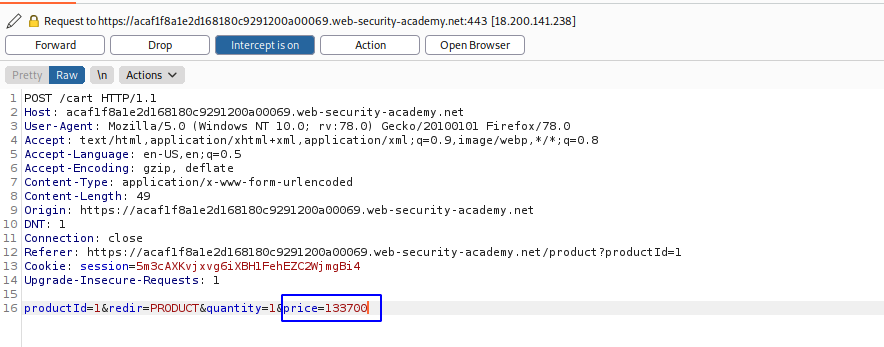

Como podemos ver, nos encontramos con un parametro llamado **price**, entonces nos da la idea de poder cambiar el valor del producto antes de generar la compra.

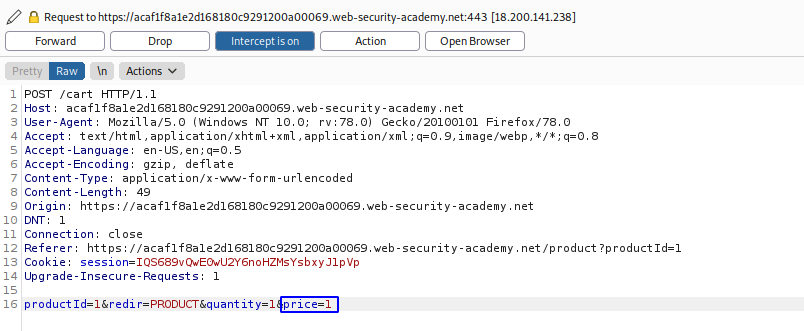

Luego vamos a la seccion del carrito y le damos clic en **Place Order**.

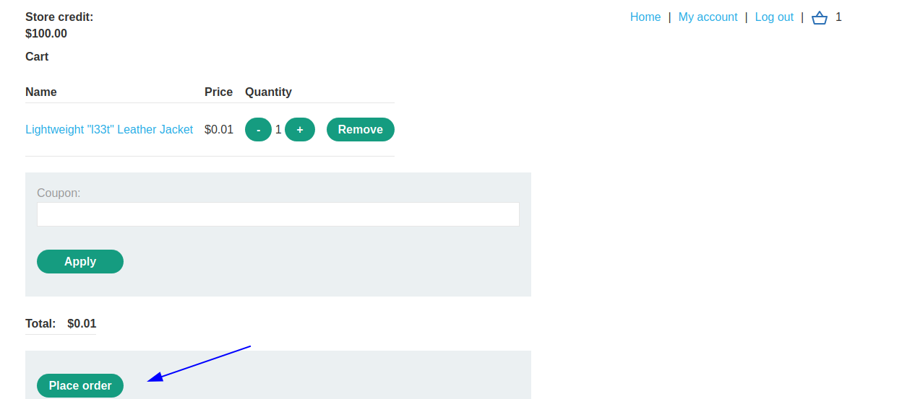

Y luego podemos ver que se completó satisfactoriamente el laboratorio.

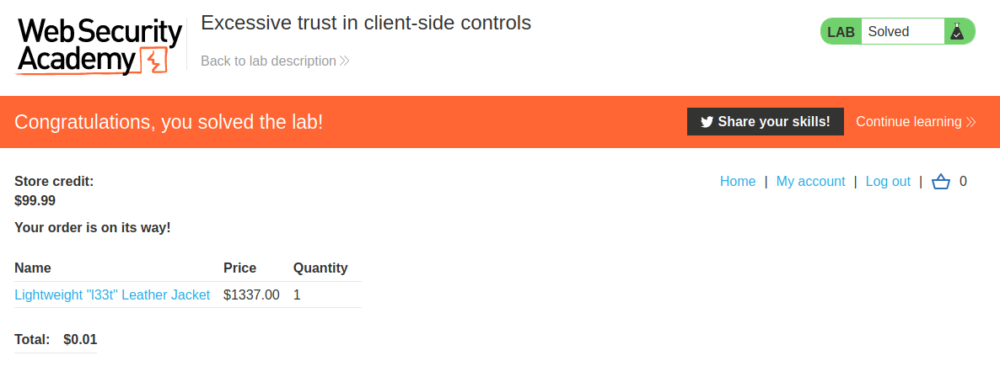

## 2. Lab: High-level logic vulnerability

 ```
Esta práctica de laboratorio no valida adecuadamente la entrada del usuario. Puede aprovechar una falla lógica en su flujo de trabajo de compras para comprar artículos por un precio no deseado. Para resolver el laboratorio, compre una "Lightweight l33t leather jacket".

Puede acceder a su propia cuenta con las siguientes credenciales: wiener:peter
 ```

Ahora lo que haremos será hacer clic es el producto que deseamos comprar.

**NOTA: NO SE OLVIDE QUE DEBE INICIAR CON SU CUENTA**

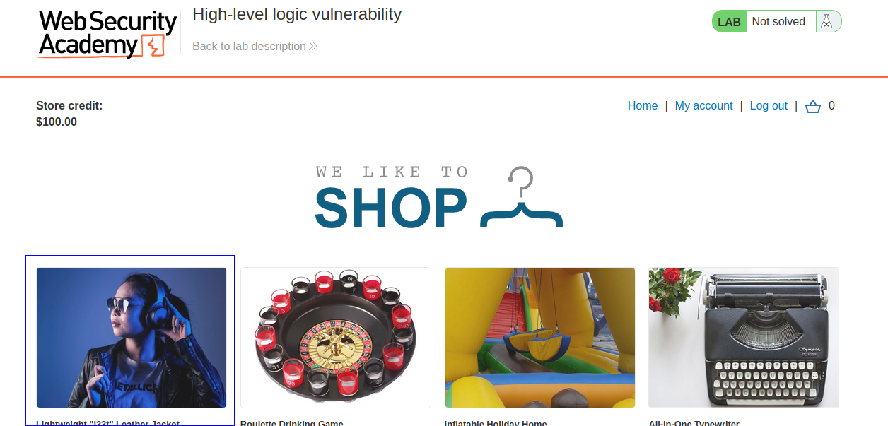

Y ahora intercpetaremos el paquete al hacer clic en **Add to cart**.

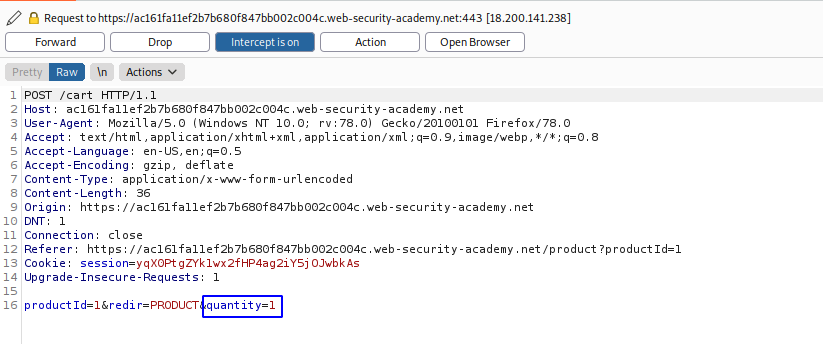

Como podemos ver, el parametro **quantity** tiene valor de 1, intentaremos actualizar su valor a **-1**.

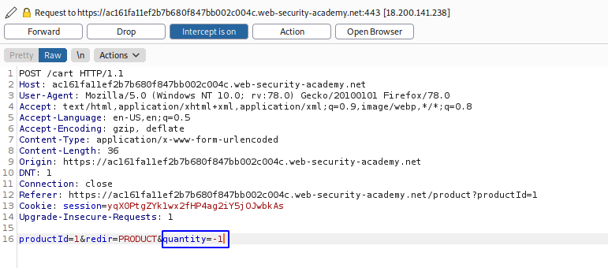

Ahora, lo enviamos el paquete, y revisamos la respuesta.

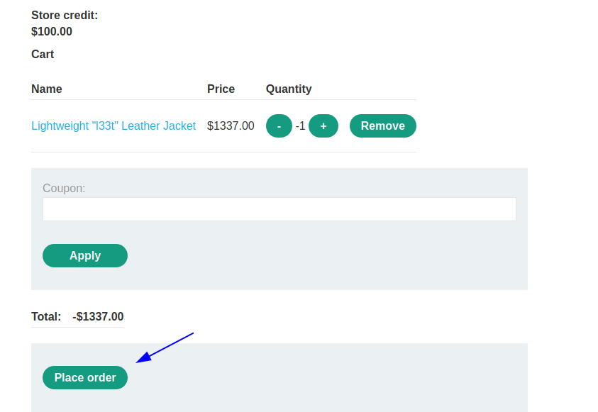

Como podemos ver, nos va a costar la compra el modico precio de: **-1337** (LOL), entonces le damos clic en **Place order**

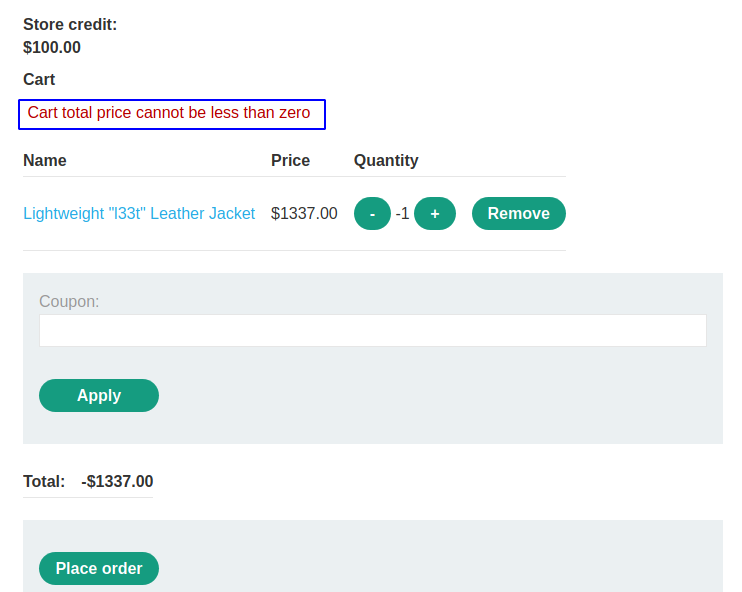, 

Con la misma logica, vamos a realizar la siguiente configuracion.

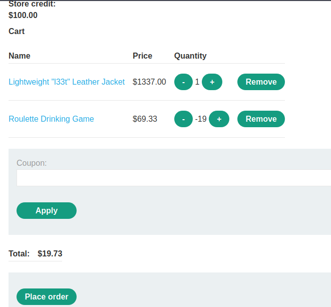

Y como vemos logramos completar el laboratorio.

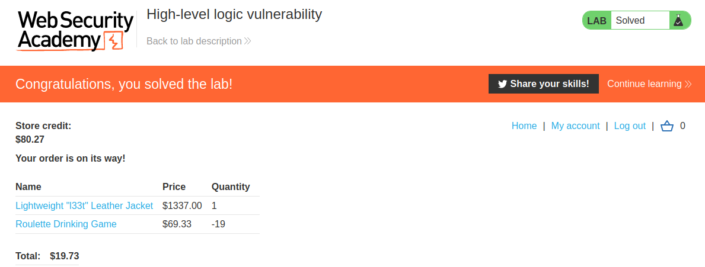

## 3. Lab: Low-level logic flaw

```bash
Esta práctica de laboratorio no valida adecuadamente la entrada del usuario. Puede aprovechar una falla lógica en su flujo de trabajo de compras para comprar artículos por un precio no deseado. Para resolver el laboratorio, compre una "Lightweight l33t leather jacket".

Puede acceder a su propia cuenta con las siguientes credenciales: wiener:peter
```

Ahora lo que haremos será hacer clic es el producto que deseamos comprar.

**NOTA: NO SE OLVIDE QUE DEBE INICIAR CON SU CUENTA**

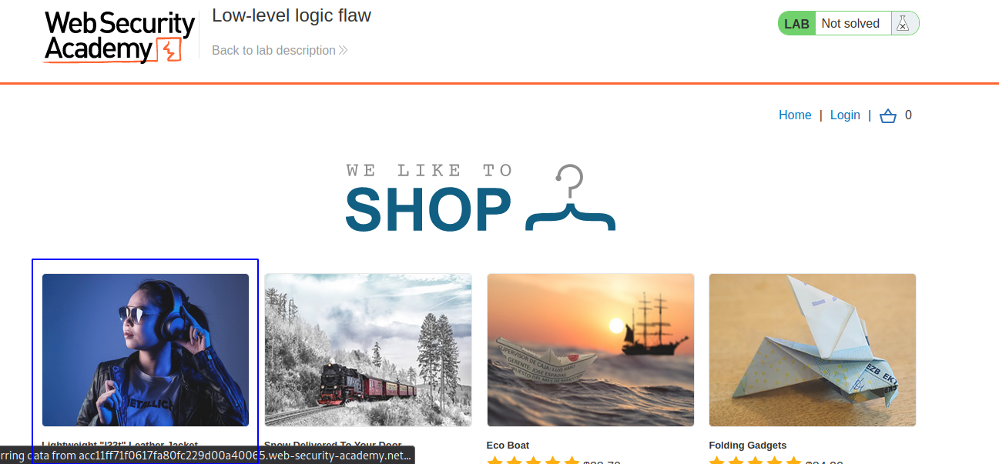

Y ahora intercpetaremos el paquete al hacer clic en **Add to cart**.

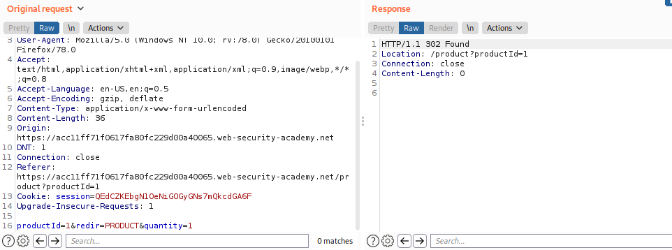

Enviamos el valor **-1** en el parametro **quantity**, pero no nos permite. 

Sabemos que un **integer** esta compuesto por 32 bits. Entonces una variable entera está en el rango de: **[ -2147483648 : 2147483647 ]**.

Como sabemos que el precio del producto es **1337**, entonces resolvemos al siguiente ecuacion.

```python
>>> (2147483647*2.0)/133700
32123.913941660434
```

Entonces, sabemos que, tenemos que reptir 32123 veces el producto, y como maximo solo podemos agregar 99 en una consulta.

```python
>>> 32123.0/99
324.47474747474746
```

Ahora enviamos el paquete anterior al intruder y seteamos la siguientes configuraciones.

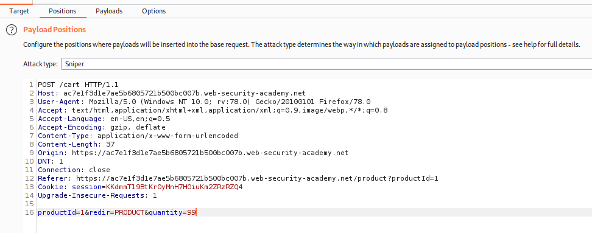

En la parte de la cantidad d payloads especificamos 323, porque el intruder cuenta desde 0.

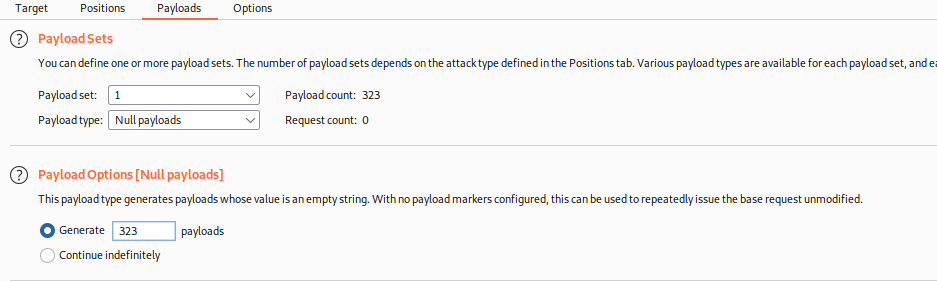

Y luego de damos en **Start Attack**.

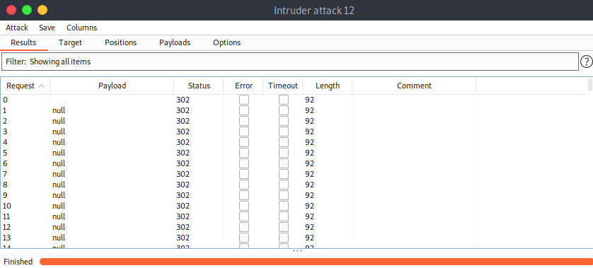

Ahora vamos al carrito, a ver como quedó los resultados.

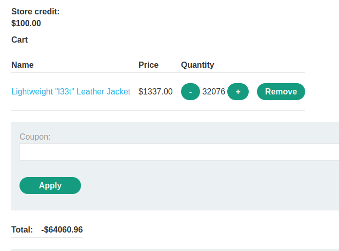

Entonces viendo cuandos mas nos falta, hacemos el siguiente calculo.

```python
>>> 6406096/133700
47
```

Entonces compramos 47 unidades manualmente del producto y tendríamos el siguiente resultado.

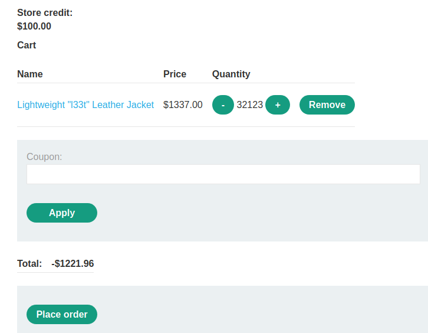

Como solo tenemos 100 de balance, no podemos exceder ese dinero, por ello que ya no podemos comprar mas productos de ese tipo. Por ello buscaremos un candidato que nos ayude a alcanzar el numero deceado. Elejiremos el producto **Giant Grasshopper** cuyo precio es: **71.20**, entonces:

```python
>>> 122196.0/7120
17.1623595505618
```

Entonces agregaremos 17 unidades del articulo **Giant Grasshopper**. El resultado sería el siguiente:

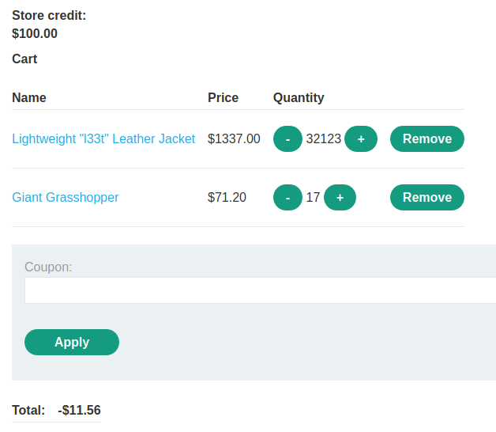

Entonces como podemos ver, todavia no llevamos a numeros positivos, así que agregamos 1 unidad mas a **Giant Grasshopper**.

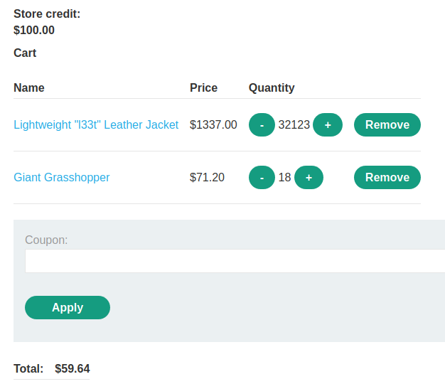

Ahora si le damos clic en **Place Order**.

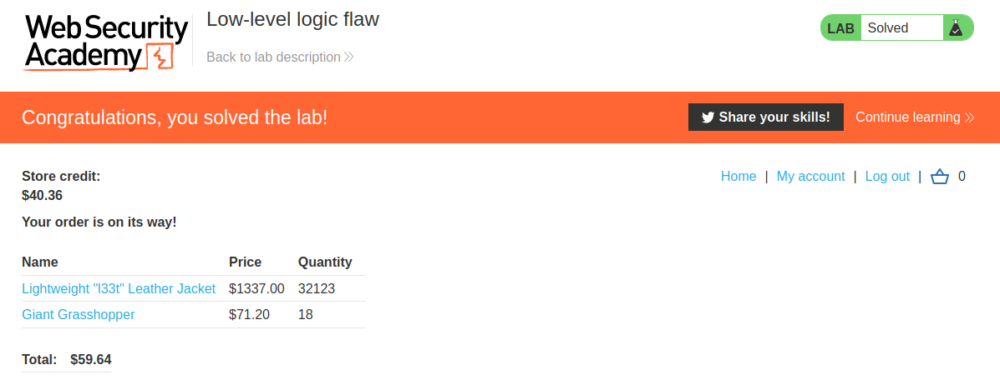

## 4. Lab: Inconsistent handling of exceptional input

```bash
Esta práctica de laboratorio no valida adecuadamente la entrada del usuario. Puede aprovechar una falla lógica en el proceso de registro de su cuenta para obtener acceso a la funcionalidad administrativa. Para resolver el laboratorio, acceda al panel de administración y elimine a Carlos
```

Intentaremos registrarnos usando un correo muy largo, para ver si ocurre algun caso excepcional con respecto al input.

```bash
AAAAAAAAAAAAAAAAAAAAAAAAAAAAAAAAAAAAAAAAAAAAAAAAAAAAAAAAAAAAAAAAAAAAAAAAAAAAAAAAAAAAAAAAAAAAAAAAAAAAAAAAAAAAAAAAAAAAAAAAAAAAAAAAAAAAAAAAAAAAAAAAAAAAAAAAAAAAAAAAAAAAAAAAAAAAAAAAAAAAAAAAAAAAAAAAAAAAAAAA@acd61f861ec39ef080ab06a901cf0050.web-security-academy.net
```

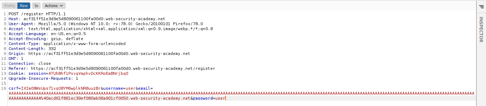

Nos da la siguiente respuesta:

```
Please check your emails for your account registration link
```

Entonces activamos la cuenta y vamos a la seccion **My Account**

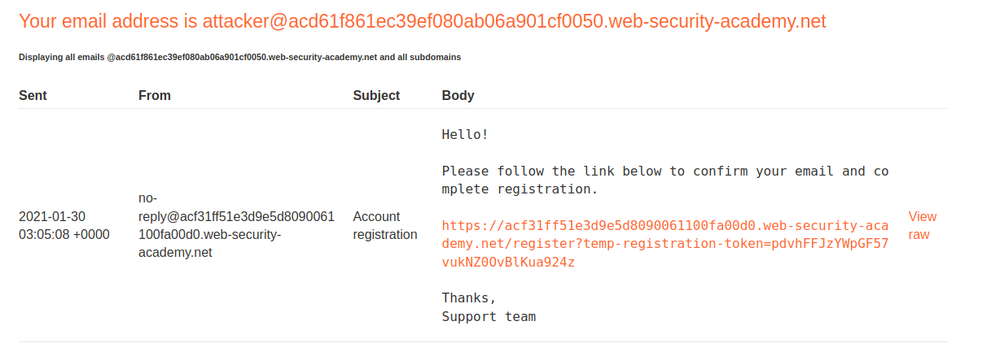

Como podemos ver, cualquier correo que pongamos llegará al **email client** sin inportar que no sea el correo especificado ahí.

Ahora nos logeamos con nuestra cuenta creada luego de darle clic al enlace.


Como podemos ver, el correo se trunca ante una logitud. Lo que haremos será obtener la cantidad de caracteres donde se trunca el correo.

```python
>>> len("AAAAAAAAAAAAAAAAAAAAAAAAAAAAAAAAAAAAAAAAAAAAAAAAAAAAAAAAAAAAAAAAAAAAAAAAAAAAAAAAAAAAAAAAAAAAAAAAAAAAAAAAAAAAAAAAAAAAAAAAAAAAAAAAAAAAAAAAAAAAAAAAAAAAAAAAAAAAAAAAAAAAAAAAAAAAAAAAAAAAAAAAAAAAAAAAAAAAAAAA@acd61f861ec39ef080ab06a901cf0050.web-security-academy.")
255
```

Entonces pensaremos en un payload que al cortarse pueda truncarse y obtener el correo que deseamos.

```bash
textoo....oooo@dontwannacry.com.acd61f861ec39ef080ab06a901cf0050.web-security-academy.net
```

Ahora, entramos a un posible directorio llamado **admin** y nos dice que solo pueden ingresar los usuarios **DontWannaCry**.

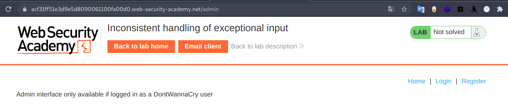

Entonces, calculamos la longiutd del correo **@dontwannacry.com** y lo que resta lo rellenamos de **A**.

```python
>>> 255-len("@dontwannacry.com")
238
>>> print "A"*238
AAAAAAAAAAAAAAAAAAAAAAAAAAAAAAAAAAAAAAAAAAAAAAAAAAAAAAAAAAAAAAAAAAAAAAAAAAAAAAAAAAAAAAAAAAAAAAAAAAAAAAAAAAAAAAAAAAAAAAAAAAAAAAAAAAAAAAAAAAAAAAAAAAAAAAAAAAAAAAAAAAAAAAAAAAAAAAAAAAAAAAAAAAAAAAAAAAAAAAAAAAAAAAAAAAAAAAAAAAAAAAAAAAAAAAAAAAAAAA
```

Nuestro payload sería pero debemos agregarle la finalidad **.acd61f861ec39ef080ab06a901cf0050.web-security-academy.net**.

```bash
AAAAAAAAAAAAAAAAAAAAAAAAAAAAAAAAAAAAAAAAAAAAAAAAAAAAAAAAAAAAAAAAAAAAAAAAAAAAAAAAAAAAAAAAAAAAAAAAAAAAAAAAAAAAAAAAAAAAAAAAAAAAAAAAAAAAAAAAAAAAAAAAAAAAAAAAAAAAAAAAAAAAAAAAAAAAAAAAAAAAAAAAAAAAAAAAAAAAAAAAAAAAAAAAAAAAAAAAAAAAAAAAAAAAAAAAAAAAAA@dontwannacry.com.acd61f861ec39ef080ab06a901cf0050.web-security-academy.net
```

Ahora nos registrmos con el payload como correo.

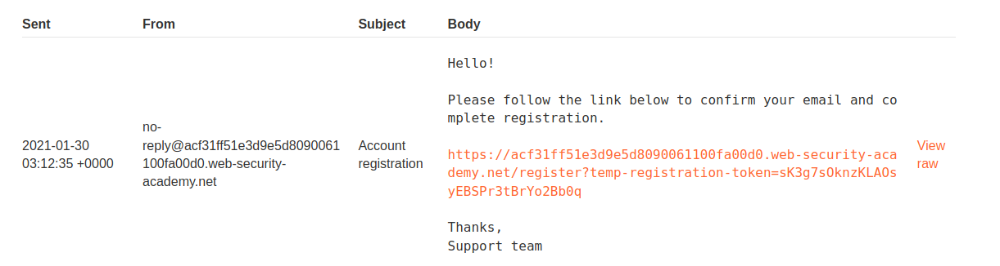

Y luego de activar la cuenta, ingresamos y vamos a la seccion de **My Account**.

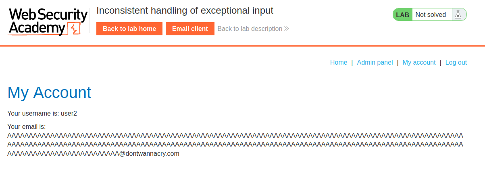

Y como podemos ver, tenemos disponible el panel del **Admin**.

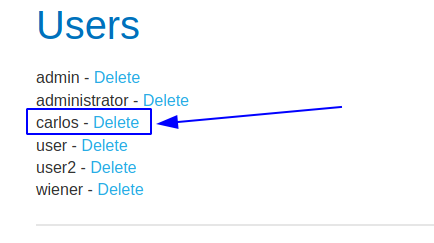

Nuestra mision es matar al usuario **carlos**.

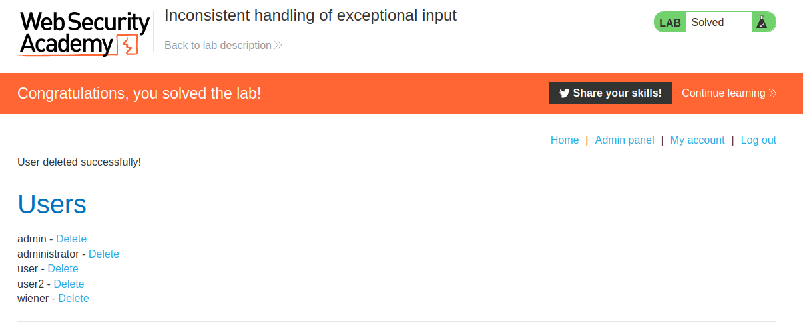

Y logramos solucionar el laboratorio.

## 5. Lab: Inconsistent security controls

```bash
La lógica defectuosa de este laboratorio permite que usuarios arbitrarios accedan a funciones administrativas que solo deberían estar disponibles para los empleados de la empresa. Para resolver el laboratorio, acceda al panel de administración y elimine a Carlos.
```

Lo que haremos para este laboratorio será registrarnos, verificar el correo y luego logearnos e ingresar a la seccion **My account**.


Ahora lo que haremos será ir a la seccion de **/admin** y nos devuelve el siguiente error:

```bash
Admin interface only available if logged in as a DontWannaCry user
```

Entonces lo que haremos será en la seccion **My account** actualizamos el correo al siguiente correo:

```bash
attacker@dontwannacry.com
```

Y obtendriamos lo siguiente:

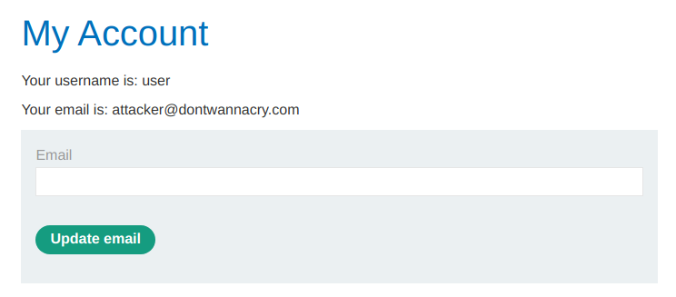

Ahora no vamos a la seccion **Admin panel** y eliminamos al usuario **carlos**.

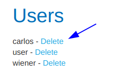

Y luego completariamos el laboratorio.

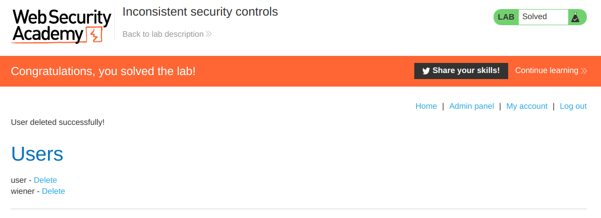

## 6. Lab: Weak isolation on dual-use endpoint

```bash
Este laboratorio hace una suposición errónea sobre el nivel de privilegios del usuario en función de su entrada. Como resultado, puede aprovechar la lógica de sus funciones de administración de cuentas para obtener acceso a cuentas de usuarios arbitrarios. Para solucionar el laboratorio, acceda a la cuenta administrator y elimine a Carlos.

Puede acceder a su propia cuenta con las siguientes credenciales: wiener:peter
```

Ingresamos con las credenciales que nos entregan, y nos dirigimos a la seccion **My account**, ahi lo que haremos será cambiar la contraseña, interceptamos el paquete y lo enviamos al **repeater**.


Como podemos ver tenemos varios parametros, entre ellos **username** el cual lo reemplazaremos por **administrator**, luego el **current-password** como no tenemos la clave, eliminaremos el parametro y seteamos una nueva contraseña que será **123**.

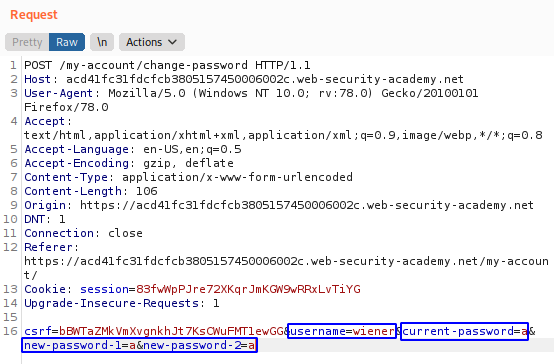

Y quedaría de la siguiente manera:

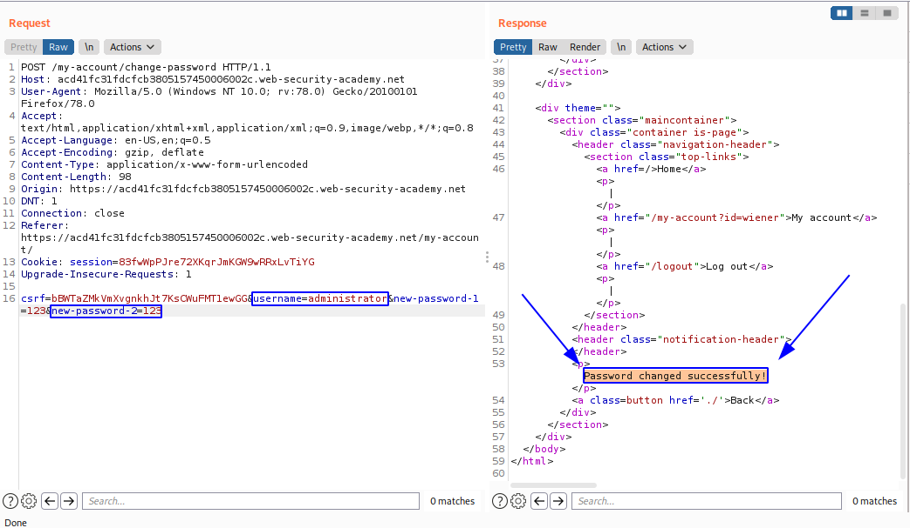

Ingresamos con el usuario **administrator** y la contraseña que especificamos que en nuestro caso es **123**.

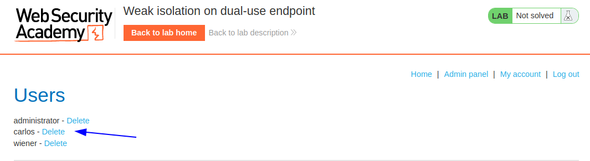

Y eliminamos el usuario carlos para completar el laboratorio.

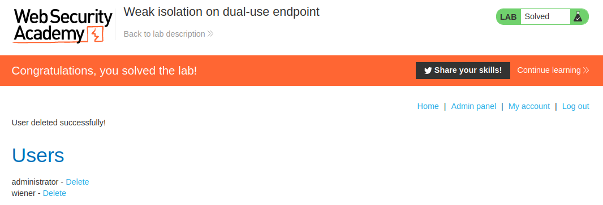

## 7. Lab: Insufficient workflow validation

```bash
Este laboratorio hace suposiciones erróneas sobre la secuencia de eventos en el flujo de trabajo de compras. Para resolver el laboratorio, aproveche este defecto para comprar una "Lightweight l33t leather jacket".

Puede acceder a su propia cuenta con las siguientes credenciales: wiener:peter
```

Nos logeamos con las credenciales que nos dá el laboratorio, y luego compramos un item, el mas barato que encontremos para interceptar todos los paquetes y ver algo interesante que podamos encontrar.

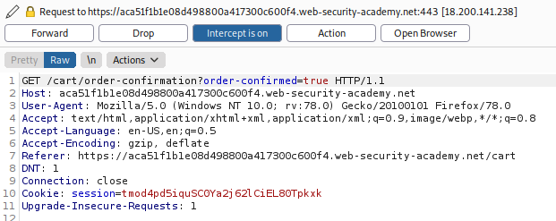

Podemos ver, un paquete muy interesante, donde se realiza una validacion y confirmacion de la compra y la llevamos a repeater.

Dropearemos el paquete del proxy, y lo que haremos será cambiar el producto que agregamos por el de **Lightweight l33t leather jacket**.

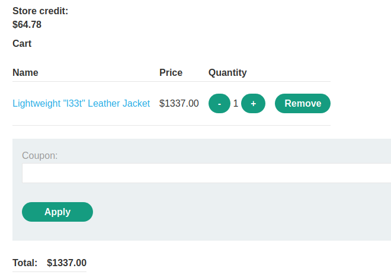

Y luego vamos al repeater, donde dejamos nuestro paquete, y lo enviamos para analizar el resultado.


Y como podemos ver, nos generá un texto que nos dice que completamos el laboratorio. Entonces vamos a la pagina principal para verificar que se completó el laboratorio.

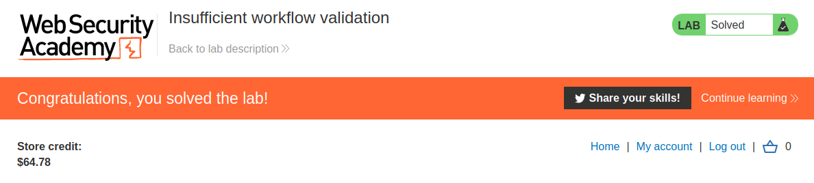

## 8. Lab: Authentication bypass via flawed state machine

```
Este laboratorio realiza suposiciones erróneas sobre la secuencia de eventos en el proceso de inicio de sesión. Para resolver el laboratorio, aproveche esta falla para evitar la autenticación del laboratorio, acceder a la interfaz de administración y eliminar a Carlos.

Puede acceder a su propia cuenta con las siguientes credenciales: wiener:peter
```

Lo logeamos con las credenciales que nos dan e interceptamos todos los paquetes, podemos ver que uno de los mas interesantes es el siguiente,

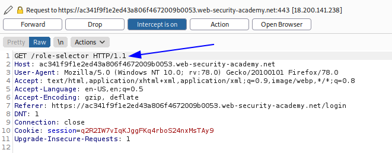

Que enviamos algunos de los valores genera un paquete POST, que es el siguiente,

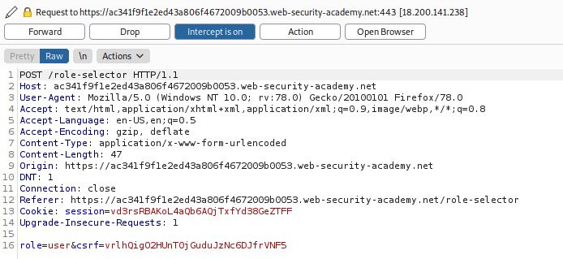

Podemos suponer que este recurso, **role-selector** sirve para actualizar el rol del usuario en el sitio web luego de realizarse el inicio de sesion, lo que intentaremos será simulas el mismo fujo pero haciendo un **drop** al momento que nos aparecer la solicitud **GET** de **/role-selector**.

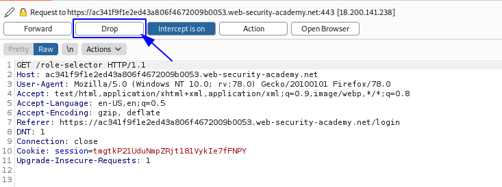

Y luego vemos en el sitio web lo siguiente,

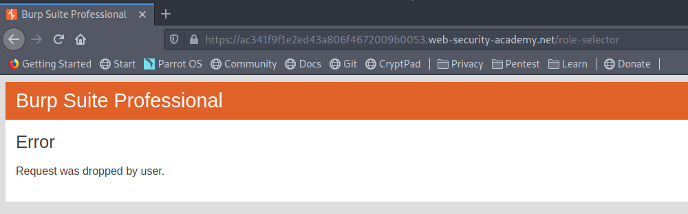

Lo cual tiene sentido porque realizamos un **drop** al request, entonces ahora simplemente accedemos al home del laboratorio y nos topamos con que nuestro rol está como administrador.

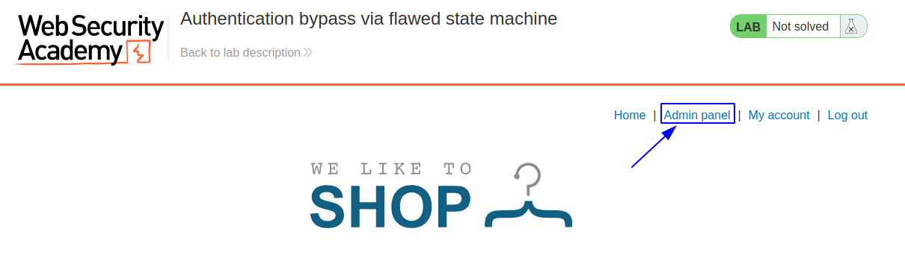

Ahora, accedemos al panel de administracion de eliminamos al usuario carlos para completar el laboratorio.

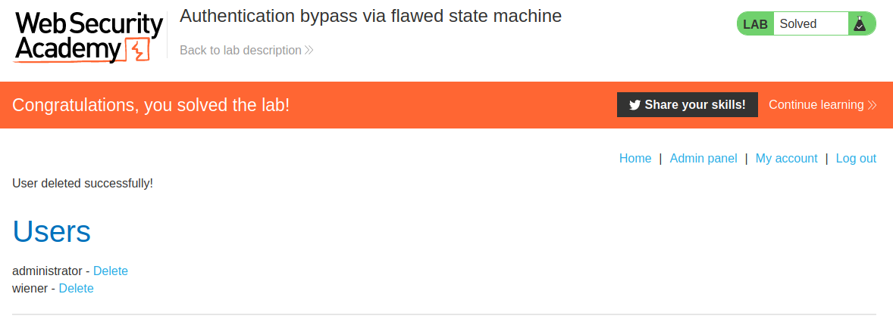

## 9. Lab: Flawed enforcement of business rules

