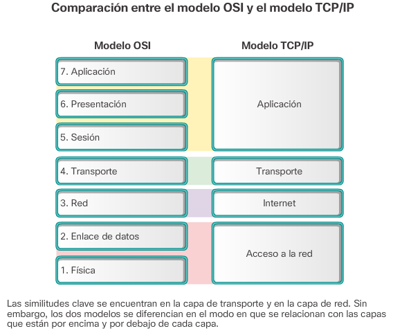

---

layout: default
title: "Un nuevo comienzo"
permalink: /how-to-start/
---

# Hola!, que tal?

Me llamo Desdes. Seria un honor para mi saber cual es tu nombre.

Mi nombre es:  <input name='name' type='text' onchange="document.getElementById('done').innerHTML = 'Un gusto!, hoy empieza tu camino en el mundo de la seguridad.'">

:)

------

Bueno, tal vez llegaste aquí porque no sabes como empezar en este mundo, y te entiendo. Puede que tengas interés en este mundo... pero, hay muchos temas o muchas ramas y no sabes por donde empezar. Esto es algo común, asi que empezaremos desde los temas mas básicos y nos iremos complicando poco a poco. Entendido :D !

Tocaremos muchos temas, la mayoría tal vez las conozcas o tal vez no. Asi que si conoces algún tema que ya conoces simplemente sáltatelo. Pero... si quieres reforzar tus ideas, te recomiendo que las revises.

Empezaremos con un tema muy básico, tal vez no muy fácil, pero muy necesario. Este tema sera conceptos de redes. Esto se debe a que, los conceptos de redes son muy útiles para entender la mayoría de conceptos de seguridad informática.

Supongo que ya has tenido algún contacto con la computación. Bueno si no fuera asi no estaría aquí XD.

Bueno, los sitios webs son la cara mas conocida de la internet, podríamos hacer un 'zoom' a cada uno de las partes de una comunicación entre usuario y sitio web y encontraríamos partes y partes de modelos de internet. Por ello empezaremos con lo mas básico y util cuando hablamos de conceptos de red. **El modelo OSI**.

## The OSI Model

Piensa en una calculadora, una simple, porque ahora hay calculadoras que hasta se conectan a internet.  Una calculadora simple y básica. Maneja información de manera interna, procesa las operaciones que le envías y te devuelve una respuesta. Esta calculadora es un sistema cerrado. Puesto que no se comunica con otras calculadora y menos con computadores. 

Ahora imaginemos 2 computadores. Estos computadores se comunican manejando un cierto 'lenguaje'.  Estos computadores son sistemas abiertos, puesto que se pueden comunicar entre ellos con el 'lenguaje' especificado anteriormente. El modelo OSI es justamente eso. Open System Interconnection Model (Modelo de interconexión de sistemas abierto). Entonces, el modelo OSI nos especifica la manera en como estos computadores se comunicaran. Luego, lo que llamamos 'lenguaje' llevara el nombre de **protocolo**.

Entonces, el **modelo OSI** consta de 7 capas:

* Aplicación
* Presentación
* Sesión
* Transporte
* Red
* Enlace de Datos
* Física

Cada una de las capas tiene multiples protocolos, entonces. Como podemos definir un protocolo?, Un protocolo vendría a ser una serie de reglas para poder realizar una comunicación entre dos elementos.

Te recomiendo investigar un poco mas sobre el modelo OSI, y sobre cada una de las capas. **:)**

## Modelo TCP/IP

El modelo TCP/IP se deriva del modelo OSI, muchas de sus capas colapsan entre ellas y ahora contamos con 4 capas, todas los demás conceptos son parecidos. Solo que, el modelo TCP/IP se centra en el **protocolo IP** (Internet Protocol). Las  cuales son:

* Aplicación
* Transporte
* Internet
* Acceso a la Red

Como podemos ver en la siguiente imagen:

Te recomiendo investigar un poco mas sobre el modelo TCP/IP, y sobre cada una de las capas. **:)**

## Protocolos

Ahora veremos algunos protocolos interesantes por cada una de las capas del modelo TCP/IP. **Te recomiendo que les des una breve revisada a cada uno de ellos, igual con el tiempo estaremos usando todos ellos, pero siempre es buena ya empezar a darle una revisada a cada uno de ellos :D**.

### Aplicación

En la capa de aplicación nos topamos con todos los protocolos mas conocidos, estos protocolos son los mas usados por los usuarios pues son los que se encuentran en el nivel mas alto **(consideremos la terminología 'nivel mas alto' como si fuera el mar, el nivel mas alto seria lo que se ve desde afuera, mientras que los niveles mas bajos serian los que se encuentran en las profundidades)**. 

* HTTP: El protocolo mas conocido hasta por los que no saben nada de redes, Quien no ha visitado una web :D ?.
* HTTPS: Recuerdas el candadito que sale a veces cuando accedes a una web, pues tiene que ver con esto.
* SSH: Esto protocolo sirve para poder ejecutar comandos de sistema de otro computador.
* FTP: Este protocolo funciona para enviar archivos a un computador.
* SMB: Protocolo usado por Microsoft (Si, los de windows.) que permite compartir archivos, impresoras entre otros, en la misma red.
* DNS: Este de aquí es un protocolo interesante, pues gracias a este no tenemos que memorizar numeritos, sino palabras.
* SMTP: Protocolo necesario para los servidores de correo electrónico.
* DHCP: Este protocolo te ayuda a darte una dirección IP cuando te conectas a una red, de esta manera no debes hacer manualmente.

Busca un poco de información sobre estos protocolos para que ya poco a poco tengas un conocimiento general sobre ellos. Si te interesa seguridad o redes, los vas a ver muy a menudo, aun hay muchos protocolos de la capa de aplicación que no hemos visto, pero estos son los mas mencionados.

### Transporte

En esta sección nos empezamos a poner cada vez mas raro, ahora hablaremos sobre los protocolos de la capa de transporte, para ser mas exactos, de los 2 mas importantes, **TCP** y **UDP**.

* TCP: Protocolo orientado a conexión, esto quiere decir que el protocolo esta rigurosamente hecho para que no se pierdan ningún paquete en el envió.
* UDP: Protocolo no orientado a conexión, en este protocolo no existe esa rigurosidad, pero esto hace que el protocolo sea mucho mas ligero.

Para definir un protocolo de transporte necesitamos la información de puertos de origen y destino. Entonces que es un puerto?.

Pues, hablaremos de puertos lógicos de red, como un carril en el cual se transporta un mensaje **(asi como en los trenes que tienes carriles?, igual, y el tren vendría el paquete con el protocolo de transporte, ya sea TCP o UDP).** Bueno, entonces, cuantos puertos existen, pues existe un total de 65535 puertos. (este no es un numero sacado de un sombrero, tiene una explicación y la veremos cuando toquemos cada uno de estos protocolos). Luego también están los datos que se transporta. Y aquí viene una gran revelación, los datos que envía el protocolo de transporte es **el paquete de la capa de aplicación con su protocolo respectivo**.

### Internet

Esta capa contiene una información parecida a la capa de transporte, pero en lugar de almacenar puertos de origen y destino. El protocolo de internet **(IP)** contiene la IP de origen y destino. En su sección de datos, almacena el paquete de la capa de transporte.

### Acceso a la red

Si te esta interesando lo que lees e.e?, te recomiendo ingresar a este enlace: [https://start.desdes.xyz/](https://start.desdes.xyz/).

