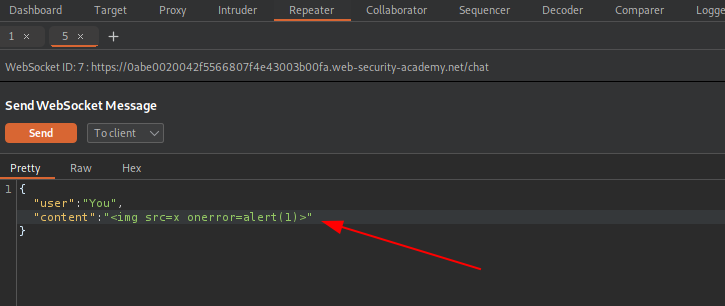

# WebSockets - PortSwigger

Todos los laboratorios posteriormente expuestos los puedes encontrar para resolverlos en el siguiente link.

[https://portswigger.net/web-security/websockets](https://portswigger.net/web-security/websockets)

## Índice

## 1. Lab: Manipulating WebSocket messages to exploit vulnerabilities

```
Esta tienda online tiene una función de chat en directo implementada mediante WebSockets.

Los mensajes de chat que usted envía son vistos por un agente de soporte en tiempo real.

Para resolver el problema, utilice un mensaje WebSocket para activar una ventana emergente alert() en el navegador del agente de soporte.
```

En este laboratorio aprenderemos a interceptar, enviar y recepcionar web sockets, para ello usaremos nuestro burpsuite. Asi que primero accedemos al sitio web y hacemos clic en la opción **Live chat**.


Luego, al ingresar podemos verificar que nos encontramos con un chat.


Al inicio el servicio nos notifica que ya podemos chatear con el bot.

Luego podemos ingresar un mensaje y hacer clic en el botón **Send**.


Desde nuestro burpsuite podemos acceder a la sección  **Proxy**, y dentro de esta a la sección **WebSockets History**.

En ella podemos ver los mensajes websocket que son enviados al servidor **(->)** y los que son enviados al cliente desde el servidor **(<-)**. Entre ellos podemos ver nuestro mensaje con el Hola que enviamos en el chat.

Antes de probar el ataque XSS al agente de soporte como solicita el laboratorio, verificaremos si el front-end del chat nos permite generar ataques XSS.


Como podemos intuir, luego de enviar un mensaje este se muestra en el chat ya que luego de enviarlo el servidor nos devuelve el mismo mensaje para que este se refleje en nuestro chat. Entonces ahora que identificamos este mensaje le daremos clic derecho y lo enviaremos al repeater.


Ya en el repeater, editamos el texto y lo enviamos para verificar el cambio en el chat.


Como podemos ver, el mensaje se ha mostrado en nuestro chat satisfactoriamente. Ahora, intentaremos lo mismo pero utilizando un payload XSS.

```html

```


Luego de enviar el payload mediante websocket podemos verificar que en nuestro navegador a saltado un alert por el ataque XSS.


Entonces, ahora que validamos que el sitio es vulnerable a ataques XSS, enviaremos nuestro payload mediante el socket inicial que identificamos en el chat.


Luego de ello validamos que nos genera el alert y nos envía que el laboratorio se ha completado.


## 2.Lab: Manipulating the WebSocket handshake to exploit vulnerabilities

```
Esta tienda online tiene una función de chat en directo implementada mediante WebSockets.

Tiene un filtro XSS agresivo pero defectuoso.

Para resolver el problema, utilice un mensaje WebSocket para activar una ventana emergente alert() en el navegador del agente de soporte.
```

Para esta laboratorio accedemos a la opción **Live Chat** del sitio web y enviamos un mensaje para interceptas los websocket en el burpsuite.


Enviamos el websocket al repeater para realizar pruebas.


Enviamos nuestro payload XSS al sitio web y como podemos ver **2** el sitio web detectó nuestro payload, y nos cerró la conexión. Asi que daremos clic en el interruptor señalado en **3** para modificar nuestra configuración de websocket.


Como podemos ver, cuando le damos clic en el botón **Connect** el servidor nos retorna que nuestra IP forma parte de la lista negra de ips bloqueadas. Algo que se puede intentar cuando nos encontramos en una situación como esta donde un sitio web nos bloquea las peticiones es utilizar la cabecera X-Forwarded-For, para intentar evadir esta restricción de la siguiente manera:

```
X-Forwarded-For: localhost
```

Luego le damos clic en el botón **Connect** y podemos verificar que el sitio web nos permite seguir usando el chat. Como nos dimos cuenta el sitio web tiene una protección XSS, por ello debemos verificar si esta protección se puede evadir. Para abordar un sitio web con XSS debemos seguir una metodología de manera de minimizar la cantidad de bloqueos que nos pueda generar, para ello empezaremos desde casos mas pequeños y generales hasta casos mas complejos.

Primero probaremos verificando que nos permite utilizar los caracteres **<>**.


Ya que verificamos que si nos permite el uso de estos caracteres, verificaremos si nos permite el uso de la etiqueta **\**


No nos bloqueó, asi que ahora verificaremos si nos permite el atributo **src**.


No nos bloqueó, asi que ahora verificaremos si nos permite agregarle un valor invalido al atributo src.


No nos bloqueó, asi que ahora verificaremos si nos permite agregarle un evento como onerror.


En esto caso el sitio web nos a bloqueado ya que no permite el evento onerror, luego de bloquearnos nos cierra la conexión de websocket establecida. Para ello haremos uso de nuevo de nuestro bypass de blacklist.

Ya que el sitio web no valida exactamente lo que se ingrese por la cabecera X-Forwarded-For, ingresaremos cualquier letra para crear una nueva identidad y no estar bloqueados, como por ejemplo:

```
X-Forwarded-For: localhostx
```
Y luego hacemos clic en **Connect**. Ahora como nos bloquea por el uso del evento onerror, intentaremos verificar cambiando algunas letras por mayusculas. Esto se debe a que algunos filtros validan mucho el uso estricto de ciertos eventos y no consideran que **HTML no es case sensitive**.


Como podemos ver, esta vez si nos permitió evadir la protección. Ahora, intentaremos agregar la función **alert()**.


Esta vez si nos bloqueo de nuevo, asi que ahora reiniciaremos la conexion del socket cambiando de nuevo el valor de la cabecera X-Forwarded-For y luego probaremos con el uso de **``** en lugar de paréntesis **()**. 


Ahora, si nos permitió el envió del payload, y si validamos en el sitio web, podemos ver que nos figura el laboratorio como resuelto.


